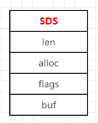

# sds动态字符串

## 简介

---
源码位置：sds.c/sds.h  

实现了动态字符串，采用预分配冗余空间的方式来减少内存的频繁分配。

SDS结构一共有5中header定义，目的是为了满足不同长度的字符串可以使用不同大小的header，从而节省内存。  
结构体主要包含以下几个部分：  
len：字符串的实际长度  
alloc：字符串的最大容量  
flags：表示结构体的类型  
buf：字符串  

</br>
</br>

## SDS结构体

---

``` c
typedef char *sds;

/* Note: sdshdr5 is never used, we just access the flags byte directly.
 * However is here to document the layout of type 5 SDS strings. */
struct __attribute__ ((__packed__)) sdshdr5 {
    unsigned char flags; /* 3 lsb of type, and 5 msb of string length */
    char buf[];
};
struct __attribute__ ((__packed__)) sdshdr8 {
    uint8_t len; /* used */
    uint8_t alloc; /* excluding the header and null terminator */
    unsigned char flags; /* 3 lsb of type, 5 unused bits */
    char buf[];
};
struct __attribute__ ((__packed__)) sdshdr16 {
    uint16_t len; /* used */
    uint16_t alloc; /* excluding the header and null terminator */
    unsigned char flags; /* 3 lsb of type, 5 unused bits */
    char buf[];
};
struct __attribute__ ((__packed__)) sdshdr32 {
    uint32_t len; /* used */
    uint32_t alloc; /* excluding the header and null terminator */
    unsigned char flags; /* 3 lsb of type, 5 unused bits */
    char buf[];
};
struct __attribute__ ((__packed__)) sdshdr64 {
    uint64_t len; /* used */
    uint64_t alloc; /* excluding the header and null terminator */
    unsigned char flags; /* 3 lsb of type, 5 unused bits */
    char buf[];
};

#define SDS_TYPE_5  0
#define SDS_TYPE_8  1
#define SDS_TYPE_16 2
#define SDS_TYPE_32 3
#define SDS_TYPE_64 4
#define SDS_TYPE_MASK 7 // 类型掩码(通过(flags & SDS_TYPE_MASK)可判断sdshdrXX)
#define SDS_TYPE_BITS 3
#define SDS_HDR_VAR(T,s) struct sdshdr##T *sh = (void*)((s)-(sizeof(struct sdshdr##T))); // 获取header头指针
#define SDS_HDR(T,s) ((struct sdshdr##T *)((s)-(sizeof(struct sdshdr##T)))) // 获取header头指针
#define SDS_TYPE_5_LEN(f) ((f)>>SDS_TYPE_BITS) // 获取sdshdr5的长度
```

</br>
</br>

## 函数功能总览

---

``` c
sds sdsnewlen(const void *init, size_t initlen); // 生成新的sds字符串（返回sdshdrXX中的buf头指针）
sds sdsnew(const char *init); // 生成新的sds字符串（调用sdsnewlen()）
sds sdsempty(void); // 创建一个空的sds字符串（调用sdsnewlen("", 0)）
sds sdsdup(const sds s); // 复制（深拷贝）s（调用sdsnewlen("", 0)）
void sdsfree(sds s); // 释放sds字符串
sds sdsgrowzero(sds s, size_t len); // 将字符串s增加到指定长度len（s的实际长度为len）
sds sdscatlen(sds s, const void *t, size_t len); // 字符串s增加len的长度（s的实际长度为len（s） + len）
sds sdscat(sds s, const char *t); // 字符串拼接（调用sdscatlen()）
sds sdscatsds(sds s, const sds t); // 同上（调用sdscatlen()）
sds sdscpylen(sds s, const char *t, size_t len); // 字符串拷贝
sds sdscpy(sds s, const char *t); // 字符串拷贝（调用sdscpylen()）

sds sdscatvprintf(sds s, const char *fmt, va_list ap); // 字符串格式化，类似于sprintf
#ifdef __GNUC__
sds sdscatprintf(sds s, const char *fmt, ...) // 字符串格式化（调用sdscatvprintf()）
    __attribute__((format(printf, 2, 3)));
#else
sds sdscatprintf(sds s, const char *fmt, ...); // 字符串格式化（调用sdscatvprintf()）
#endif

sds sdscatfmt(sds s, char const *fmt, ...); // 字符串格式化拼接
sds sdstrim(sds s, const char *cset); // 字符串s剔除指定的cset
void sdsrange(sds s, ssize_t start, ssize_t end); // 选取指定长度
void sdsupdatelen(sds s); // 更新s的长度
void sdsclear(sds s); // 清空s的内容
int sdscmp(const sds s1, const sds s2); // 字符串拷贝
sds *sdssplitlen(const char *s, ssize_t len, const char *sep, int seplen, int *count); // 字符串分割，将字符串s根据sep分割符来进行分割，返回字符串数组，count为数组个数
void sdsfreesplitres(sds *tokens, int count); // 释放字符串数组tokens
void sdstolower(sds s); // 字符串转小写
void sdstoupper(sds s); // 字符串转大写
sds sdsfromlonglong(long long value); // long long 转为sds格式
sds sdscatrepr(sds s, const char *p, size_t len); // 将s里不可打印的字符('\n'、'\t'等)转义为可用来打印的字符('\\n'、'\\t'等)
sds *sdssplitargs(const char *line, int *argc);
sds sdsmapchars(sds s, const char *from, const char *to, size_t setlen); // 替换字符串，将s中为from的字符串替换为to
sds sdsjoin(char **argv, int argc, char *sep); // 字符串数组连接
sds sdsjoinsds(sds *argv, int argc, const char *sep, size_t seplen); // sds格式的字符串连接

/* Low level functions exposed to the user API */
sds sdsMakeRoomFor(sds s, size_t addlen); // 字符串s增加扩大addlen个字节
void sdsIncrLen(sds s, ssize_t incr);
sds sdsRemoveFreeSpace(sds s); // 删除掉sds中的末端空间(local-len)
size_t sdsAllocSize(sds s); // 返回整个结构的内存大小
void *sdsAllocPtr(sds s); // 返回结构体的头指针

/* Export the allocator used by SDS to the program using SDS.
 * Sometimes the program SDS is linked to, may use a different set of
 * allocators, but may want to allocate or free things that SDS will
 * respectively free or allocate. */
void *sds_malloc(size_t size); // 分配内存size大小的空间
void *sds_realloc(void *ptr, size_t size); // 重新分配内存大小为size的空间
void sds_free(void *ptr); // 释放内存
```
