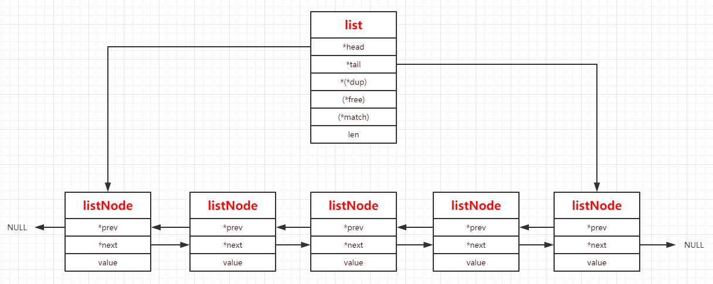

# adlist双端链表

## 简介

---
很好理解的双端链表，结构如下，不多做解释了。

</br>
</br>
</br>

## 结构体与宏定义

---

``` c
// 链表结点定义
typedef struct listNode {
    struct listNode *prev; // 前置结点
    struct listNode *next; // 后置结点
    void *value; // 数据
} listNode;
// 链表迭代器定义
typedef struct listIter {
    listNode *next;
    int direction; // 方向参数，正序和逆序
} listIter;
// 链表定义
typedef struct list {
    listNode *head; // 链表的头部结点
    listNode *tail; // 链表的尾部结点
    void *(*dup)(void *ptr); // 拷贝函数的函数指针，由使用者来实现其功能
    void (*free)(void *ptr); // 释放函数的函数指针，由使用者来实现其功能
    int (*match)(void *ptr, void *key); // 匹配函数的函数指针，由使用者来实现其功能
    unsigned long len; // 链表大小（结点个数）
} list;

#define listLength(l) ((l)->len) // 获取链表长度
#define listFirst(l) ((l)->head) // 获取链表头结点指针
#define listLast(l) ((l)->tail) // 获取链表尾结点指针
#define listPrevNode(n) ((n)->prev) // 获取当前结点的前置结点指针
#define listNextNode(n) ((n)->next) // 获取当前结点的后置结点指针
#define listNodeValue(n) ((n)->value) // 获取当前结点的value

#define listSetDupMethod(l,m) ((l)->dup = (m)) // 设定链表的复制函数
#define listSetFreeMethod(l,m) ((l)->free = (m)) // 设定链表的释放函数
#define listSetMatchMethod(l,m) ((l)->match = (m)) // 设定链表的匹配函数

#define listGetDupMethod(l) ((l)->dup) // 获取链表的复制函数
#define listGetFreeMethod(l) ((l)->free) // 获取链表的释放函数
#define listGetMatchMethod(l) ((l)->match) // 获取链表的匹配函数
```

</br>
</br>

## 函数功能总览

---

``` c
list *listCreate(void); // 创建链表
void listRelease(list *list);
void listEmpty(list *list);
list *listAddNodeHead(list *list, void *value);
list *listAddNodeTail(list *list, void *value);
list *listInsertNode(list *list, listNode *old_node, void *value, int after);
void listDelNode(list *list, listNode *node);
listIter *listGetIterator(list *list, int direction);
listNode *listNext(listIter *iter);
void listReleaseIterator(listIter *iter);
list *listDup(list *orig);
listNode *listSearchKey(list *list, void *key);
listNode *listIndex(list *list, long index);
void listRewind(list *list, listIter *li);
void listRewindTail(list *list, listIter *li);
void listRotate(list *list);
void listJoin(list *l, list *o);
```

</br>
</br>

## 函数实现

---

``` c
// 创建一个链表
list *listCreate(void)
{
    struct list *list;

    if ((list = zmalloc(sizeof(*list))) == NULL)
        return NULL;
    list->head = list->tail = NULL;
    list->len = 0;
    list->dup = NULL;
    list->free = NULL;
    list->match = NULL;
    return list;
}
```

``` c
// 链表清空
void listEmpty(list *list)
{
    unsigned long len;
    listNode *current, *next;

    current = list->head;
    len = list->len;
    while(len--) {
        next = current->next;
        if (list->free) list->free(current->value);
        zfree(current);
        current = next;
    }
    list->head = list->tail = NULL;
    list->len = 0;
}

void listRelease(list *list)
{
    listEmpty(list);
    zfree(list);
}
```

``` c
// 在头部新增一个结点
list *listAddNodeHead(list *list, void *value)
{
    listNode *node;

    if ((node = zmalloc(sizeof(*node))) == NULL)
        return NULL;
    node->value = value;
    if (list->len == 0) {
        list->head = list->tail = node;
        node->prev = node->next = NULL;
    } else {
        node->prev = NULL;
        node->next = list->head;
        list->head->prev = node;
        list->head = node;
    }
    list->len++;
    return list;
}
```

``` c
// 在尾部新增一个结点
list *listAddNodeTail(list *list, void *value)
{
    listNode *node;

    if ((node = zmalloc(sizeof(*node))) == NULL)
        return NULL;
    node->value = value;
    if (list->len == 0) {
        list->head = list->tail = node;
        node->prev = node->next = NULL;
    } else {
        node->prev = list->tail;
        node->next = NULL;
        list->tail->next = node;
        list->tail = node;
    }
    list->len++;
    return list;
}
```

``` c
// 在链表的old_node结点前或者后（由after变量指定）插入一个新的结点
list *listInsertNode(list *list, listNode *old_node, void *value, int after) {
    listNode *node;

    if ((node = zmalloc(sizeof(*node))) == NULL)
        return NULL;
    node->value = value;
    if (after) {
        node->prev = old_node;
        node->next = old_node->next;
        if (list->tail == old_node) {
            list->tail = node;
        }
    } else {
        node->next = old_node;
        node->prev = old_node->prev;
        if (list->head == old_node) {
            list->head = node;
        }
    }
    if (node->prev != NULL) {
        node->prev->next = node;
    }
    if (node->next != NULL) {
        node->next->prev = node;
    }
    list->len++;
    return list;
}
```

``` c
// 删除链表中的node结点
void listDelNode(list *list, listNode *node)
{
    if (node->prev)
        node->prev->next = node->next;
    else
        list->head = node->next;
    if (node->next)
        node->next->prev = node->prev;
    else
        list->tail = node->prev;
    if (list->free) list->free(node->value);
    zfree(node);
    list->len--;
}
```

``` c
// 获取列表迭代器，direction为方向参数，AL_START_HEAD正序和AL_START_TAIL逆序
listIter *listGetIterator(list *list, int direction)
{
    listIter *iter;

    if ((iter = zmalloc(sizeof(*iter))) == NULL) return NULL;
    if (direction == AL_START_HEAD)
        iter->next = list->head;
    else
        iter->next = list->tail;
    iter->direction = direction;
    return iter;
}
```

``` c
// 通过迭代器访问下一个结点
listNode *listNext(listIter *iter)
{
    listNode *current = iter->next;

    if (current != NULL) {
        if (iter->direction == AL_START_HEAD)
            iter->next = current->next;
        else
            iter->next = current->prev;
    }
    return current;
}
```

``` c
// 释放迭代器
void listReleaseIterator(listIter *iter) {
    zfree(iter);
}
```

``` c
// 链表复制
list *listDup(list *orig)
{
    list *copy;
    listIter iter;
    listNode *node;

    if ((copy = listCreate()) == NULL)
        return NULL;
    copy->dup = orig->dup;
    copy->free = orig->free;
    copy->match = orig->match;
    listRewind(orig, &iter);
    while((node = listNext(&iter)) != NULL) {
        void *value;

        if (copy->dup) {
            value = copy->dup(node->value);
            if (value == NULL) {
                listRelease(copy);
                return NULL;
            }
        } else
            value = node->value;
        if (listAddNodeTail(copy, value) == NULL) {
            listRelease(copy);
            return NULL;
        }
    }
    return copy;
}
```

``` c
// 查找key，如果链表有定义match函数，则通过match函数来查找，否则判断结点的value来和key是否相等
listNode *listSearchKey(list *list, void *key)
{
    listIter iter;
    listNode *node;

    listRewind(list, &iter);
    while((node = listNext(&iter)) != NULL) {
        if (list->match) {
            if (list->match(node->value, key)) {
                return node;
            }
        } else {
            if (key == node->value) {
                return node;
            }
        }
    }
    return NULL;
}
```

``` c
// 获取链表中第index的结点
listNode *listIndex(list *list, long index) {
    listNode *n;

    if (index < 0) {
        index = (-index)-1;
        n = list->tail;
        while(index-- && n) n = n->prev;
    } else {
        n = list->head;
        while(index-- && n) n = n->next;
    }
    return n;
}
```

``` c
// 获取链表首结点的迭代器
void listRewind(list *list, listIter *li) {
    li->next = list->head;
    li->direction = AL_START_HEAD;
}
```

``` c
// 获取链表尾结点的迭代器
void listRewindTail(list *list, listIter *li) {
    li->next = list->tail;
    li->direction = AL_START_TAIL;
}
```

``` c
// 将链表的尾节点移动插入到链表头部
void listRotate(list *list) {
    listNode *tail = list->tail;

    if (listLength(list) <= 1) return;

    /* Detach current tail */
    list->tail = tail->prev;
    list->tail->next = NULL;
    /* Move it as head */
    list->head->prev = tail;
    tail->prev = NULL;
    tail->next = list->head;
    list->head = tail;
}
```

``` c
// 将链表o插入到链表l的尾部
void listJoin(list *l, list *o) {
    if (o->head)
        o->head->prev = l->tail;

    if (l->tail)
        l->tail->next = o->head;
    else
        l->head = o->head;

    if (o->tail) l->tail = o->tail;
    l->len += o->len;

    /* Setup other as an empty list. */
    o->head = o->tail = NULL;
    o->len = 0;
}
```