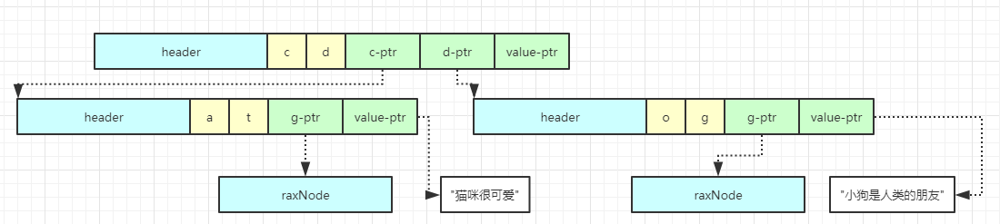

# rax基数树

## 简介

---
源码位置：rax.c/rax.h

Redis 5.0版本引入的一个新的数据结构。  

<font size=4>Rax核心数据结构：</font>  

字段说明：

1. iskey：占用1个bit。表示该节点是否包含key。
    * 0：没有key
    * 1：表示从头结点到该节点的父节点的路径完整的存储了key，查找的时候按子节点iskey=1判断key是否存在
2. isnull：占用1个bit。表示该节点是否存储value值。
3. iscompr：占用1个bit。表示该节点是否为压缩节点，决定了data的存储结构（如果当前节点有多个子节点，为非压缩结构，如果只有一个子节点，则为压缩结构）。
4. size：占用29个bit。
    * 非压缩：子节点的数量
    * 压缩：该节点字符个数
5. data：柔性数组。包含路由键，子节点指针，value指针。
    * 非压缩节点的data伪代码：

       ``` C
       struct data {
            char[] childKey; // 路由键字符列表
            raxNode*[] childNodes; // 多个子节点指针
            void* value; // 取决于 header 的 isNull 字段
       }
       ```

        图示如下：
       

    * 压缩节点的data伪代码：

       ``` C
       struct data {
           struct {
               char[] childKey; // 路由键字符列表
               raxNode* childNodes; // 单个子节点指针
           } child; // 取决于 header 的 size 字段是否为零（如果是叶节点，则不存在child）
            void* value; // 取决于 header 的 isNull 字段
       }
       ```

        图示如下：
       

</br>

<font size=4>Rax创建：</font>  
  

</br>

<font size=4>Rax插入：</font>  

<font size=3>1.在新创建的节点上插入<dog, "小狗是人类的朋友"></font>  


</br>
</br>

## 结构体与宏定义

---

``` c
#define RAX_NODE_MAX_SIZE ((1<<29)-1)
typedef struct raxNode {
    uint32_t iskey:1;       // 该节点是否包含key，1个bit
    uint32_t isnull:1;      // 该该节点是否存储value值，1个bit
    uint32_t iscompr:1;     // 该节点是否压缩，1个bit
    uint32_t size:29;       // 子节点的数量或者是压缩字符串的长度，29个bit
    unsigned char data[];   // 柔性数组，保存节点对应的数据，0bit
} raxNode; // raxNode size：4byte

typedef struct rax {
    raxNode *head;      // 头节点
    uint64_t numele;    // 元素个数
    uint64_t numnodes;  // 节点数
} rax;

#define RAX_STACK_STATIC_ITEMS 32
typedef struct raxStack {
    void **stack;
    size_t items, maxitems;
    void *static_items[RAX_STACK_STATIC_ITEMS];
    int oom;
} raxStack;

#define RAX_ITER_STATIC_LEN 128
#define RAX_ITER_JUST_SEEKED (1<<0)
#define RAX_ITER_EOF (1<<1)
#define RAX_ITER_SAFE (1<<2)
typedef struct raxIterator {
    int flags;
    rax *rt;                // 需要迭代的基数树
    unsigned char *key;     /* The current string. */
    void *data;             /* Data associated to this key. */
    size_t key_len;         /* Current key length. */
    size_t key_max;         /* Max key len the current key buffer can hold. */
    unsigned char key_static_string[RAX_ITER_STATIC_LEN];
    raxNode *node;          /* Current node. Only for unsafe iteration. */
    raxStack stack;         /* Stack used for unsafe iteration. */
    raxNodeCallback node_cb; /* Optional node callback. Normally set to NULL. */
} raxIterator;
```

</br>

## 函数功能总览

``` c
rax *raxNew(void);
int raxInsert(rax *rax, unsigned char *s, size_t len, void *data, void **old);
int raxTryInsert(rax *rax, unsigned char *s, size_t len, void *data, void **old);
int raxRemove(rax *rax, unsigned char *s, size_t len, void **old);
void *raxFind(rax *rax, unsigned char *s, size_t len);
void raxFree(rax *rax);
void raxFreeWithCallback(rax *rax, void (*free_callback)(void*));
void raxStart(raxIterator *it, rax *rt);
int raxSeek(raxIterator *it, const char *op, unsigned char *ele, size_t len);
int raxNext(raxIterator *it);
int raxPrev(raxIterator *it);
int raxRandomWalk(raxIterator *it, size_t steps);
int raxCompare(raxIterator *iter, const char *op, unsigned char *key, size_t key_len);
void raxStop(raxIterator *it);
int raxEOF(raxIterator *it);
void raxShow(rax *rax);
uint64_t raxSize(rax *rax);
unsigned long raxTouch(raxNode *n);
void raxSetDebugMsg(int onoff);

/* Internal API. May be used by the node callback in order to access rax nodes
 * in a low level way, so this function is exported as well. */
void raxSetData(raxNode *n, void *data);
```

</br>

## 主要函数实现

---

**创建：**

``` c
/* 为了内存对齐填充的字节，为什么需要填充，本质上来说是为了提高cpu性能。填充之后的数据首地址按照
 * sizeof(void*)字节对齐，保证每个节点都是内存对齐的：
 * 在64位系统中(sizeof(void*)=8)，节点大小如下：
 * 1. [header-4][padding-4] = 8byte
 * 2. [header-4][data-2][padding-2] = 8byte
 * 3. [header-4][data-11][padding-1] = 16byte
 */
#define raxPadding(nodesize) ((sizeof(void*)-((nodesize+4) % sizeof(void*))) & (sizeof(void*)-1))

// 创建基数树
rax *raxNew(void) {
    rax *rax = rax_malloc(sizeof(*rax)); // sizeof(*rax) = 4
    if (rax == NULL) return NULL;
    rax->numele = 0;
    rax->numnodes = 1;
    rax->head = raxNewNode(0,0); // 创建首节点
    if (rax->head == NULL) {
        rax_free(rax);
        return NULL;
    } else {
        return rax;
    }
}
// 创建一个节点
raxNode *raxNewNode(size_t children, int datafield) {
    size_t nodesize = sizeof(raxNode)+children+raxPadding(children)+
                      sizeof(raxNode*)*children;
    if (datafield) nodesize += sizeof(void*);
    raxNode *node = rax_malloc(nodesize);
    if (node == NULL) return NULL;
    node->iskey = 0;
    node->isnull = 0;
    node->iscompr = 0;
    node->size = children;
    return node;
}
```

**插入：**

``` c
int raxGenericInsert(rax *rax, unsigned char *s, size_t len, void *data, void **old, int overwrite) {
    size_t i;
    int j = 0; /* Split position. If raxLowWalk() stops in a compressed
                  node, the index 'j' represents the char we stopped within the
                  compressed node, that is, the position where to split the
                  node for insertion. */
    raxNode *h, **parentlink;

    debugf("### Insert %.*s with value %p\n", (int)len, s, data);
    i = raxLowWalk(rax,s,len,&h,&parentlink,&j,NULL);

    /* If i == len we walked following the whole string. If we are not
     * in the middle of a compressed node, the string is either already
     * inserted or this middle node is currently not a key, but can represent
     * our key. We have just to reallocate the node and make space for the
     * data pointer. */
    if (i == len && (!h->iscompr || j == 0 /* not in the middle if j is 0 */)) {
        debugf("### Insert: node representing key exists\n");
        /* Make space for the value pointer if needed. */
        if (!h->iskey || (h->isnull && overwrite)) {
            h = raxReallocForData(h,data);
            if (h) memcpy(parentlink,&h,sizeof(h));
        }
        if (h == NULL) {
            errno = ENOMEM;
            return 0;
        }

        /* Update the existing key if there is already one. */
        if (h->iskey) {
            if (old) *old = raxGetData(h);
            if (overwrite) raxSetData(h,data);
            errno = 0;
            return 0; /* Element already exists. */
        }

        /* Otherwise set the node as a key. Note that raxSetData()
         * will set h->iskey. */
        raxSetData(h,data);
        rax->numele++;
        return 1; /* Element inserted. */
    }

    /* If the node we stopped at is a compressed node, we need to
     * split it before to continue.
     *
     * Splitting a compressed node have a few possible cases.
     * Imagine that the node 'h' we are currently at is a compressed
     * node contaning the string "ANNIBALE" (it means that it represents
     * nodes A -> N -> N -> I -> B -> A -> L -> E with the only child
     * pointer of this node pointing at the 'E' node, because remember that
     * we have characters at the edges of the graph, not inside the nodes
     * themselves.
     *
     * In order to show a real case imagine our node to also point to
     * another compressed node, that finally points at the node without
     * children, representing 'O':
     *
     *     "ANNIBALE" -> "SCO" -> []
     *
     * When inserting we may face the following cases. Note that all the cases
     * require the insertion of a non compressed node with exactly two
     * children, except for the last case which just requires splitting a
     * compressed node.
     *
     * 1) Inserting "ANNIENTARE"
     *
     *               |B| -> "ALE" -> "SCO" -> []
     *     "ANNI" -> |-|
     *               |E| -> (... continue algo ...) "NTARE" -> []
     *
     * 2) Inserting "ANNIBALI"
     *
     *                  |E| -> "SCO" -> []
     *     "ANNIBAL" -> |-|
     *                  |I| -> (... continue algo ...) []
     *
     * 3) Inserting "AGO" (Like case 1, but set iscompr = 0 into original node)
     *
     *            |N| -> "NIBALE" -> "SCO" -> []
     *     |A| -> |-|
     *            |G| -> (... continue algo ...) |O| -> []
     *
     * 4) Inserting "CIAO"
     *
     *     |A| -> "NNIBALE" -> "SCO" -> []
     *     |-|
     *     |C| -> (... continue algo ...) "IAO" -> []
     *
     * 5) Inserting "ANNI"
     *
     *     "ANNI" -> "BALE" -> "SCO" -> []
     *
     * The final algorithm for insertion covering all the above cases is as
     * follows.
     *
     * ============================= ALGO 1 =============================
     *
     * For the above cases 1 to 4, that is, all cases where we stopped in
     * the middle of a compressed node for a character mismatch, do:
     *
     * Let $SPLITPOS be the zero-based index at which, in the
     * compressed node array of characters, we found the mismatching
     * character. For example if the node contains "ANNIBALE" and we add
     * "ANNIENTARE" the $SPLITPOS is 4, that is, the index at which the
     * mismatching character is found.
     *
     * 1. Save the current compressed node $NEXT pointer (the pointer to the
     *    child element, that is always present in compressed nodes).
     *
     * 2. Create "split node" having as child the non common letter
     *    at the compressed node. The other non common letter (at the key)
     *    will be added later as we continue the normal insertion algorithm
     *    at step "6".
     *
     * 3a. IF $SPLITPOS == 0:
     *     Replace the old node with the split node, by copying the auxiliary
     *     data if any. Fix parent's reference. Free old node eventually
     *     (we still need its data for the next steps of the algorithm).
     *
     * 3b. IF $SPLITPOS != 0:
     *     Trim the compressed node (reallocating it as well) in order to
     *     contain $splitpos characters. Change chilid pointer in order to link
     *     to the split node. If new compressed node len is just 1, set
     *     iscompr to 0 (layout is the same). Fix parent's reference.
     *
     * 4a. IF the postfix len (the length of the remaining string of the
     *     original compressed node after the split character) is non zero,
     *     create a "postfix node". If the postfix node has just one character
     *     set iscompr to 0, otherwise iscompr to 1. Set the postfix node
     *     child pointer to $NEXT.
     *
     * 4b. IF the postfix len is zero, just use $NEXT as postfix pointer.
     *
     * 5. Set child[0] of split node to postfix node.
     *
     * 6. Set the split node as the current node, set current index at child[1]
     *    and continue insertion algorithm as usually.
     *
     * ============================= ALGO 2 =============================
     *
     * For case 5, that is, if we stopped in the middle of a compressed
     * node but no mismatch was found, do:
     *
     * Let $SPLITPOS be the zero-based index at which, in the
     * compressed node array of characters, we stopped iterating because
     * there were no more keys character to match. So in the example of
     * the node "ANNIBALE", addig the string "ANNI", the $SPLITPOS is 4.
     *
     * 1. Save the current compressed node $NEXT pointer (the pointer to the
     *    child element, that is always present in compressed nodes).
     *
     * 2. Create a "postfix node" containing all the characters from $SPLITPOS
     *    to the end. Use $NEXT as the postfix node child pointer.
     *    If the postfix node length is 1, set iscompr to 0.
     *    Set the node as a key with the associated value of the new
     *    inserted key.
     *
     * 3. Trim the current node to contain the first $SPLITPOS characters.
     *    As usually if the new node length is just 1, set iscompr to 0.
     *    Take the iskey / associated value as it was in the orignal node.
     *    Fix the parent's reference.
     *
     * 4. Set the postfix node as the only child pointer of the trimmed
     *    node created at step 1.
     */

    /* ------------------------- ALGORITHM 1 --------------------------- */
    if (h->iscompr && i != len) {
        debugf("ALGO 1: Stopped at compressed node %.*s (%p)\n",
            h->size, h->data, (void*)h);
        debugf("Still to insert: %.*s\n", (int)(len-i), s+i);
        debugf("Splitting at %d: '%c'\n", j, ((char*)h->data)[j]);
        debugf("Other (key) letter is '%c'\n", s[i]);

        /* 1: Save next pointer. */
        raxNode **childfield = raxNodeLastChildPtr(h);
        raxNode *next;
        memcpy(&next,childfield,sizeof(next));
        debugf("Next is %p\n", (void*)next);
        debugf("iskey %d\n", h->iskey);
        if (h->iskey) {
            debugf("key value is %p\n", raxGetData(h));
        }

        /* Set the length of the additional nodes we will need. */
        size_t trimmedlen = j;
        size_t postfixlen = h->size - j - 1;
        int split_node_is_key = !trimmedlen && h->iskey && !h->isnull;
        size_t nodesize;

        /* 2: Create the split node. Also allocate the other nodes we'll need
         *    ASAP, so that it will be simpler to handle OOM. */
        raxNode *splitnode = raxNewNode(1, split_node_is_key);
        raxNode *trimmed = NULL;
        raxNode *postfix = NULL;

        if (trimmedlen) {
            nodesize = sizeof(raxNode)+trimmedlen+raxPadding(trimmedlen)+
                       sizeof(raxNode*);
            if (h->iskey && !h->isnull) nodesize += sizeof(void*);
            trimmed = rax_malloc(nodesize);
        }

        if (postfixlen) {
            nodesize = sizeof(raxNode)+postfixlen+raxPadding(postfixlen)+
                       sizeof(raxNode*);
            postfix = rax_malloc(nodesize);
        }

        /* OOM? Abort now that the tree is untouched. */
        if (splitnode == NULL ||
            (trimmedlen && trimmed == NULL) ||
            (postfixlen && postfix == NULL))
        {
            rax_free(splitnode);
            rax_free(trimmed);
            rax_free(postfix);
            errno = ENOMEM;
            return 0;
        }
        splitnode->data[0] = h->data[j];

        if (j == 0) {
            /* 3a: Replace the old node with the split node. */
            if (h->iskey) {
                void *ndata = raxGetData(h);
                raxSetData(splitnode,ndata);
            }
            memcpy(parentlink,&splitnode,sizeof(splitnode));
        } else {
            /* 3b: Trim the compressed node. */
            trimmed->size = j;
            memcpy(trimmed->data,h->data,j);
            trimmed->iscompr = j > 1 ? 1 : 0;
            trimmed->iskey = h->iskey;
            trimmed->isnull = h->isnull;
            if (h->iskey && !h->isnull) {
                void *ndata = raxGetData(h);
                raxSetData(trimmed,ndata);
            }
            raxNode **cp = raxNodeLastChildPtr(trimmed);
            memcpy(cp,&splitnode,sizeof(splitnode));
            memcpy(parentlink,&trimmed,sizeof(trimmed));
            parentlink = cp; /* Set parentlink to splitnode parent. */
            rax->numnodes++;
        }

        /* 4: Create the postfix node: what remains of the original
         * compressed node after the split. */
        if (postfixlen) {
            /* 4a: create a postfix node. */
            postfix->iskey = 0;
            postfix->isnull = 0;
            postfix->size = postfixlen;
            postfix->iscompr = postfixlen > 1;
            memcpy(postfix->data,h->data+j+1,postfixlen);
            raxNode **cp = raxNodeLastChildPtr(postfix);
            memcpy(cp,&next,sizeof(next));
            rax->numnodes++;
        } else {
            /* 4b: just use next as postfix node. */
            postfix = next;
        }

        /* 5: Set splitnode first child as the postfix node. */
        raxNode **splitchild = raxNodeLastChildPtr(splitnode);
        memcpy(splitchild,&postfix,sizeof(postfix));

        /* 6. Continue insertion: this will cause the splitnode to
         * get a new child (the non common character at the currently
         * inserted key). */
        rax_free(h);
        h = splitnode;
    } else if (h->iscompr && i == len) {
    /* ------------------------- ALGORITHM 2 --------------------------- */
        debugf("ALGO 2: Stopped at compressed node %.*s (%p) j = %d\n",
            h->size, h->data, (void*)h, j);

        /* Allocate postfix & trimmed nodes ASAP to fail for OOM gracefully. */
        size_t postfixlen = h->size - j;
        size_t nodesize = sizeof(raxNode)+postfixlen+raxPadding(postfixlen)+
                          sizeof(raxNode*);
        if (data != NULL) nodesize += sizeof(void*);
        raxNode *postfix = rax_malloc(nodesize);

        nodesize = sizeof(raxNode)+j+raxPadding(j)+sizeof(raxNode*);
        if (h->iskey && !h->isnull) nodesize += sizeof(void*);
        raxNode *trimmed = rax_malloc(nodesize);

        if (postfix == NULL || trimmed == NULL) {
            rax_free(postfix);
            rax_free(trimmed);
            errno = ENOMEM;
            return 0;
        }

        /* 1: Save next pointer. */
        raxNode **childfield = raxNodeLastChildPtr(h);
        raxNode *next;
        memcpy(&next,childfield,sizeof(next));

        /* 2: Create the postfix node. */
        postfix->size = postfixlen;
        postfix->iscompr = postfixlen > 1;
        postfix->iskey = 1;
        postfix->isnull = 0;
        memcpy(postfix->data,h->data+j,postfixlen);
        raxSetData(postfix,data);
        raxNode **cp = raxNodeLastChildPtr(postfix);
        memcpy(cp,&next,sizeof(next));
        rax->numnodes++;

        /* 3: Trim the compressed node. */
        trimmed->size = j;
        trimmed->iscompr = j > 1;
        trimmed->iskey = 0;
        trimmed->isnull = 0;
        memcpy(trimmed->data,h->data,j);
        memcpy(parentlink,&trimmed,sizeof(trimmed));
        if (h->iskey) {
            void *aux = raxGetData(h);
            raxSetData(trimmed,aux);
        }

        /* Fix the trimmed node child pointer to point to
         * the postfix node. */
        cp = raxNodeLastChildPtr(trimmed);
        memcpy(cp,&postfix,sizeof(postfix));

        /* Finish! We don't need to continue with the insertion
         * algorithm for ALGO 2. The key is already inserted. */
        rax->numele++;
        rax_free(h);
        return 1; /* Key inserted. */
    }

    /* We walked the radix tree as far as we could, but still there are left
     * chars in our string. We need to insert the missing nodes. */
    while(i < len) {
        raxNode *child;

        /* If this node is going to have a single child, and there
         * are other characters, so that that would result in a chain
         * of single-childed nodes, turn it into a compressed node. */
        if (h->size == 0 && len-i > 1) {
            debugf("Inserting compressed node\n");
            size_t comprsize = len-i;
            if (comprsize > RAX_NODE_MAX_SIZE)
                comprsize = RAX_NODE_MAX_SIZE;
            raxNode *newh = raxCompressNode(h,s+i,comprsize,&child);
            if (newh == NULL) goto oom;
            h = newh;
            memcpy(parentlink,&h,sizeof(h));
            parentlink = raxNodeLastChildPtr(h);
            i += comprsize;
        } else {
            debugf("Inserting normal node\n");
            raxNode **new_parentlink;
            raxNode *newh = raxAddChild(h,s[i],&child,&new_parentlink);
            if (newh == NULL) goto oom;
            h = newh;
            memcpy(parentlink,&h,sizeof(h));
            parentlink = new_parentlink;
            i++;
        }
        rax->numnodes++;
        h = child;
    }
    raxNode *newh = raxReallocForData(h,data);
    if (newh == NULL) goto oom;
    h = newh;
    if (!h->iskey) rax->numele++;
    raxSetData(h,data);
    memcpy(parentlink,&h,sizeof(h));
    return 1; /* Element inserted. */

oom:
    /* This code path handles out of memory after part of the sub-tree was
     * already modified. Set the node as a key, and then remove it. However we
     * do that only if the node is a terminal node, otherwise if the OOM
     * happened reallocating a node in the middle, we don't need to free
     * anything. */
    if (h->size == 0) {
        h->isnull = 1;
        h->iskey = 1;
        rax->numele++; /* Compensate the next remove. */
        assert(raxRemove(rax,s,i,NULL) != 0);
    }
    errno = ENOMEM;
    return 0;
}
```
