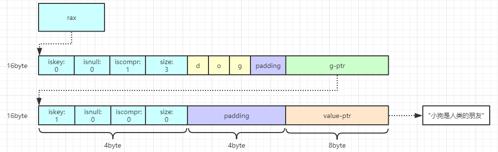

# rax基数树

## 简介

---
源码位置：rax.c/rax.h

Redis 5.0版本引入的一个新的数据结构。目前主要用在stream这个数据结构上。Rax是一个有序字典树（基数树），按照key的字典序排列，支持快速定位、查找和删除操作。  

<font size=4>一、Rax数据结构：</font>  

字段说明：

1. iskey：占用1个bit。表示该节点是否包含key。
    * 0：没有key
    * 1：表示从头结点到该节点的父节点的路径完整的存储了key，查找的时候按子节点iskey=1判断key是否存在
2. isnull：占用1个bit。表示该节点是否存储value值。
3. iscompr：占用1个bit。表示该节点是否为压缩节点，决定了data的存储结构（如果当前节点有多个子节点，为非压缩结构，如果只有一个子节点，则为压缩结构）。
4. size：占用29个bit。
    * 非压缩：子节点的数量
    * 压缩：该节点字符个数
5. data：柔性数组。包含路由键，子节点指针，value指针。为了提高cpu性能，data内存空间对齐(sizeof(void*))，所以会根据计算结果来进行相应的字节填充。
    * 非压缩节点的data伪代码：

       ``` C
       struct data {
            char[] childKey; // 路由键字符列表
            raxNode*[] childNodes; // 多个子节点指针
            void* value; // 取决于 header 的 isNull 字段
       }
       ```

    * 压缩节点的data伪代码：

       ``` C
       struct data {
           struct {
               char[] childKey; // 路由键字符列表
               raxNode* childNodes; // 单个子节点指针
           } child; // 取决于 header 的 size 字段是否为零（如果是叶节点，则不存在child）
            void* value; // 取决于 header 的 isNull 字段
       }
       ```

        非压缩与压缩节点图示如下：
       

</br>

<font size=4>二、Rax创建：</font>  
  

</br>

<font size=4>三、Rax插入：</font>  
ps：以下内容中的padding皆是为了内存对齐填充的空间。  

<font size=3>1. 在空的基数树中插入数据：<dog, "狗是人类的朋友"></font>  
解析：  
首先从头结点开始查找，因为这是一个空的基数树，所以直接将"dog"插入到节点中，设置该节点为压缩节点（iscompr=1）,padding部分是为了内存对齐而填充的，创建该节点的叶子结点，叶子结点中，iskey=1是表示从头结点到该节点的父节点是一个完整的key，iskey=1 && isnull=0表示该叶子结点存储了key的value。  
结果如下图：  


<font size=3>2. 接着插入数据：<cat, "猫咪很可爱"></font>  
解析：  
接着上面的基数树，从头结点开始查找，当前头结点存储的第一个字符是'd'，与要插入的key的第一个字符'c'不相等，所以需要将该节点拆分成两个节点（拆分的过程可看我下面的源码注释），分别存储[d]和[og]，此时基数树有3个节点。随后将字符'c'插入到首节点中，接着创建'c'子节点，将[at]插入到子节点中，并创建子节点的叶节点插入value的指针，此时基数树存在5个节点，元素个数为2。  
结果如下图：  


<font size=3>3. 接着插入数据：<doggy, "小狗很可爱"></font>  
解析：  
接着上面的基数树，从头结点开始查找key['doggy']，发现头结点只有一个'd'，接着在'd'的子节点node_1中比较['oggy']，找到['og']，'og'的子节点为叶子结点，这时只要直接把['gy']插入到叶子结点中，并创建一个'gy'的叶子结点插入value指针，即可完成插入。此时该基数树的节点数为6，元素个数为3。  
结果如下图：  


<font size=3>4. 接着插入数据：<carry, "携带"></font>  
解析：  
步骤如上一步，当匹配到节点['at']时，需要拆分该节点为['a']节点和['rt']节点， ['a']为['rt']的父节点，['rt']节点为非压缩节点，'r'指针指向新的节点['ry']，并创建['ry']的叶子结点，'t'指针指向原先的叶子结点，基数树右边部分保持不变，完成插入操作。此时该基数树的节点数为9，元素个数为4。  
结果如下图：  


</br>

<font size=4>四、Rax查找：</font>  
查找实现函数为：raxLowWalk()  
从基数树的头节点往下遍历。比较节点的data值，并通过子节点指针往下继续遍历，直到找到完整的key。

</br>

<font size=4>五、Rax删除：</font>  
分为几个步骤：  

1. 通过raxLowWalk()找到要删除的key的节点
2. 接着判断删除后，附近节点是否可以进行压缩、收敛树的高度
3. 如果可以压缩，则进行压缩合并，合并的条件如下：

   * iskey=1的节点
   * 子节点只有一个字符
   * 父节点只有一个子节点

</br>
</br>

## 结构体与宏定义

---

``` c
#define RAX_NODE_MAX_SIZE ((1<<29)-1)
typedef struct raxNode {
    uint32_t iskey:1;       // 该节点是否包含key，1个bit
    uint32_t isnull:1;      // 该该节点是否存储value值，1个bit
    uint32_t iscompr:1;     // 该节点是否压缩，1个bit
    uint32_t size:29;       // 子节点的数量或者是压缩字符串的长度，29个bit
    unsigned char data[];   // 柔性数组，保存节点对应的数据，0bit
} raxNode; // raxNode size：4byte

typedef struct rax {
    raxNode *head;      // 头节点
    uint64_t numele;    // 元素个数
    uint64_t numnodes;  // 节点数
} rax;

#define RAX_STACK_STATIC_ITEMS 32
typedef struct raxStack {
    void **stack; // 存储每一层节点的地址
    size_t items, maxitems;
    void *static_items[RAX_STACK_STATIC_ITEMS];
    int oom;
} raxStack; // 用于迭代，查找，删除的时候记录节点信息的栈结构，FILO

#define RAX_ITER_STATIC_LEN 128
#define RAX_ITER_JUST_SEEKED (1<<0)
#define RAX_ITER_EOF (1<<1)
#define RAX_ITER_SAFE (1<<2)
typedef struct raxIterator {
    int flags;
    rax *rt;                // 需要迭代的基数树
    unsigned char *key;     /* The current string. */
    void *data;             /* Data associated to this key. */
    size_t key_len;         /* Current key length. */
    size_t key_max;         /* Max key len the current key buffer can hold. */
    unsigned char key_static_string[RAX_ITER_STATIC_LEN];
    raxNode *node;          /* Current node. Only for unsafe iteration. */
    raxStack stack;         /* Stack used for unsafe iteration. */
    raxNodeCallback node_cb; /* Optional node callback. Normally set to NULL. */
} raxIterator;

/* 为了内存对齐填充的字节，为什么需要填充，本质上来说是为了提高cpu性能。填充之后的数据首地址按照
 * sizeof(void*)字节对齐，保证每个节点都是内存对齐的：
 * 在64位系统中(sizeof(void*)=8)，节点大小如下：
 * 1. [header-4][padding-4] = 8byte
 * 2. [header-4][data-2][padding-2] = 8byte
 * 3. [header-4][data-11][padding-1] = 16byte
 */
#define raxPadding(nodesize) ((sizeof(void*)-((nodesize+4) % sizeof(void*))) & (sizeof(void*)-1))
```

</br>

## 函数功能总览

``` c
rax *raxNew(void);
int raxInsert(rax *rax, unsigned char *s, size_t len, void *data, void **old);
int raxTryInsert(rax *rax, unsigned char *s, size_t len, void *data, void **old);
int raxRemove(rax *rax, unsigned char *s, size_t len, void **old);
void *raxFind(rax *rax, unsigned char *s, size_t len);
void raxFree(rax *rax);
void raxFreeWithCallback(rax *rax, void (*free_callback)(void*));
void raxStart(raxIterator *it, rax *rt);
int raxSeek(raxIterator *it, const char *op, unsigned char *ele, size_t len);
int raxNext(raxIterator *it);
int raxPrev(raxIterator *it);
int raxRandomWalk(raxIterator *it, size_t steps);
int raxCompare(raxIterator *iter, const char *op, unsigned char *key, size_t key_len);
void raxStop(raxIterator *it);
int raxEOF(raxIterator *it);
void raxShow(rax *rax);
uint64_t raxSize(rax *rax);
unsigned long raxTouch(raxNode *n);
void raxSetDebugMsg(int onoff);

/* Internal API. May be used by the node callback in order to access rax nodes
 * in a low level way, so this function is exported as well. */
void raxSetData(raxNode *n, void *data);
```

</br>

## 主要函数实现

---

**创建：**

``` c
// 创建基数树
rax *raxNew(void) {
    rax *rax = rax_malloc(sizeof(*rax)); // sizeof(*rax) = 4
    if (rax == NULL) return NULL;
    rax->numele = 0;
    rax->numnodes = 1;
    rax->head = raxNewNode(0,0); // 创建首节点
    if (rax->head == NULL) {
        rax_free(rax);
        return NULL;
    } else {
        return rax;
    }
}
// 创建一个节点
raxNode *raxNewNode(size_t children, int datafield) {
    size_t nodesize = sizeof(raxNode)+children+raxPadding(children)+
                      sizeof(raxNode*)*children;
    if (datafield) nodesize += sizeof(void*);
    raxNode *node = rax_malloc(nodesize);
    if (node == NULL) return NULL;
    node->iskey = 0;
    node->isnull = 0;
    node->iscompr = 0;
    node->size = children;
    return node;
}
```

**查找：**

``` c
static inline size_t raxLowWalk(rax *rax, unsigned char *s, size_t len, raxNode **stopnode, raxNode ***plink, int *splitpos, raxStack *ts) {
    raxNode *h = rax->head; // 从头节点开始往下遍历
    raxNode **parentlink = &rax->head;

    size_t i = 0; /* Position in the string. */
    size_t j = 0; /* Position in the node children (or bytes if compressed).*/
    while(h->size && i < len) {
        debugnode("Lookup current node",h);
        unsigned char *v = h->data;

        if (h->iscompr) {
            /* 如果是压缩节点，表明该节点存储的全部字符应该和s中的部分或者全部字符相等
             * 例如：
             * 1. node:[header|'abcd'|d-ptr]  s:['abc']  那么j=3
             * 2. node:[header|'ab'|b-ptr] s:['abc'] 继续往下遍历节点(b-ptr)找到字符'C'
             *    然后在子节点中确定'c'的位置j */
            for (j = 0; j < h->size && i < len; j++, i++) {
                if (v[j] != s[i]) break;
            }
            if (j != h->size) break; // 表示已经找到节点，退出循环
        } else {
            /* 如果是非压缩节点，找到s[i]字符的位置j
             * 例如：
             * node:[header|'abc'|'a-ptr'|'b-ptr'|'c-ptr']， s[i]:['b']，那么j=1
             * 然后可以根据j来确定子节点的地址'b-ptr'，便可继续往下遍历 */
            for (j = 0; j < h->size; j++) {
                if (v[j] == s[i]) break;
            }
            if (j == h->size) break;
            i++;
        }

        if (ts) raxStackPush(ts,h); // 将当前节点压入栈中
        raxNode **children = raxNodeFirstChildPtr(h); // 获取当前节点的第一个子节点指针的地址
        if (h->iscompr) j = 0; /* 压缩节点不需要设置偏移量j */
        memcpy(&h,children+j,sizeof(h)); // 根据偏移量j计算得到子节点的指针，并拷贝给h，接着继续while循环往下遍历
        parentlink = children+j;
        j = 0;
    }
    debugnode("Lookup stop node is",h);
    if (stopnode) *stopnode = h;
    if (plink) *plink = parentlink;
    if (splitpos && h->iscompr) *splitpos = j;
    return i;
}

void *raxFind(rax *rax, unsigned char *s, size_t len) {
    raxNode *h;

    debugf("### Lookup: %.*s\n", (int)len, s);
    int splitpos = 0;
    size_t i = raxLowWalk(rax,s,len,&h,NULL,&splitpos,NULL);
    if (i != len || (h->iscompr && splitpos != 0) || !h->iskey)
        return raxNotFound;
    return raxGetData(h);
}
```

**插入：**

``` c
int raxGenericInsert(rax *rax, unsigned char *s, size_t len, void *data, void **old, int overwrite) {
    size_t i;
    int j = 0;
    raxNode *h, **parentlink;

    debugf("### Insert %.*s with value %p\n", (int)len, s, data);
    i = raxLowWalk(rax,s,len,&h,&parentlink,&j,NULL); // 确定插入的节点位置，如果是压缩节点，确定分割位置j

    // 如果s已经存在于rax中
    if (i == len && (!h->iscompr || j == 0)) {
        debugf("### Insert: node representing key exists\n");
        if (!h->iskey || (h->isnull && overwrite)) {
            h = raxReallocForData(h,data); // 为值指针分配空间
            if (h) memcpy(parentlink,&h,sizeof(h));
        }
        if (h == NULL) {
            errno = ENOMEM;
            return 0;
        }

        /* Update the existing key if there is already one. */
        if (h->iskey) {
            // 如果该key以存在，则根据需要是否重写value
            if (old) *old = raxGetData(h);
            if (overwrite) raxSetData(h,data);
            errno = 0;
            return 0; /* Element already exists. */
        }

        /* Otherwise set the node as a key. Note that raxSetData()
         * will set h->iskey. */
        // 插入value
        raxSetData(h,data);
        rax->numele++;
        return 1; /* Element inserted. */
    }

    /* ------------------------- ALGORITHM 1 --------------------------- */
    if (h->iscompr && i != len) {
        // 如果遍历后停在压缩节点上
        debugf("ALGO 1: Stopped at compressed node %.*s (%p)\n",
            h->size, h->data, (void*)h);
        debugf("Still to insert: %.*s\n", (int)(len-i), s+i);
        debugf("Splitting at %d: '%c'\n", j, ((char*)h->data)[j]);
        debugf("Other (key) letter is '%c'\n", s[i]);

        /* 1: Save next pointer. */
        raxNode **childfield = raxNodeLastChildPtr(h);
        raxNode *next;
        memcpy(&next,childfield,sizeof(next));
        debugf("Next is %p\n", (void*)next);
        debugf("iskey %d\n", h->iskey);
        if (h->iskey) {
            debugf("key value is %p\n", raxGetData(h));
        }

        /* Set the length of the additional nodes we will need. */
        size_t trimmedlen = j;
        size_t postfixlen = h->size - j - 1;
        int split_node_is_key = !trimmedlen && h->iskey && !h->isnull;
        size_t nodesize;

        /* 2: Create the split node. Also allocate the other nodes we'll need
         *    ASAP, so that it will be simpler to handle OOM. */
        raxNode *splitnode = raxNewNode(1, split_node_is_key);
        raxNode *trimmed = NULL;
        raxNode *postfix = NULL;

        if (trimmedlen) {
            nodesize = sizeof(raxNode)+trimmedlen+raxPadding(trimmedlen)+
                       sizeof(raxNode*);
            if (h->iskey && !h->isnull) nodesize += sizeof(void*);
            trimmed = rax_malloc(nodesize);
        }

        if (postfixlen) {
            nodesize = sizeof(raxNode)+postfixlen+raxPadding(postfixlen)+
                       sizeof(raxNode*);
            postfix = rax_malloc(nodesize);
        }

        /* OOM? Abort now that the tree is untouched. */
        if (splitnode == NULL ||
            (trimmedlen && trimmed == NULL) ||
            (postfixlen && postfix == NULL))
        {
            rax_free(splitnode);
            rax_free(trimmed);
            rax_free(postfix);
            errno = ENOMEM;
            return 0;
        }
        splitnode->data[0] = h->data[j];

        if (j == 0) {
            /* 3a: Replace the old node with the split node. */
            if (h->iskey) {
                void *ndata = raxGetData(h);
                raxSetData(splitnode,ndata);
            }
            memcpy(parentlink,&splitnode,sizeof(splitnode));
        } else {
            /* 3b: Trim the compressed node. */
            trimmed->size = j;
            memcpy(trimmed->data,h->data,j);
            trimmed->iscompr = j > 1 ? 1 : 0;
            trimmed->iskey = h->iskey;
            trimmed->isnull = h->isnull;
            if (h->iskey && !h->isnull) {
                void *ndata = raxGetData(h);
                raxSetData(trimmed,ndata);
            }
            raxNode **cp = raxNodeLastChildPtr(trimmed);
            memcpy(cp,&splitnode,sizeof(splitnode));
            memcpy(parentlink,&trimmed,sizeof(trimmed));
            parentlink = cp; /* Set parentlink to splitnode parent. */
            rax->numnodes++;
        }

        /* 4: Create the postfix node: what remains of the original
         * compressed node after the split. */
        if (postfixlen) {
            /* 4a: create a postfix node. */
            postfix->iskey = 0;
            postfix->isnull = 0;
            postfix->size = postfixlen;
            postfix->iscompr = postfixlen > 1;
            memcpy(postfix->data,h->data+j+1,postfixlen);
            raxNode **cp = raxNodeLastChildPtr(postfix);
            memcpy(cp,&next,sizeof(next));
            rax->numnodes++;
        } else {
            /* 4b: just use next as postfix node. */
            postfix = next;
        }

        /* 5: Set splitnode first child as the postfix node. */
        raxNode **splitchild = raxNodeLastChildPtr(splitnode);
        memcpy(splitchild,&postfix,sizeof(postfix));

        /* 6. Continue insertion: this will cause the splitnode to
         * get a new child (the non common character at the currently
         * inserted key). */
        rax_free(h);
        h = splitnode;
    } else if (h->iscompr && i == len) {
    /* ------------------------- ALGORITHM 2 --------------------------- */
        // 如果在压缩节点h中找到了所有的字符，则创建一个子节点插入
        debugf("ALGO 2: Stopped at compressed node %.*s (%p) j = %d\n",
            h->size, h->data, (void*)h, j);

        /* Allocate postfix & trimmed nodes ASAP to fail for OOM gracefully. */
        size_t postfixlen = h->size - j;
        size_t nodesize = sizeof(raxNode)+postfixlen+raxPadding(postfixlen)+
                          sizeof(raxNode*);
        if (data != NULL) nodesize += sizeof(void*);
        raxNode *postfix = rax_malloc(nodesize);

        nodesize = sizeof(raxNode)+j+raxPadding(j)+sizeof(raxNode*);
        if (h->iskey && !h->isnull) nodesize += sizeof(void*);
        raxNode *trimmed = rax_malloc(nodesize);

        if (postfix == NULL || trimmed == NULL) {
            rax_free(postfix);
            rax_free(trimmed);
            errno = ENOMEM;
            return 0;
        }

        /* 1: Save next pointer. */
        raxNode **childfield = raxNodeLastChildPtr(h);
        raxNode *next;
        memcpy(&next,childfield,sizeof(next));

        /* 2: Create the postfix node. */
        postfix->size = postfixlen;
        postfix->iscompr = postfixlen > 1;
        postfix->iskey = 1;
        postfix->isnull = 0;
        memcpy(postfix->data,h->data+j,postfixlen);
        raxSetData(postfix,data);
        raxNode **cp = raxNodeLastChildPtr(postfix);
        memcpy(cp,&next,sizeof(next));
        rax->numnodes++;

        /* 3: Trim the compressed node. */
        trimmed->size = j;
        trimmed->iscompr = j > 1;
        trimmed->iskey = 0;
        trimmed->isnull = 0;
        memcpy(trimmed->data,h->data,j);
        memcpy(parentlink,&trimmed,sizeof(trimmed));
        if (h->iskey) {
            void *aux = raxGetData(h);
            raxSetData(trimmed,aux);
        }

        /* Fix the trimmed node child pointer to point to
         * the postfix node. */
        cp = raxNodeLastChildPtr(trimmed);
        memcpy(cp,&postfix,sizeof(postfix));

        /* Finish! We don't need to continue with the insertion
         * algorithm for ALGO 2. The key is already inserted. */
        rax->numele++;
        rax_free(h);
        return 1; /* Key inserted. */
    }

    /* We walked the radix tree as far as we could, but still there are left
     * chars in our string. We need to insert the missing nodes. */
    while(i < len) {
        raxNode *child;

        /* If this node is going to have a single child, and there
         * are other characters, so that that would result in a chain
         * of single-childed nodes, turn it into a compressed node. */
        if (h->size == 0 && len-i > 1) {
            debugf("Inserting compressed node\n");
            size_t comprsize = len-i;
            if (comprsize > RAX_NODE_MAX_SIZE)
                comprsize = RAX_NODE_MAX_SIZE;
            raxNode *newh = raxCompressNode(h,s+i,comprsize,&child);
            if (newh == NULL) goto oom;
            h = newh;
            memcpy(parentlink,&h,sizeof(h));
            parentlink = raxNodeLastChildPtr(h);
            i += comprsize;
        } else {
            debugf("Inserting normal node\n");
            raxNode **new_parentlink;
            raxNode *newh = raxAddChild(h,s[i],&child,&new_parentlink);
            if (newh == NULL) goto oom;
            h = newh;
            memcpy(parentlink,&h,sizeof(h));
            parentlink = new_parentlink;
            i++;
        }
        rax->numnodes++;
        h = child;
    }
    raxNode *newh = raxReallocForData(h,data);
    if (newh == NULL) goto oom;
    h = newh;
    if (!h->iskey) rax->numele++;
    raxSetData(h,data);
    memcpy(parentlink,&h,sizeof(h));
    return 1; /* Element inserted. */

oom:
    /* This code path handles out of memory after part of the sub-tree was
     * already modified. Set the node as a key, and then remove it. However we
     * do that only if the node is a terminal node, otherwise if the OOM
     * happened reallocating a node in the middle, we don't need to free
     * anything. */
    if (h->size == 0) {
        h->isnull = 1;
        h->iskey = 1;
        rax->numele++; /* Compensate the next remove. */
        assert(raxRemove(rax,s,i,NULL) != 0);
    }
    errno = ENOMEM;
    return 0;
}
```

**删除：**

``` c
int raxRemove(rax *rax, unsigned char *s, size_t len, void **old) {
    raxNode *h;
    raxStack ts;

    debugf("### Delete: %.*s\n", (int)len, s);
    raxStackInit(&ts);
    int splitpos = 0;
    size_t i = raxLowWalk(rax,s,len,&h,NULL,&splitpos,&ts); // 将基数树路径上的节点压入ts栈中
    if (i != len || (h->iscompr && splitpos != 0) || !h->iskey) {
        raxStackFree(&ts);
        return 0;
    }
    if (old) *old = raxGetData(h); // 如果需要旧数据，则获取旧数据
    h->iskey = 0;
    rax->numele--;

    /* If this node has no children, the deletion needs to reclaim the
     * no longer used nodes. This is an iterative process that needs to
     * walk the three upward, deleting all the nodes with just one child
     * that are not keys, until the head of the rax is reached or the first
     * node with more than one child is found. */

    int trycompress = 0; /* Will be set to 1 if we should try to optimize the
                            tree resulting from the deletion. */

    if (h->size == 0) {
        debugf("Key deleted in node without children. Cleanup needed.\n");
        raxNode *child = NULL;
        while(h != rax->head) {
            child = h;
            debugf("Freeing child %p [%.*s] key:%d\n", (void*)child,
                (int)child->size, (char*)child->data, child->iskey);
            rax_free(child);
            rax->numnodes--;
            h = raxStackPop(&ts);
             /* If this node has more then one child, or actually holds
              * a key, stop here. */
            if (h->iskey || (!h->iscompr && h->size != 1)) break;
        }
        if (child) {
            debugf("Unlinking child %p from parent %p\n",
                (void*)child, (void*)h);
            raxNode *new = raxRemoveChild(h,child); // 删除子节点和父节点相关的信息（data和子节点指针）
            if (new != h) {
                raxNode *parent = raxStackPeek(&ts);
                raxNode **parentlink;
                if (parent == NULL) {
                    parentlink = &rax->head;
                } else {
                    parentlink = raxFindParentLink(parent,h);
                }
                memcpy(parentlink,&new,sizeof(new));
            }

            /* If after the removal the node has just a single child
             * and is not a key, we need to try to compress it. */
            if (new->size == 1 && new->iskey == 0) { // 删除后，如果符合压缩节点结构，则压缩该节点
                trycompress = 1;
                h = new;
            }
        }
    } else if (h->size == 1) { //
        /* 如果该节点只有一个子节点，则进行压缩 */
        trycompress = 1;
    }

    /* 如果是oom错误，则不进行压缩节点操作 */
    if (trycompress && ts.oom) trycompress = 0;

    if (trycompress) {
        debugf("After removing %.*s:\n", (int)len, s);
        debugnode("Compression may be needed",h);
        debugf("Seek start node\n");

        /* 从栈中弹出节点，用来判断最高可到达的能进行压缩的节点上。循环结束时，h指向可以尝试压缩的第一个节点，parent表示h的父节点 */
        raxNode *parent;
        while(1) {
            parent = raxStackPop(&ts); // 从栈中弹出节点
            if (!parent || parent->iskey ||
                (!parent->iscompr && parent->size != 1)) break;
            h = parent;
            debugnode("Going up to",h);
        }
        raxNode *start = h; /* Compression starting node. */

        /* 扫描可以压缩的节点链路 */
        size_t comprsize = h->size;
        int nodes = 1;
        while(h->size != 0) {
            raxNode **cp = raxNodeLastChildPtr(h);
            memcpy(&h,cp,sizeof(h));
            if (h->iskey || (!h->iscompr && h->size != 1)) break;
            /* 判断节点中size是否超出最大限制 */
            if (comprsize + h->size > RAX_NODE_MAX_SIZE) break;
            nodes++;
            comprsize += h->size;
        }
        if (nodes > 1) {
            /* 如果可以压缩收敛，则创建新的节点进行合并 */
            size_t nodesize =
                sizeof(raxNode)+comprsize+raxPadding(comprsize)+sizeof(raxNode*);
            raxNode *new = rax_malloc(nodesize);
            /* An out of memory here just means we cannot optimize this
             * node, but the tree is left in a consistent state. */
            if (new == NULL) {
                raxStackFree(&ts);
                return 1;
            }
            new->iskey = 0;
            new->isnull = 0;
            new->iscompr = 1;
            new->size = comprsize;
            rax->numnodes++;

            /* 再次扫描，以进行新节点的内容填充并修复新节点指针，同时释放所有不再使用的节点 */
            comprsize = 0;
            h = start;
            while(h->size != 0) {
                memcpy(new->data+comprsize,h->data,h->size);
                comprsize += h->size;
                raxNode **cp = raxNodeLastChildPtr(h);
                raxNode *tofree = h;
                memcpy(&h,cp,sizeof(h));
                rax_free(tofree); rax->numnodes--;
                if (h->iskey || (!h->iscompr && h->size != 1)) break;
            }
            debugnode("New node",new);

            /* 此时h指向的是不参与压缩的节点，将新节点的指针指向它 */
            raxNode **cp = raxNodeLastChildPtr(new);
            memcpy(cp,&h,sizeof(h));

            /* 父节点指针重新链接到新节点上 */
            if (parent) {
                raxNode **parentlink = raxFindParentLink(parent,start);
                memcpy(parentlink,&new,sizeof(new));
            } else {
                rax->head = new;
            }

            debugf("Compressed %d nodes, %d total bytes\n",
                nodes, (int)comprsize);
        }
    }
    raxStackFree(&ts);
    return 1;
}

raxNode *raxRemoveChild(raxNode *parent, raxNode *child) {
    debugnode("raxRemoveChild before", parent);
    /* 如果父节点是一个压缩节点（即只有一个子节点），那么删除子节点就意味着将其变成一个没有子节点的普通节点 */
    if (parent->iscompr) {
        void *data = NULL;
        if (parent->iskey) data = raxGetData(parent);
        parent->isnull = 0;
        parent->iscompr = 0;
        parent->size = 0;
        if (parent->iskey) raxSetData(parent,data);
        debugnode("raxRemoveChild after", parent);
        return parent;
    }

    /* Otherwise we need to scan for the child pointer and memmove()
     * accordingly.
     *
     * 1. To start we seek the first element in both the children
     *    pointers and edge bytes in the node. */
    raxNode **cp = raxNodeFirstChildPtr(parent);
    raxNode **c = cp;
    unsigned char *e = parent->data;

    /* 2. 确定子节点的指针 */
    while(1) {
        raxNode *aux;
        memcpy(&aux,c,sizeof(aux));
        if (aux == child) break;
        c++;
        e++;
    }

    /* 3. 删除节点上的数据，和相应的子节点指针 */
    int taillen = parent->size - (e - parent->data) - 1;
    debugf("raxRemoveChild tail len: %d\n", taillen);
    memmove(e,e+1,taillen);

    /* 因为删除一个节点，需要删除父节点上关于子节点的data信息和指针信息，所以需要计算父节点上的偏移量，即节点上的数据向左偏移的字节数 */
    size_t shift = ((parent->size+4) % sizeof(void*)) == 1 ? sizeof(void*) : 0;

    /* 在删除之前移动子指针 */
    if (shift)
        memmove(((char*)cp)-shift,cp,(parent->size-taillen-1)*sizeof(raxNode**));

    /* 将剩余的尾部指针移动到指定位置 */
    size_t valuelen = (parent->iskey && !parent->isnull) ? sizeof(void*) : 0;
    memmove(((char*)c)-shift,c+1,taillen*sizeof(raxNode**)+valuelen);

    /* 4. 更新节点size. */
    parent->size--;

    /* 重新分配父节点的空间 */
    raxNode *newnode = rax_realloc(parent,raxNodeCurrentLength(parent));
    if (newnode) {
        debugnode("raxRemoveChild after", newnode);
    }
    /* Note: if rax_realloc() fails we just return the old address, which
     * is valid. */
    return newnode ? newnode : parent;
}
```
