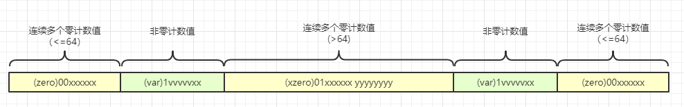
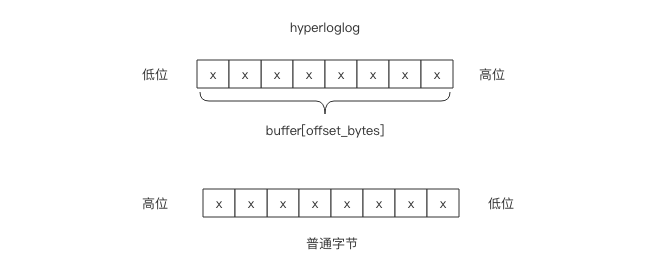
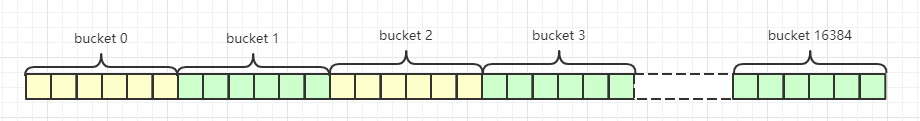

# hyperloglog基数统计

## 简介

---
源码位置：hyperloglog.c  

hyperloglog是一种算法，它提供了不精确的去重计数方案。redis的hyperloglog内部维护了16384个桶来记录各自桶的元素数量，当一个元素到来时，它会散列到其中一个桶，以一定的概率影响到这个桶的计数值。因为是概率算法，所以单个桶的计数值并不准确，但是将所有桶的计数值进行调合均值累加起来后，结果就会非常接近真实的计数值。  
[算法演示](http://content.research.neustar.biz/blog/hll.html)

当数据量很大时，redis采用密集模式，它将分配了16384个桶，每个桶占用6个bit空间，所以hyperloglog实际占用的空间大约为(16384*6bit/8+16=12304byte≈12k)左右的内存空间就可以统计大量的不同元素的基数。  
当在计数比较小的时候，大多数桶的计数值都是0，此时redis采用了稀疏模式存储，稀疏模式存储的占用空间远远小于12k字节，而密集模式存储占用的空间固定为12k。  
</br>

**稀疏模式存储结构：**
  
当连续多个桶的计数值为0时，redis使用一个字节来表示连续有多少个桶的值为0：00xxxxxx。前缀00表示接下来的6bit的整数值**加1**就是连续为0的桶的数量。比如，00101011：表示连续 101011(bin) + 1 = 44(dec)个桶的计数值都为0。6个bit最多表示能表示连续64个桶的值为0，所以redis将用两个字节表示多个多于64个连续0的桶数：01xxxxxx yyyyyyyy，后面的14个bit可以表示连续16384个桶的值为0。这就是hyperloglog数据结构中16384个桶的初始化状态。  
当连续多个桶的计数值非0时，则使用一个字节：1vvvvvxx表示，其中中间的5个bit vvvvv表示计数值，后面的2个bit xx表示连续几个桶，所以稀疏模式的计数值最大值为11111(bin)+1=32(dec)，最多连续桶为11(bin)+1=4(dec)，当计数值超过32时，redis会立即转为密集模式（不可逆的）。

</br>

**密集模式存储结构：**  
是由连续的16384个6bit串成的字符串位图。需要注意，普通的字节位序是左边高位右边低位，而在此处的字节位序是左边低位右边高位，所以需要进行倒置。  
  
以下是密集模式存储结构：

[参考这篇文章，图文讲解的很清楚](https://blog.csdn.net/u013474436/article/details/88945767)

</br>
</br>

## 结构体与宏定义

``` c
struct hllhdr {
    char magic[4];      /* "HYLL"固定值，用于标识hyperloglog键 */
    uint8_t encoding;   /* HLL_DENSE密集模式 or HLL_SPARSE稀疏模式. */
    uint8_t notused[3]; /* Reserved for future use, must be zero.保留字段 */
    uint8_t card[8];    /* Cached cardinality, little endian.基数缓存，存储上一次计算的基数 */
    uint8_t registers[]; /* Data bytes. */
};

/* The cached cardinality MSB is used to signal validity of the cached value. */
#define HLL_INVALIDATE_CACHE(hdr) (hdr)->card[7] |= (1<<7)
#define HLL_VALID_CACHE(hdr) (((hdr)->card[7] & (1<<7)) == 0)

#define HLL_P 14 /* The greater is P, the smaller the error. */
#define HLL_Q (64-HLL_P) /* The number of bits of the hash value used for
                            determining the number of leading zeros. */
#define HLL_REGISTERS (1<<HLL_P) /* With P=14, 16384 registers. */
#define HLL_P_MASK (HLL_REGISTERS-1) /* Mask to index register. */
#define HLL_BITS 6 /* Enough to count up to 63 leading zeroes. */
#define HLL_REGISTER_MAX ((1<<HLL_BITS)-1)
#define HLL_HDR_SIZE sizeof(struct hllhdr) // hll结构体的大小
#define HLL_DENSE_SIZE (HLL_HDR_SIZE+((HLL_REGISTERS*HLL_BITS+7)/8)) // 密集模式占用空间大小（为什么会+7？这里不是很理解）
#define HLL_DENSE 0 /* Dense encoding. */
#define HLL_SPARSE 1 /* Sparse encoding. */
#define HLL_RAW 255 /* Only used internally, never exposed. */
#define HLL_MAX_ENCODING 1

static char *invalid_hll_err = "-INVALIDOBJ Corrupted HLL object detected\r\n";

// 密集模式获取指定桶的数据
/* Store the value of the register at position 'regnum' into variable 'target'.
 * 'p' is an array of unsigned bytes. */
#define HLL_DENSE_GET_REGISTER(target,p,regnum) do { \
    uint8_t *_p = (uint8_t*) p; \
    unsigned long _byte = regnum*HLL_BITS/8; \
    unsigned long _fb = regnum*HLL_BITS&7; \
    unsigned long _fb8 = 8 - _fb; \
    unsigned long b0 = _p[_byte]; \
    unsigned long b1 = _p[_byte+1]; \
    target = ((b0 >> _fb) | (b1 << _fb8)) & HLL_REGISTER_MAX; \
} while(0)

// 密集模式填充指定桶的数据
/* Set the value of the register at position 'regnum' to 'val'.
 * 'p' is an array of unsigned bytes. */
#define HLL_DENSE_SET_REGISTER(p,regnum,val) do { \
    uint8_t *_p = (uint8_t*) p; \
    unsigned long _byte = regnum*HLL_BITS/8; \
    unsigned long _fb = regnum*HLL_BITS&7; \
    unsigned long _fb8 = 8 - _fb; \
    unsigned long _v = val; \
    _p[_byte] &= ~(HLL_REGISTER_MAX << _fb); \
    _p[_byte] |= _v << _fb; \
    _p[_byte+1] &= ~(HLL_REGISTER_MAX >> _fb8); \
    _p[_byte+1] |= _v >> _fb8; \
} while(0)

/* Macros to access the sparse representation.
 * The macros parameter is expected to be an uint8_t pointer. */
#define HLL_SPARSE_XZERO_BIT 0x40 /* 01xxxxxx */ // 计数值为0的双字节头两位是01
#define HLL_SPARSE_VAL_BIT 0x80 /* 1vvvvvxx */ // 计数值非0的单字节头一位是1
#define HLL_SPARSE_IS_ZERO(p) (((*(p)) & 0xc0) == 0) /* 00xxxxxx */ // 判断是否是计数值为0的单字节
#define HLL_SPARSE_IS_XZERO(p) (((*(p)) & 0xc0) == HLL_SPARSE_XZERO_BIT) // 判断是否是计数值为0的双字节
#define HLL_SPARSE_IS_VAL(p) ((*(p)) & HLL_SPARSE_VAL_BIT) // 判断计数值非0的计数值
#define HLL_SPARSE_ZERO_LEN(p) (((*(p)) & 0x3f)+1) // 获取单字节计数值为0的桶的个数
#define HLL_SPARSE_XZERO_LEN(p) (((((*(p)) & 0x3f) << 8) | (*((p)+1)))+1) // 获取双字节计数值为0的桶的个数
#define HLL_SPARSE_VAL_VALUE(p) ((((*(p)) >> 2) & 0x1f)+1) // 获取计数值非0的计数值
#define HLL_SPARSE_VAL_LEN(p) (((*(p)) & 0x3)+1) // 获取计数值非0的桶的个数
#define HLL_SPARSE_VAL_MAX_VALUE 32 // 计数值最大值为32（超过则转为密集模式）
#define HLL_SPARSE_VAL_MAX_LEN 4 // 计数值非0的连续桶的个数为4
#define HLL_SPARSE_ZERO_MAX_LEN 64 // 单字节计数值为0的连续桶的个数为64（连续的桶个数超过64时，用双字节表示）
#define HLL_SPARSE_XZERO_MAX_LEN 16384 // 双字节计数值为0的连续桶的个数为16384
#define HLL_SPARSE_VAL_SET(p,val,len) do { \
    *(p) = (((val)-1)<<2|((len)-1))|HLL_SPARSE_VAL_BIT; \
} while(0) // 设置计数值
#define HLL_SPARSE_ZERO_SET(p,len) do { \
    *(p) = (len)-1; \
} while(0) // 设置单字节计数值为0的桶的个数
#define HLL_SPARSE_XZERO_SET(p,len) do { \
    int _l = (len)-1; \
    *(p) = (_l>>8) | HLL_SPARSE_XZERO_BIT; \
    *((p)+1) = (_l&0xff); \
} while(0) // 设置双字节计数值为0的桶的个数（初始化的值： 0111 1111 1111 1111）
#define HLL_ALPHA_INF 0.721347520444481703680 /* constant for 0.5/ln(2) */
```

</br>
</br>
## 主要函数实现

``` c
// 创建hyperloglog对象，默认sparse encoding（稀疏模式），根据需要升级为密集模式
/* Create an HLL object. We always create the HLL using sparse encoding.
 * This will be upgraded to the dense representation as needed. */
robj *createHLLObject(void) {
    robj *o;
    struct hllhdr *hdr;
    sds s;
    uint8_t *p;
     // sparselen = HLL_HDR_SIZE(16) + 2 = 18, 16是hll的数据结构大小，2个字节是表示01xxxxxx yyyyyyyyy连续16384个桶的计数值为0
    int sparselen = HLL_HDR_SIZE +
                    (((HLL_REGISTERS+(HLL_SPARSE_XZERO_MAX_LEN-1)) /
                     HLL_SPARSE_XZERO_MAX_LEN)*2);
    int aux;

    /* Populate the sparse representation with as many XZERO opcodes as
     * needed to represent all the registers. */
    aux = HLL_REGISTERS;
    s = sdsnewlen(NULL,sparselen);
    p = (uint8_t*)s + HLL_HDR_SIZE;
    while(aux) {
        int xzero = HLL_SPARSE_XZERO_MAX_LEN;
        if (xzero > aux) xzero = aux;
        HLL_SPARSE_XZERO_SET(p,xzero);
        p += 2;
        aux -= xzero;
    }
    serverAssert((p-(uint8_t*)s) == sparselen);

    /* Create the actual object. */
    o = createObject(OBJ_STRING,s);
    hdr = o->ptr;
    memcpy(hdr->magic,"HYLL",4);
    hdr->encoding = HLL_SPARSE;
    return o;
}
```

</br>

**添加元素:**

``` c
// 添加元素
/* Call hllDenseAdd() or hllSparseAdd() according to the HLL encoding. */
int hllAdd(robj *o, unsigned char *ele, size_t elesize) {
    struct hllhdr *hdr = o->ptr;
    switch(hdr->encoding) {
    case HLL_DENSE: return hllDenseAdd(hdr->registers,ele,elesize); // 密集模式
    case HLL_SPARSE: return hllSparseAdd(o,ele,elesize); // 稀疏模式
    default: return -1; /* Invalid representation. */
    }
}
```

``` c
// 用于计算hash后的值中第一个1出现的位置
/* Given a string element to add to the HyperLogLog, returns the length
 * of the pattern 000..1 of the element hash. As a side effect 'regp' is
 * set to the register index this element hashes to. */
int hllPatLen(unsigned char *ele, size_t elesize, long *regp) {
    uint64_t hash, bit, index;
    int count;

    /* Count the number of zeroes starting from bit HLL_REGISTERS
     * (that is a power of two corresponding to the first bit we don't use
     * as index). The max run can be 64-P+1 = Q+1 bits.
     *
     * Note that the final "1" ending the sequence of zeroes must be
     * included in the count, so if we find "001" the count is 3, and
     * the smallest count possible is no zeroes at all, just a 1 bit
     * at the first position, that is a count of 1.
     *
     * This may sound like inefficient, but actually in the average case
     * there are high probabilities to find a 1 after a few iterations. */
    hash = MurmurHash64A(ele,elesize,0xadc83b19ULL);
    index = hash & HLL_P_MASK; /* Register index. */ // 计算应该放在哪个桶中，与操作，保证index在16384范围内
    hash >>= HLL_P; /* Remove bits used to address the register. */
    hash |= ((uint64_t)1<<HLL_Q); /* Make sure the loop terminates
                                     and count will be <= Q+1. */ //为了保证循环能够终止
    bit = 1;
    count = 1; /* Initialized to 1 since we count the "00000...1" pattern. */
    // 查找1出现的位置，并计数
    while((hash & bit) == 0) {
        count++;
        bit <<= 1;
    }
    *regp = (int) index;
    return count;
}
```

</br>
**稀疏模式：**

``` c
// 稀疏模式添加元素实现
/* "Add" the element in the sparse hyperloglog data structure.
 * Actually nothing is added, but the max 0 pattern counter of the subset
 * the element belongs to is incremented if needed.
 *
 * This function is actually a wrapper for hllSparseSet(), it only performs
 * the hashshing of the elmenet to obtain the index and zeros run length. */
int hllSparseAdd(robj *o, unsigned char *ele, size_t elesize) {
    long index;
    uint8_t count = hllPatLen(ele,elesize,&index);
    /* Update the register if this element produced a longer run of zeroes. */
    return hllSparseSet(o,index,count);
}

// 稀疏模式插入，当计数值大于32时，立即转为密集模式并插入
/* Low level function to set the sparse HLL register at 'index' to the
 * specified value if the current value is smaller than 'count'.
 *
 * The object 'o' is the String object holding the HLL. The function requires
 * a reference to the object in order to be able to enlarge the string if
 * needed.
 *
 * On success, the function returns 1 if the cardinality changed, or 0
 * if the register for this element was not updated.
 * On error (if the representation is invalid) -1 is returned.
 *
 * As a side effect the function may promote the HLL representation from
 * sparse to dense: this happens when a register requires to be set to a value
 * not representable with the sparse representation, or when the resulting
 * size would be greater than server.hll_sparse_max_bytes. */
int hllSparseSet(robj *o, long index, uint8_t count) {
    struct hllhdr *hdr;
    uint8_t oldcount, *sparse, *end, *p, *prev, *next;
    long first, span;
    long is_zero = 0, is_xzero = 0, is_val = 0, runlen = 0;

    /* If the count is too big to be representable by the sparse representation
     * switch to dense representation. */
    if (count > HLL_SPARSE_VAL_MAX_VALUE) goto promote; // 当计数值大于32时，立即转为密集模式并插入

    /* When updating a sparse representation, sometimes we may need to
     * enlarge the buffer for up to 3 bytes in the worst case (XZERO split
     * into XZERO-VAL-XZERO). Make sure there is enough space right now
     * so that the pointers we take during the execution of the function
     * will be valid all the time. */
    o->ptr = sdsMakeRoomFor(o->ptr,3); // 扩大3个字节

    /* Step 1: we need to locate the opcode we need to modify to check
     * if a value update is actually needed. */
    // 第一步，需要定位到需要修改的节点位置，判断值是否需要被修改
    sparse = p = ((uint8_t*)o->ptr) + HLL_HDR_SIZE;
    end = p + sdslen(o->ptr) - HLL_HDR_SIZE;

    first = 0;
    prev = NULL; /* Points to previous opcode at the end of the loop. */
    next = NULL; /* Points to the next opcode at the end of the loop. */
    span = 0;
    while(p < end) {
        long oplen;

        /* Set span to the number of registers covered by this opcode.
         *
         * This is the most performance critical loop of the sparse
         * representation. Sorting the conditionals from the most to the
         * least frequent opcode in many-bytes sparse HLLs is faster. */
        oplen = 1;
        if (HLL_SPARSE_IS_ZERO(p)) {
            span = HLL_SPARSE_ZERO_LEN(p);
        } else if (HLL_SPARSE_IS_VAL(p)) {
            span = HLL_SPARSE_VAL_LEN(p);
        } else { /* XZERO. */
            span = HLL_SPARSE_XZERO_LEN(p);
            oplen = 2;
        }
        /* Break if this opcode covers the register as 'index'. */
        if (index <= first+span-1) break;
        prev = p;
        p += oplen;
        first += span;
    }
    if (span == 0 || p >= end) return -1; /* Invalid format. */

    next = HLL_SPARSE_IS_XZERO(p) ? p+2 : p+1;
    if (next >= end) next = NULL;

    /* Cache current opcode type to avoid using the macro again and
     * again for something that will not change.
     * Also cache the run-length of the opcode. */
    if (HLL_SPARSE_IS_ZERO(p)) {
        is_zero = 1;
        runlen = HLL_SPARSE_ZERO_LEN(p);
    } else if (HLL_SPARSE_IS_XZERO(p)) {
        is_xzero = 1;
        runlen = HLL_SPARSE_XZERO_LEN(p);
    } else {
        is_val = 1;
        runlen = HLL_SPARSE_VAL_LEN(p);
    }

    /* Step 2: After the loop:
     *
     * 'first' stores to the index of the first register covered
     *  by the current opcode, which is pointed by 'p'.
     *
     * 'next' ad 'prev' store respectively the next and previous opcode,
     *  or NULL if the opcode at 'p' is respectively the last or first.
     *
     * 'span' is set to the number of registers covered by the current
     *  opcode.
     *
     * There are different cases in order to update the data structure
     * in place without generating it from scratch:
     *
     * A) If it is a VAL opcode already set to a value >= our 'count'
     *    no update is needed, regardless of the VAL run-length field.
     *    In this case PFADD returns 0 since no changes are performed.
     *
     * B) If it is a VAL opcode with len = 1 (representing only our
     *    register) and the value is less than 'count', we just update it
     *    since this is a trivial case. */
    if (is_val) {
        oldcount = HLL_SPARSE_VAL_VALUE(p);
        /* Case A. */
        if (oldcount >= count) return 0;

        /* Case B. */
        if (runlen == 1) {
            HLL_SPARSE_VAL_SET(p,count,1);
            goto updated;
        }
    }

    /* C) Another trivial to handle case is a ZERO opcode with a len of 1.
     * We can just replace it with a VAL opcode with our value and len of 1. */
    if (is_zero && runlen == 1) {
        HLL_SPARSE_VAL_SET(p,count,1);
        goto updated;
    }

    /* D) General case.
     *
     * The other cases are more complex: our register requires to be updated
     * and is either currently represented by a VAL opcode with len > 1,
     * by a ZERO opcode with len > 1, or by an XZERO opcode.
     *
     * In those cases the original opcode must be split into multiple
     * opcodes. The worst case is an XZERO split in the middle resuling into
     * XZERO - VAL - XZERO, so the resulting sequence max length is
     * 5 bytes.
     *
     * We perform the split writing the new sequence into the 'new' buffer
     * with 'newlen' as length. Later the new sequence is inserted in place
     * of the old one, possibly moving what is on the right a few bytes
     * if the new sequence is longer than the older one. */
    uint8_t seq[5], *n = seq;
    int last = first+span-1; /* Last register covered by the sequence. */
    int len;

    if (is_zero || is_xzero) {
        /* Handle splitting of ZERO / XZERO. */
        if (index != first) {
            len = index-first;
            if (len > HLL_SPARSE_ZERO_MAX_LEN) {
                HLL_SPARSE_XZERO_SET(n,len);
                n += 2;
            } else {
                HLL_SPARSE_ZERO_SET(n,len);
                n++;
            }
        }
        HLL_SPARSE_VAL_SET(n,count,1);
        n++;
        if (index != last) {
            len = last-index;
            if (len > HLL_SPARSE_ZERO_MAX_LEN) {
                HLL_SPARSE_XZERO_SET(n,len);
                n += 2;
            } else {
                HLL_SPARSE_ZERO_SET(n,len);
                n++;
            }
        }
    } else {
        /* Handle splitting of VAL. */
        int curval = HLL_SPARSE_VAL_VALUE(p);

        if (index != first) {
            len = index-first;
            HLL_SPARSE_VAL_SET(n,curval,len);
            n++;
        }
        HLL_SPARSE_VAL_SET(n,count,1);
        n++;
        if (index != last) {
            len = last-index;
            HLL_SPARSE_VAL_SET(n,curval,len);
            n++;
        }
    }

    /* Step 3: substitute the new sequence with the old one.
     *
     * Note that we already allocated space on the sds string
     * calling sdsMakeRoomFor(). */
     int seqlen = n-seq;
     int oldlen = is_xzero ? 2 : 1;
     int deltalen = seqlen-oldlen;

     if (deltalen > 0 &&
         sdslen(o->ptr)+deltalen > server.hll_sparse_max_bytes) goto promote;
     if (deltalen && next) memmove(next+deltalen,next,end-next);
     sdsIncrLen(o->ptr,deltalen);
     memcpy(p,seq,seqlen);
     end += deltalen;

updated:
    /* Step 4: Merge adjacent values if possible.
     *
     * The representation was updated, however the resulting representation
     * may not be optimal: adjacent VAL opcodes can sometimes be merged into
     * a single one. */
    p = prev ? prev : sparse;
    int scanlen = 5; /* Scan up to 5 upcodes starting from prev. */
    while (p < end && scanlen--) {
        if (HLL_SPARSE_IS_XZERO(p)) {
            p += 2;
            continue;
        } else if (HLL_SPARSE_IS_ZERO(p)) {
            p++;
            continue;
        }
        /* We need two adjacent VAL opcodes to try a merge, having
         * the same value, and a len that fits the VAL opcode max len. */
        if (p+1 < end && HLL_SPARSE_IS_VAL(p+1)) {
            int v1 = HLL_SPARSE_VAL_VALUE(p);
            int v2 = HLL_SPARSE_VAL_VALUE(p+1);
            if (v1 == v2) {
                int len = HLL_SPARSE_VAL_LEN(p)+HLL_SPARSE_VAL_LEN(p+1);
                if (len <= HLL_SPARSE_VAL_MAX_LEN) {
                    HLL_SPARSE_VAL_SET(p+1,v1,len);
                    memmove(p,p+1,end-p);
                    sdsIncrLen(o->ptr,-1);
                    end--;
                    /* After a merge we reiterate without incrementing 'p'
                     * in order to try to merge the just merged value with
                     * a value on its right. */
                    continue;
                }
            }
        }
        p++;
    }

    /* Invalidate the cached cardinality. */
    hdr = o->ptr;
    HLL_INVALIDATE_CACHE(hdr);
    return 1;

promote: /* Promote to dense representation. */
    if (hllSparseToDense(o) == C_ERR) return -1; /* Corrupted HLL. */
    hdr = o->ptr;

    /* We need to call hllDenseAdd() to perform the operation after the
     * conversion. However the result must be 1, since if we need to
     * convert from sparse to dense a register requires to be updated.
     *
     * Note that this in turn means that PFADD will make sure the command
     * is propagated to slaves / AOF, so if there is a sparse -> dense
     * conversion, it will be performed in all the slaves as well. */
    int dense_retval = hllDenseSet(hdr->registers,index,count);
    serverAssert(dense_retval == 1);
    return dense_retval;
}
```

</br>

**稀疏模式转为密集模式：**

``` c
/* Convert the HLL with sparse representation given as input in its dense
 * representation. Both representations are represented by SDS strings, and
 * the input representation is freed as a side effect.
 *
 * The function returns C_OK if the sparse representation was valid,
 * otherwise C_ERR is returned if the representation was corrupted. */
int hllSparseToDense(robj *o) {
    sds sparse = o->ptr, dense;
    struct hllhdr *hdr, *oldhdr = (struct hllhdr*)sparse;
    int idx = 0, runlen, regval;
    uint8_t *p = (uint8_t*)sparse, *end = p+sdslen(sparse);

    /* If the representation is already the right one return ASAP. */
    hdr = (struct hllhdr*) sparse;
    if (hdr->encoding == HLL_DENSE) return C_OK;

    // 申请HLL_DENSE_SIZE大小的空间用于密集模式
    /* Create a string of the right size filled with zero bytes.
     * Note that the cached cardinality is set to 0 as a side effect
     * that is exactly the cardinality of an empty HLL. */
    dense = sdsnewlen(NULL,HLL_DENSE_SIZE);
    hdr = (struct hllhdr*) dense;
    *hdr = *oldhdr; /* This will copy the magic and cached cardinality. */
    hdr->encoding = HLL_DENSE;

    // 将稀疏模式的数据导入到密集模式中
    /* Now read the sparse representation and set non-zero registers
     * accordingly. */
    p += HLL_HDR_SIZE;
    while(p < end) {
        if (HLL_SPARSE_IS_ZERO(p)) {
            runlen = HLL_SPARSE_ZERO_LEN(p);
            idx += runlen;
            p++;
        } else if (HLL_SPARSE_IS_XZERO(p)) {
            runlen = HLL_SPARSE_XZERO_LEN(p);
            idx += runlen;
            p += 2;
        } else {
            runlen = HLL_SPARSE_VAL_LEN(p);
            regval = HLL_SPARSE_VAL_VALUE(p);
            if ((runlen + idx) > HLL_REGISTERS) break; /* Overflow. */
            while(runlen--) {
                HLL_DENSE_SET_REGISTER(hdr->registers,idx,regval);
                idx++;
            }
            p++;
        }
    }

    /* If the sparse representation was valid, we expect to find idx
     * set to HLL_REGISTERS. */
    if (idx != HLL_REGISTERS) {
        sdsfree(dense);
        return C_ERR;
    }

    /* Free the old representation and set the new one. */
    sdsfree(o->ptr);
    o->ptr = dense;
    return C_OK;
}
```

</br>

**密集模式：**

``` c
// 密集模式添加元素实现
/* "Add" the element in the dense hyperloglog data structure.
 * Actually nothing is added, but the max 0 pattern counter of the subset
 * the element belongs to is incremented if needed.
 *
 * This is just a wrapper to hllDenseSet(), performing the hashing of the
 * element in order to retrieve the index and zero-run count. */
int hllDenseAdd(uint8_t *registers, unsigned char *ele, size_t elesize) {
    long index;
    uint8_t count = hllPatLen(ele,elesize,&index);
    /* Update the register if this element produced a longer run of zeroes. */
    return hllDenseSet(registers,index,count);
}

/* Low level function to set the dense HLL register at 'index' to the
 * specified value if the current value is smaller than 'count'.
 *
 * 'registers' is expected to have room for HLL_REGISTERS plus an
 * additional byte on the right. This requirement is met by sds strings
 * automatically since they are implicitly null terminated.
 *
 * The function always succeed, however if as a result of the operation
 * the approximated cardinality changed, 1 is returned. Otherwise 0
 * is returned. */
int hllDenseSet(uint8_t *registers, long index, uint8_t count) {
    uint8_t oldcount;

    HLL_DENSE_GET_REGISTER(oldcount,registers,index);
    if (count > oldcount) {
        HLL_DENSE_SET_REGISTER(registers,index,count);
        return 1;
    } else {
        return 0;
    }
}
```
