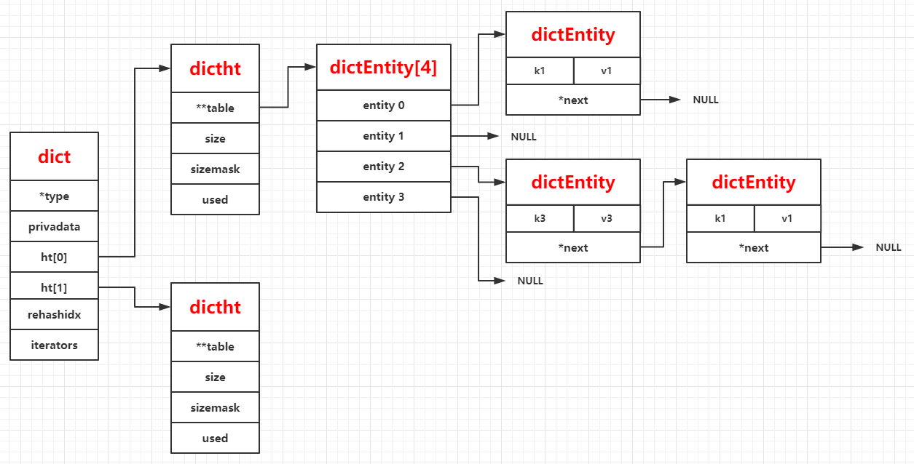

# dict字典

## 简介

---
源码位置：dict.c/dict.h  

Redis的字典是由两个HashTable（后面简称ht[0]、ht[1]）构成，与其他字典不同的是，当当前的hashtable负载过高时，redis的字典会进行rehash（重新计算hash），rehash的过程是渐进式的，并不会一下子把所有的数据转移到另一张hashtable中，否则那样会造成服务短暂时间内无法使用。  
  
**rehash的条件**：当哈希表的结点个数（used）是哈希表中节点链表数（size）的5倍时，将进行rehash。  

**rehash的过程**：当满足rehash的条件时，redis将进行expend扩展，扩展的size是ht[0]->size的2倍。因为是渐进式的rehash，所以redis会初始化ht[1]，给ht[1]分配足够的内存大小（ht[0]->size*2*sizeof(dictEntry*)），将字典的rehashidx的值置为0，并且当前不会进行rehash操作。  
当用户进行查询、插入、删除时，将进行一个节点的rehash操作。直到ht[0]的节点全部rehash完毕后，删除ht[0]并且把ht[1]指针赋予给ht[0]，rehashidx值将回到-1，直到下次满足rehash的条件。  
  
**确定key的位置（查找、删除、插入操作）**：如果当前正在rehash，则插入到ht[1]中，根据key计算hash值，& sizemask后得到的index（index=h & d->ht[table].sizemask）就是该key所在的链表的索引。

Redis中字典的结构：
  
</br>
</br>

## 结构体与宏定义

---

``` c
/* Unused arguments generate annoying warnings... */
#define DICT_NOTUSED(V) ((void) V)

// 字典的结点
typedef struct dictEntry {
    void *key;
    union {
        void *val;
        uint64_t u64;
        int64_t s64;
        double d;
    } v;
    struct dictEntry *next; // 指向下一个节点的指针
} dictEntry;

// 保存了用于操作特定类型键值对的函数
typedef struct dictType {
    uint64_t (*hashFunction)(const void *key); // 哈希函数指针
    void *(*keyDup)(void *privdata, const void *key); // 键复制函数指针
    void *(*valDup)(void *privdata, const void *obj); // 值复制函数指针
    int (*keyCompare)(void *privdata, const void *key1, const void *key2); // 键比较函数指针
    void (*keyDestructor)(void *privdata, void *key); // 键析构函数指针
    void (*valDestructor)(void *privdata, void *obj); // 值析构函数指针
} dictType;

/* This is our hash table structure. Every dictionary has two of this as we
 * implement incremental rehashing, for the old to the new table. */
 // 哈希表
typedef struct dictht {
    dictEntry **table; // 哈希表(字典数组)，俗称桶bucket
    unsigned long size; // 哈希表大小（字典数组的长度，桶的层数）
    unsigned long sizemask; // 哈希表掩码（值为size-1），通过（hash & sizemask）计算得到哈希表的索引
    unsigned long used; // 当前的节点数（键值对数）
} dictht;
// 完整的字典
typedef struct dict {
    dictType *type; // 特定类型的处理函数
    void *privdata; // 私有数据
    dictht ht[2]; // 2个哈希表
    long rehashidx; /* rehashing not in progress if rehashidx == -1 */ // 当前未进行rehash时，值为-1，否则为当前rehash的索引
    unsigned long iterators; /* number of iterators currently running */ // 当前字典的迭代器个数
} dict;

/* If safe is set to 1 this is a safe iterator, that means, you can call
 * dictAdd, dictFind, and other functions against the dictionary even while
 * iterating. Otherwise it is a non safe iterator, and only dictNext()
 * should be called while iterating. */
// 迭代器
typedef struct dictIterator {
    dict *d; // 字典指针
    long index; // 索引
    int table, safe; // safe为1，则表示是安全的迭代器，迭代期间，可以进行增删改查操作。 table为当前为第几个哈希表
    dictEntry *entry, *nextEntry; // 当前结点指针和下一个结点的指针
    /* unsafe iterator fingerprint for misuse detection. */
    long long fingerprint; // 不安全迭代器的指纹
} dictIterator;

typedef void (dictScanFunction)(void *privdata, const dictEntry *de);
typedef void (dictScanBucketFunction)(void *privdata, dictEntry **bucketref);

/* This is the initial size of every hash table */
#define DICT_HT_INITIAL_SIZE     4  // 哈希表的链表个数初始化为4

/* ------------------------------- Macros ------------------------------------*/
#define dictFreeVal(d, entry) \
    if ((d)->type->valDestructor) \
        (d)->type->valDestructor((d)->privdata, (entry)->v.val)

#define dictSetVal(d, entry, _val_) do { \
    if ((d)->type->valDup) \
        (entry)->v.val = (d)->type->valDup((d)->privdata, _val_); \
    else \
        (entry)->v.val = (_val_); \
} while(0)

#define dictSetSignedIntegerVal(entry, _val_) \
    do { (entry)->v.s64 = _val_; } while(0)

#define dictSetUnsignedIntegerVal(entry, _val_) \
    do { (entry)->v.u64 = _val_; } while(0)

#define dictSetDoubleVal(entry, _val_) \
    do { (entry)->v.d = _val_; } while(0)

#define dictFreeKey(d, entry) \
    if ((d)->type->keyDestructor) \
        (d)->type->keyDestructor((d)->privdata, (entry)->key)

#define dictSetKey(d, entry, _key_) do { \
    if ((d)->type->keyDup) \
        (entry)->key = (d)->type->keyDup((d)->privdata, _key_); \
    else \
        (entry)->key = (_key_); \
} while(0)

#define dictCompareKeys(d, key1, key2) \
    (((d)->type->keyCompare) ? \
        (d)->type->keyCompare((d)->privdata, key1, key2) : \
        (key1) == (key2))

#define dictHashKey(d, key) (d)->type->hashFunction(key)
#define dictGetKey(he) ((he)->key)
#define dictGetVal(he) ((he)->v.val)
#define dictGetSignedIntegerVal(he) ((he)->v.s64)
#define dictGetUnsignedIntegerVal(he) ((he)->v.u64)
#define dictGetDoubleVal(he) ((he)->v.d)
#define dictSlots(d) ((d)->ht[0].size+(d)->ht[1].size)
#define dictSize(d) ((d)->ht[0].used+(d)->ht[1].used)
#define dictIsRehashing(d) ((d)->rehashidx != -1)

```

</br>
</br>

## 函数功能总览

---

``` c
dict *dictCreate(dictType *type, void *privDataPtr); // 创建dict字典
int dictExpand(dict *d, unsigned long size); // 哈希表扩展，当哈希表的冲突率过高时，链表会很长，查询效率降低，所以需要扩展哈希表
int dictAdd(dict *d, void *key, void *val); // 新增键值对
dictEntry *dictAddRaw(dict *d, void *key, dictEntry **existing); // 新增dictEntity结点
dictEntry *dictAddOrFind(dict *d, void *key); // 查找key的dictEntity结点，如果不存在，则新增
int dictReplace(dict *d, void *key, void *val); // 更改val，如果不存在，则增加key-value
int dictDelete(dict *d, const void *key); // 删除key
dictEntry *dictUnlink(dict *ht, const void *key); // 删除key
void dictFreeUnlinkedEntry(dict *d, dictEntry *he); // 释放结点
void dictRelease(dict *d); // 清空字典（释放内存）
dictEntry * dictFind(dict *d, const void *key); // 查找
void *dictFetchValue(dict *d, const void *key); // 查找
int dictResize(dict *d); // 重新计算size
dictIterator *dictGetIterator(dict *d); // 获取字典迭代器
dictIterator *dictGetSafeIterator(dict *d); // 获取安全的迭代器
dictEntry *dictNext(dictIterator *iter); // 获取下一个哈希结点
void dictReleaseIterator(dictIterator *iter); // 释放迭代器
dictEntry *dictGetRandomKey(dict *d); // 获取随机key
dictEntry *dictGetFairRandomKey(dict *d);
unsigned int dictGetSomeKeys(dict *d, dictEntry **des, unsigned int count); // 获取count个key
void dictGetStats(char *buf, size_t bufsize, dict *d); // 获取当前字典的状态
uint64_t dictGenHashFunction(const void *key, int len);
uint64_t dictGenCaseHashFunction(const unsigned char *buf, int len);
void dictEmpty(dict *d, void(callback)(void*)); // 清空字典（不释放内存）
void dictEnableResize(void); // 允许resize，将静态变量dict_can_resize设为1
void dictDisableResize(void); // 不允许resize，dict_can_resize为0
int dictRehash(dict *d, int n); // 进行rehash操作，n为rehash的个数
int dictRehashMilliseconds(dict *d, int ms); // ms时间内进行rehash操作，每次rehash100个
void dictSetHashFunctionSeed(uint8_t *seed); // 设置哈希种子，调用默认哈希函数时使用
uint8_t *dictGetHashFunctionSeed(void); // 获取哈希种子
unsigned long dictScan(dict *d, unsigned long v, dictScanFunction *fn, dictScanBucketFunction *bucketfn, void *privdata); // 扫描字典
uint64_t dictGetHash(dict *d, const void *key); // 获取哈希值
dictEntry **dictFindEntryRefByPtrAndHash(dict *d, const void *oldptr, uint64_t hash); // 通过hash值和结点指针查找字典中的结点
```
