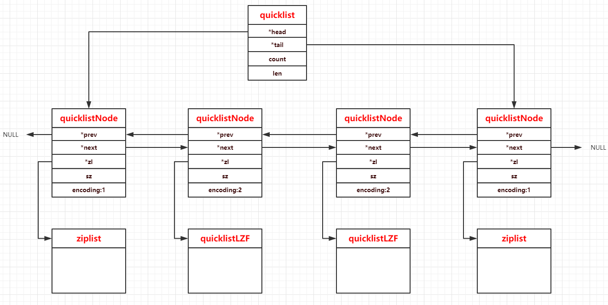

# quicklist快速列表

## 简介

---
源码位置：quicklist.c/quicklist.h

Redis3.2版本以前的列表底层的编码是ziplist和linkedlist(adlist.c)实现的，3.2版本后引入了quicklist的数据结构，列表底层都由quicklist来实现。本质上，quicklist是由ziplist和linkedlist结合而成。所以，学习quicklist之前，需要明白[ziplist](Redis源码-压缩列表ziplist.md)的原理。  

**ziplist：**  
优点：存储效率高，内存开销少。  
缺点：进行插入、修改、删除操作时，需要频繁的申请和释放内存，当ziplist很长时，一次realloc可能会导致很大的内存拷贝。ziplist操作还有可能进行连锁更新操作，时间复杂度增加。  
**linkedlist：**  
优点：便于在两端进行push或pop操作时间复杂度低。  
缺点：内存开销大，因为是不连续的内存块，所以节点多了容易产生内存碎片。  
**quicklist：**  
quicklist本质上节点为ziplist的双向链表的数据结构，所以quicklist结合了两者的优点。  
从存储效率上分析：

1. 每个quicklist节点上的ziplist越短，则内存碎片越多。内存碎片多了，有可能产生很多无法利用的内存碎片，导致存储效率降低。
2. 每个quicklist节点上的ziplist越长，则为ziplist分配大块连续的内存空间难度就越大。有可能出现内存里有很多小的空闲空间无法使用，同样会导致存储效率降低。  

所以ziplist的长度，需要根据实际使用场景来进行调整，redis提供了配置参数list-max-ziplist-size，可供使用者来进行设定。

**quicklist结构：**


</br>
</br>

## 结构体与宏定义

---

``` c
typedef struct quicklistNode {
    struct quicklistNode *prev;  // 前置节点
    struct quicklistNode *next;  // 后置节点
    unsigned char *zl;           // 压缩列表ziplist
    unsigned int sz;             // 表示指向ziplist结构的总长度(内存占用长度)
    unsigned int count : 16;     // ziplist中的节点数
    unsigned int encoding : 2;   // ziplist是否压缩。取值：1--ziplist，2--quicklistLZF
    unsigned int container : 2;  // 存储类型，目前使用固定值2 表示使用ziplist存储
    unsigned int recompress : 1; // 当我们使用类似lindex这样的命令查看了某一项本来压缩的数据时，需要把数据暂时解压，这时就设置recompress=1做一个标记，等有机会再把数据重新压缩
    unsigned int attempted_compress : 1; /* node can't compress; too small */ // // 测试相关
    unsigned int extra : 10; /* more bits to steal for future usage */ // // 扩展字段，暂时没用
} quicklistNode;

typedef struct quicklistLZF {
    unsigned int sz; /* LZF size in bytes*/ // 压缩后的ziplist大小
    char compressed[]; // 柔性数组，存放压缩后的ziplist字节数组
} quicklistLZF;

typedef struct quicklistBookmark {
    quicklistNode *node;
    char *name;
} quicklistBookmark;

typedef struct quicklist {
    quicklistNode *head;
    quicklistNode *tail;
    unsigned long count;        /* total count of all entries in all ziplists */
    unsigned long len;          /* number of quicklistNodes */
    int fill : QL_FILL_BITS;              /* fill factor for individual nodes */ // 负数代表级别，正数代表个数，配置文件中定义
    unsigned int compress : QL_COMP_BITS; /* depth of end nodes not to compress;0=off */ // 压缩级别，配置文件中定义
    unsigned int bookmark_count: QL_BM_BITS; // 书签数，测试用
    quicklistBookmark bookmarks[]; // 书签，测试用
} quicklist;
/*
fill和compress由配置文件redis.conf定义。

fill成员对应的配置：list-max-ziplist-size -2
当数字为负数，表示以下含义：
-1 每个quicklistNode节点的ziplist字节大小不能超过4kb。（建议）
-2 每个quicklistNode节点的ziplist字节大小不能超过8kb。（默认配置）
-3 每个quicklistNode节点的ziplist字节大小不能超过16kb。（一般不建议）
-4 每个quicklistNode节点的ziplist字节大小不能超过32kb。（不建议）
-5 每个quicklistNode节点的ziplist字节大小不能超过64kb。（正常工作量不建议）
代码中的定义static const size_t optimization_level[] = {4096, 8192, 16384, 32768, 65536};

当数字为正数，表示：ziplist结构所最多包含的entry个数。最大值为 215215。

compress成员对应的配置：list-compress-depth 0
后面的数字有以下含义：
0： 表示不压缩。（默认）
1： 表示quicklist列表的两端各有1个节点不压缩，中间的节点压缩。
2： 表示quicklist列表的两端各有2个节点不压缩，中间的节点压缩。
3： 表示quicklist列表的两端各有3个节点不压缩，中间的节点压缩。
以此类推，最大为 216216。
首位节点不压缩，是因为支持快速的push/pop操作。
*/

typedef struct quicklistIter {
    const quicklist *quicklist;
    quicklistNode *current;
    unsigned char *zi;
    long offset; /* offset in current ziplist */
    int direction;
} quicklistIter;

// 中间结构，用于查找、删除等操作
typedef struct quicklistEntry {
    const quicklist *quicklist; // quicklist
    quicklistNode *node; // 当前的节点
    unsigned char *zi; // ziplist结构指针
    unsigned char *value; // 当前entry的数据，是字符串
    long long longval; // 当前entry的数据，是整数
    unsigned int sz; // 当前ziplist的字节数
    int offset; // entry的当前偏移量
} quicklistEntry;

#define QUICKLIST_HEAD 0
#define QUICKLIST_TAIL -1

/* quicklist node encodings */
#define QUICKLIST_NODE_ENCODING_RAW 1
#define QUICKLIST_NODE_ENCODING_LZF 2

/* quicklist compression disable */
#define QUICKLIST_NOCOMPRESS 0

/* quicklist container formats */
#define QUICKLIST_NODE_CONTAINER_NONE 1
#define QUICKLIST_NODE_CONTAINER_ZIPLIST 2

#define quicklistNodeIsCompressed(node)                                        \
    ((node)->encoding == QUICKLIST_NODE_ENCODING_LZF)
```

</br>

## 函数功能总览

``` c
/* Prototypes */
quicklist *quicklistCreate(void); // 创建quicklist
quicklist *quicklistNew(int fill, int compress); // 创建quicklist并设定fill和compress
void quicklistSetCompressDepth(quicklist *quicklist, int depth); // 设置quicklist的compress
void quicklistSetFill(quicklist *quicklist, int fill); // 设置quicklist的fill
void quicklistSetOptions(quicklist *quicklist, int fill, int depth); // 设置quicklist的fill和compress
void quicklistRelease(quicklist *quicklist); // 释放quicklist
int quicklistPushHead(quicklist *quicklist, void *value, const size_t sz); // 头部节点插入元素
int quicklistPushTail(quicklist *quicklist, void *value, const size_t sz); // 尾部节点插入元素
void quicklistPush(quicklist *quicklist, void *value, const size_t sz,
                   int where); // 插入元素
void quicklistAppendZiplist(quicklist *quicklist, unsigned char *zl); // 向quicklist中插入一个已定义的ziplist（需要创建quicklistCreateNode）(浅拷贝)
quicklist *quicklistAppendValuesFromZiplist(quicklist *quicklist,
                                            unsigned char *zl); // 向quicklist复制ziplist中的值（深拷贝）
quicklist *quicklistCreateFromZiplist(int fill, int compress,
                                      unsigned char *zl); //创建quicklist并复制ziplist中的值
void quicklistInsertAfter(quicklist *quicklist, quicklistEntry *node,
                          void *value, const size_t sz); // 插入元素
void quicklistInsertBefore(quicklist *quicklist, quicklistEntry *node,
                           void *value, const size_t sz); // 插入元素
void quicklistDelEntry(quicklistIter *iter, quicklistEntry *entry); // 删除元素
int quicklistReplaceAtIndex(quicklist *quicklist, long index, void *data,
                            int sz);
int quicklistDelRange(quicklist *quicklist, const long start, const long stop);
quicklistIter *quicklistGetIterator(const quicklist *quicklist, int direction);
quicklistIter *quicklistGetIteratorAtIdx(const quicklist *quicklist,
                                         int direction, const long long idx);
int quicklistNext(quicklistIter *iter, quicklistEntry *node);
void quicklistReleaseIterator(quicklistIter *iter);
quicklist *quicklistDup(quicklist *orig);
int quicklistIndex(const quicklist *quicklist, const long long index,
                   quicklistEntry *entry);
void quicklistRewind(quicklist *quicklist, quicklistIter *li);
void quicklistRewindTail(quicklist *quicklist, quicklistIter *li);
void quicklistRotate(quicklist *quicklist);
int quicklistPopCustom(quicklist *quicklist, int where, unsigned char **data,
                       unsigned int *sz, long long *sval,
                       void *(*saver)(unsigned char *data, unsigned int sz));
int quicklistPop(quicklist *quicklist, int where, unsigned char **data,
                 unsigned int *sz, long long *slong);
unsigned long quicklistCount(const quicklist *ql);
int quicklistCompare(unsigned char *p1, unsigned char *p2, int p2_len);
size_t quicklistGetLzf(const quicklistNode *node, void **data);

/* bookmarks */
int quicklistBookmarkCreate(quicklist **ql_ref, const char *name, quicklistNode *node);
int quicklistBookmarkDelete(quicklist *ql, const char *name);
quicklistNode *quicklistBookmarkFind(quicklist *ql, const char *name);
void quicklistBookmarksClear(quicklist *ql);
```

</br>

## 主要函数实现

---

**创建与释放：**

``` c
// quicklist创建
quicklist *quicklistCreate(void) {
    struct quicklist *quicklist;

    quicklist = zmalloc(sizeof(*quicklist));
    quicklist->head = quicklist->tail = NULL;
    quicklist->len = 0;
    quicklist->count = 0;
    quicklist->compress = 0;
    quicklist->fill = -2;
    quicklist->bookmark_count = 0;
    return quicklist;
}

// quicklistNode创建
REDIS_STATIC quicklistNode *quicklistCreateNode(void) {
    quicklistNode *node;
    node = zmalloc(sizeof(*node));
    node->zl = NULL;
    node->count = 0;
    node->sz = 0;
    node->next = node->prev = NULL;
    node->encoding = QUICKLIST_NODE_ENCODING_RAW;
    node->container = QUICKLIST_NODE_CONTAINER_ZIPLIST;
    node->recompress = 0;
    return node;
}

void quicklistRelease(quicklist *quicklist) {
    unsigned long len;
    quicklistNode *current, *next;

    current = quicklist->head;
    len = quicklist->len;
    while (len--) {
        next = current->next;

        zfree(current->zl);
        quicklist->count -= current->count;

        zfree(current);

        quicklist->len--;
        current = next;
    }
    quicklistBookmarksClear(quicklist);
    zfree(quicklist);
}

void quicklistBookmarksClear(quicklist *ql) {
    while (ql->bookmark_count)
        zfree(ql->bookmarks[--ql->bookmark_count].name);
    /* NOTE: We do not shrink (realloc) the quick list. main use case for this
     * function is just before releasing the allocation. */
}
```

**push操作：**

``` c
void quicklistPush(quicklist *quicklist, void *value, const size_t sz,
                   int where) {
    if (where == QUICKLIST_HEAD) {
        quicklistPushHead(quicklist, value, sz);
    } else if (where == QUICKLIST_TAIL) {
        quicklistPushTail(quicklist, value, sz);
    }
}

int quicklistPushHead(quicklist *quicklist, void *value, size_t sz) {
    quicklistNode *orig_head = quicklist->head;
    // likely可以让编译器进行代码优化，表示告知编译器，括号里的值为真的可能性更大，这样编译器在编译过程中，会将可能性更大的代码紧跟着前面的代码，从而减少指令跳转带来的性能上的下降
    if (likely(
            // 判断头节点是否能插入新元素
            _quicklistNodeAllowInsert(quicklist->head, quicklist->fill, sz))) {
        // 如果能插入，则调用ziplistPush插入新元素
        quicklist->head->zl =
            ziplistPush(quicklist->head->zl, value, sz, ZIPLIST_HEAD);
        // 更新node的sz指针指向
        quicklistNodeUpdateSz(quicklist->head);
    } else {
        // 如果不能插入，则创建一个新的quicklistNode用于插入新元素
        quicklistNode *node = quicklistCreateNode();
        // 调用ziplistNew创建新的ziplist，并ziplistPush插入新元素
        node->zl = ziplistPush(ziplistNew(), value, sz, ZIPLIST_HEAD);

        // 更新node的sz指针指向
        quicklistNodeUpdateSz(node);
        // 将新的node结点插入到quicklist头部
        _quicklistInsertNodeBefore(quicklist, quicklist->head, node);
    }
    quicklist->count++;
    quicklist->head->count++;
    return (orig_head != quicklist->head);
}

int quicklistPushTail(quicklist *quicklist, void *value, size_t sz) {
    quicklistNode *orig_tail = quicklist->tail;
    if (likely(
            _quicklistNodeAllowInsert(quicklist->tail, quicklist->fill, sz))) {
        quicklist->tail->zl =
            ziplistPush(quicklist->tail->zl, value, sz, ZIPLIST_TAIL);
        quicklistNodeUpdateSz(quicklist->tail);
    } else {
        quicklistNode *node = quicklistCreateNode();
        node->zl = ziplistPush(ziplistNew(), value, sz, ZIPLIST_TAIL);

        quicklistNodeUpdateSz(node);
        // 将新的node结点插入到quicklist尾部
        _quicklistInsertNodeAfter(quicklist, quicklist->tail, node);
    }
    quicklist->count++;
    quicklist->tail->count++;
    return (orig_tail != quicklist->tail);
}

REDIS_STATIC int _quicklistNodeAllowInsert(const quicklistNode *node,
                                           const int fill, const size_t sz) {
    if (unlikely(!node))
        return 0;

    int ziplist_overhead; // 根据sz来估算将要插入的entry的大小
    /* size of previous offset */
    if (sz < 254)   // 根据ziplist的性质，计算entry的prevlen的编码大小，小于254为1位，大于等于254为5位
        ziplist_overhead = 1;
    else
        ziplist_overhead = 5;

    /* size of forward offset */
    if (sz < 64)    // 对entry的len进行编码，小于64为ZIP_STR_06B或者整数，1个字节
        ziplist_overhead += 1;
    else if (likely(sz < 16384)) // 小于16384，为ZIP_STR_14B，2个字节
        ziplist_overhead += 2;
    else  // 否则为ZIP_STR_32B，5个字节
        ziplist_overhead += 5;

    /* new_sz overestimates if 'sz' encodes to an integer type */
    unsigned int new_sz = node->sz + sz + ziplist_overhead; // 插入元素后，大致计算出ziplist的大小（忽略连锁更新）
    if (likely(_quicklistNodeSizeMeetsOptimizationRequirement(new_sz, fill))) // 是否超过ziplist设定的存储限制
        return 1;
    else if (!sizeMeetsSafetyLimit(new_sz)) // 判断是不是安全的大小
        return 0;
    else if ((int)node->count < fill) // 最后判断个数限制
        return 1;
    else
        return 0;
}
```

**pop操作：**

``` c
int quicklistPop(quicklist *quicklist, int where, unsigned char **data,
                 unsigned int *sz, long long *slong) {
    unsigned char *vstr;
    unsigned int vlen;
    long long vlong;
    if (quicklist->count == 0)
        return 0;
    int ret = quicklistPopCustom(quicklist, where, &vstr, &vlen, &vlong,
                                 _quicklistSaver);
    if (data)
        *data = vstr;
    if (slong)
        *slong = vlong;
    if (sz)
        *sz = vlen;
    return ret;
}

int quicklistPopCustom(quicklist *quicklist, int where, unsigned char **data,
                       unsigned int *sz, long long *sval,
                       void *(*saver)(unsigned char *data, unsigned int sz)) {
    unsigned char *p;
    unsigned char *vstr;
    unsigned int vlen;
    long long vlong;
    int pos = (where == QUICKLIST_HEAD) ? 0 : -1;

    if (quicklist->count == 0)
        return 0;

    if (data)
        *data = NULL;
    if (sz)
        *sz = 0;
    if (sval)
        *sval = -123456789;

    quicklistNode *node;
    if (where == QUICKLIST_HEAD && quicklist->head) {
        node = quicklist->head;
    } else if (where == QUICKLIST_TAIL && quicklist->tail) {
        node = quicklist->tail;
    } else {
        return 0;
    }

    p = ziplistIndex(node->zl, pos);
    if (ziplistGet(p, &vstr, &vlen, &vlong)) {
        if (vstr) {
            if (data)
                *data = saver(vstr, vlen);
            if (sz)
                *sz = vlen;
        } else {
            if (data)
                *data = NULL;
            if (sval)
                *sval = vlong;
        }
        quicklistDelIndex(quicklist, node, &p);
        return 1;
    }
    return 0;
}
```

**删除：**

``` c
void quicklistDelEntry(quicklistIter *iter, quicklistEntry *entry) {
    quicklistNode *prev = entry->node->prev;
    quicklistNode *next = entry->node->next;
    int deleted_node = quicklistDelIndex((quicklist *)entry->quicklist,
                                         entry->node, &entry->zi);

    /* after delete, the zi is now invalid for any future usage. */
    iter->zi = NULL;

    /* If current node is deleted, we must update iterator node and offset. */
    if (deleted_node) {
        if (iter->direction == AL_START_HEAD) {
            iter->current = next;
            iter->offset = 0;
        } else if (iter->direction == AL_START_TAIL) {
            iter->current = prev;
            iter->offset = -1;
        }
    }
    /* else if (!deleted_node), no changes needed.
     * we already reset iter->zi above, and the existing iter->offset
     * doesn't move again because:
     *   - [1, 2, 3] => delete offset 1 => [1, 3]: next element still offset 1
     *   - [1, 2, 3] => delete offset 0 => [2, 3]: next element still offset 0
     *  if we deleted the last element at offet N and now
     *  length of this ziplist is N-1, the next call into
     *  quicklistNext() will jump to the next node. */
}

REDIS_STATIC int quicklistDelIndex(quicklist *quicklist, quicklistNode *node,
                                   unsigned char **p) {
    int gone = 0;

    node->zl = ziplistDelete(node->zl, p);
    node->count--;
    if (node->count == 0) {
        gone = 1;
        __quicklistDelNode(quicklist, node);
    } else {
        quicklistNodeUpdateSz(node);
    }
    quicklist->count--;
    /* If we deleted the node, the original node is no longer valid */
    return gone ? 1 : 0;
}

REDIS_STATIC void __quicklistDelNode(quicklist *quicklist,
                                     quicklistNode *node) {
    /* Update the bookmark if any */
    quicklistBookmark *bm = _quicklistBookmarkFindByNode(quicklist, node);
    if (bm) {
        bm->node = node->next;
        /* if the bookmark was to the last node, delete it. */
        if (!bm->node)
            _quicklistBookmarkDelete(quicklist, bm);
    }

    if (node->next)
        node->next->prev = node->prev;
    if (node->prev)
        node->prev->next = node->next;

    if (node == quicklist->tail) {
        quicklist->tail = node->prev;
    }

    if (node == quicklist->head) {
        quicklist->head = node->next;
    }

    /* If we deleted a node within our compress depth, we
     * now have compressed nodes needing to be decompressed. */
    __quicklistCompress(quicklist, NULL);

    quicklist->count -= node->count;

    zfree(node->zl);
    zfree(node);
    quicklist->len--;
}
```

**查找：**

``` c
int quicklistIndex(const quicklist *quicklist, const long long idx,
                   quicklistEntry *entry) {
    quicklistNode *n;
    unsigned long long accum = 0;
    unsigned long long index;
    int forward = idx < 0 ? 0 : 1; /* < 0 -> reverse, 0+ -> forward */ // 正向遍历或者是反向遍历

    initEntry(entry);
    entry->quicklist = quicklist;

    // 正向遍历，从头节点开始查找，反向遍历，从尾节点开始查找
    if (!forward) {
        index = (-idx) - 1;
        n = quicklist->tail;
    } else {
        index = idx;
        n = quicklist->head;
    }

    if (index >= quicklist->count)
        return 0;

    // 查找index在哪个quicklistNode中
    while (likely(n)) {
        if ((accum + n->count) > index) {
            break;
        } else {
            D("Skipping over (%p) %u at accum %lld", (void *)n, n->count,
              accum);
            accum += n->count;
            n = forward ? n->next : n->prev;
        }
    }

    if (!n)
        return 0;

    D("Found node: %p at accum %llu, idx %llu, sub+ %llu, sub- %llu", (void *)n,
      accum, index, index - accum, (-index) - 1 + accum);

    // 计算index在命中的节点中的偏移量
    entry->node = n;
    if (forward) {
        /* forward = normal head-to-tail offset. */
        entry->offset = index - accum;
    } else {
        /* reverse = need negative offset for tail-to-head, so undo
         * the result of the original if (index < 0) above. */
        entry->offset = (-index) - 1 + accum;
    }

    quicklistDecompressNodeForUse(entry->node); // listzip如果压缩，则进行解压
    entry->zi = ziplistIndex(entry->node->zl, entry->offset); // 定位ziplist中指定index的地址
    ziplistGet(entry->zi, &entry->value, &entry->sz, &entry->longval); // 获取数据
    /* The caller will use our result, so we don't re-compress here.
     * The caller can recompress or delete the node as needed. */
    return 1;
}
```
