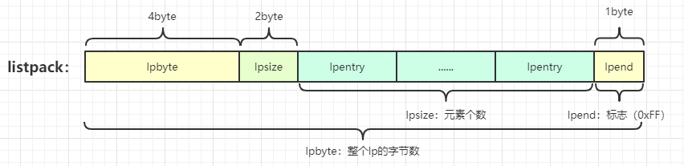
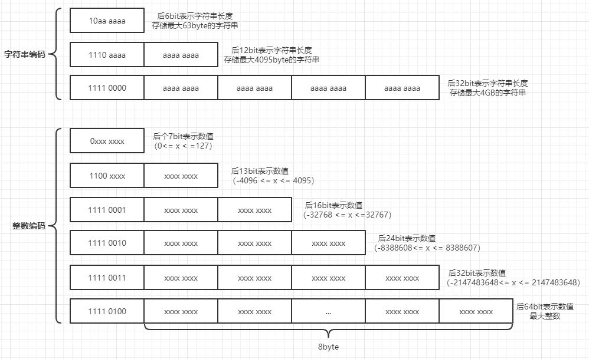

# listpack紧凑列表

## 简介

---
源码位置：listpack.c/listpack.h

Redis 5.0版本引入的一个新的数据结构，它是对ziplist压缩列表的改进，listpack结构更为精简，更加节省内存空间。它的实现方式也和ziplist很类似，所以阅读理解起来并不难。也许该数据结构设计出来是要替代ziplist的，只不过ziplist目前在redis中的应用非常广泛，替换起来复杂度很高，所以目前该数据结构只有在新引入的stream数据结构中使用，可能将来有一天会全面替换ziplist。  

相对于ziplist，listpack取消了存储前置节点长度的字段，listpack的节点之间是相互独立的，改变前置节点的长度，不会影响到后续节点的长度，所以再也不需要连锁更新操作。

和ziplist一样，没有专门定义的结构体，在内存中的表现如下：  
**listpack结构：**
  
|属性       |长度        |用途        |
|---        |---        |---        |
|lpbyte     |4byte      |表示整个lp的字节数（最大可存储4GB）。可用于快速定位最后一个节点的位置。|
|lpsize     |2byte      |表示元素（节点）个数。|
|lpentry    |不定长     |节点。存储数据编码类型，数据，和当前元素的长度。|
|lpend      |1byte      |lp结束标志，和ziplist一样，恒为0xff。|

**lpentry节点：**

encoding：数据的编码类型，如下：  

data：元素。
backlen：存储encoding+data的长度，这个是用于反向遍历的关键，通过位置指针p-backlen_size-backlen，可移动到上一个节点的位置。编码如下：  


</br>

下面来列举一下主要函数的时间复杂度：  
|函数|作用 |复杂度|
|---|---|---|
|lpNew()|创建listpack|O(1)|
|lpFree()|释放listpack|O(1)|
|lpSeek()|获取指定位置的节点指针|平均O(N)，首尾O(1)|
|lpAppend()|指定位置插入元素|O(1)|
|lpDelete()|指定位置删除元素|O(1)|

</br>
</br>

## 结构体与宏定义

``` c
// listpack_malloc.h
#define lp_malloc zmalloc
#define lp_realloc zrealloc
#define lp_free zfree

#define LP_INTBUF_SIZE 21 /* 20 digits of -2^63 + 1 null term = 21. */

// listpack.h
/* lpInsert() where argument possible values: */
#define LP_BEFORE 0
#define LP_AFTER 1
#define LP_REPLACE 2

// listpack.c
#define LP_HDR_SIZE 6       /* 32 bit total len + 16 bit number of elements. */ // 前4个byte表示占用的总字节数，后2个byte表示元素个数
#define LP_HDR_NUMELE_UNKNOWN UINT16_MAX
#define LP_MAX_INT_ENCODING_LEN 9
#define LP_MAX_BACKLEN_SIZE 5
#define LP_MAX_ENTRY_BACKLEN 34359738367ULL
#define LP_ENCODING_INT 0
#define LP_ENCODING_STRING 1

#define LP_ENCODING_7BIT_UINT 0
#define LP_ENCODING_7BIT_UINT_MASK 0x80 // 1000 0000
#define LP_ENCODING_IS_7BIT_UINT(byte) (((byte)&LP_ENCODING_7BIT_UINT_MASK)==LP_ENCODING_7BIT_UINT) // 0xxx xxxx : 7bit正整数编码类型判断

#define LP_ENCODING_6BIT_STR 0x80 // 1000 0000
#define LP_ENCODING_6BIT_STR_MASK 0xC0 // 1100 0000
#define LP_ENCODING_IS_6BIT_STR(byte) (((byte)&LP_ENCODING_6BIT_STR_MASK)==LP_ENCODING_6BIT_STR) // 10aa aaaa : 6bit字符串编码，前2个bit表示6bit字符串编码，后跟6个bit表示字符串长度

#define LP_ENCODING_13BIT_INT 0xC0 // 1100 0000
#define LP_ENCODING_13BIT_INT_MASK 0xE0 // 1110 0000
#define LP_ENCODING_IS_13BIT_INT(byte) (((byte)&LP_ENCODING_13BIT_INT_MASK)==LP_ENCODING_13BIT_INT) // 1100 xxxx : 13bit整数编码类型判断

#define LP_ENCODING_12BIT_STR 0xE0 // 1110 0000
#define LP_ENCODING_12BIT_STR_MASK 0xF0 // 1111 0000
#define LP_ENCODING_IS_12BIT_STR(byte) (((byte)&LP_ENCODING_12BIT_STR_MASK)==LP_ENCODING_12BIT_STR) // 1100 aaaa aaaa aaaa : 12bit字符串编码，前4个bit表示12bit字符串编码，后跟12个bit表示字符串长度

#define LP_ENCODING_16BIT_INT 0xF1 // 1111 0001
#define LP_ENCODING_16BIT_INT_MASK 0xFF // 1111 1111
#define LP_ENCODING_IS_16BIT_INT(byte) (((byte)&LP_ENCODING_16BIT_INT_MASK)==LP_ENCODING_16BIT_INT) // 1110 0001 : 16bit整数编码类型判断

#define LP_ENCODING_24BIT_INT 0xF2 // 1111 0010
#define LP_ENCODING_24BIT_INT_MASK 0xFF // 1111 1111
#define LP_ENCODING_IS_24BIT_INT(byte) (((byte)&LP_ENCODING_24BIT_INT_MASK)==LP_ENCODING_24BIT_INT) // 1111 0010 : 24bit整数编码类型判断

#define LP_ENCODING_32BIT_INT 0xF3 // 1111 0011
#define LP_ENCODING_32BIT_INT_MASK 0xFF // 1111 1111
#define LP_ENCODING_IS_32BIT_INT(byte) (((byte)&LP_ENCODING_32BIT_INT_MASK)==LP_ENCODING_32BIT_INT) // 1111 0011 : 32bit整数编码类型判断

#define LP_ENCODING_64BIT_INT 0xF4 // 1111 0100
#define LP_ENCODING_64BIT_INT_MASK 0xFF // 1111 1111
#define LP_ENCODING_IS_64BIT_INT(byte) (((byte)&LP_ENCODING_64BIT_INT_MASK)==LP_ENCODING_64BIT_INT) // 1111 0100 : 64bit整数编码类型判断

#define LP_ENCODING_32BIT_STR 0xF0 // 1111 0000
#define LP_ENCODING_32BIT_STR_MASK 0xFF  // 1111 1111
#define LP_ENCODING_IS_32BIT_STR(byte) (((byte)&LP_ENCODING_32BIT_STR_MASK)==LP_ENCODING_32BIT_STR) // 1111 0000 : 32bit字符串编码，前8个bit表示32bit字符串编码，后跟32个bit表示字符串长度

#define LP_EOF 0xFF // listpack结束标志

// 计算6bit字符串类型编码的实际长度
#define LP_ENCODING_6BIT_STR_LEN(p) ((p)[0] & 0x3F)
// 计算12bit字符串类型编码的实际长度
#define LP_ENCODING_12BIT_STR_LEN(p) ((((p)[0] & 0xF) << 8) | (p)[1])
// 计算32bit字符串类型编码的实际长度
#define LP_ENCODING_32BIT_STR_LEN(p) (((uint32_t)(p)[1]<<0) | \
                                      ((uint32_t)(p)[2]<<8) | \
                                      ((uint32_t)(p)[3]<<16) | \
                                      ((uint32_t)(p)[4]<<24))
// 获取listpack总字节数
#define lpGetTotalBytes(p)           (((uint32_t)(p)[0]<<0) | \
                                      ((uint32_t)(p)[1]<<8) | \
                                      ((uint32_t)(p)[2]<<16) | \
                                      ((uint32_t)(p)[3]<<24))
// 获取listpack元素个数
#define lpGetNumElements(p)          (((uint32_t)(p)[4]<<0) | \
                                      ((uint32_t)(p)[5]<<8))
// 设置listpack的总字节数
#define lpSetTotalBytes(p,v) do { \
    (p)[0] = (v)&0xff; \
    (p)[1] = ((v)>>8)&0xff; \
    (p)[2] = ((v)>>16)&0xff; \
    (p)[3] = ((v)>>24)&0xff; \
} while(0)
// 设置元素个数
#define lpSetNumElements(p,v) do { \
    (p)[4] = (v)&0xff; \
    (p)[5] = ((v)>>8)&0xff; \
} while(0)
```

</br>

## 函数功能总览

``` c
unsigned char *lpNew(void); // 创建listpack
void lpFree(unsigned char *lp); // 释放listpack
unsigned char *lpInsert(unsigned char *lp, unsigned char *ele, uint32_t size, unsigned char *p, int where, unsigned char **newp); // 指定节点插入或删除操作（ele为空，则为删除）
unsigned char *lpAppend(unsigned char *lp, unsigned char *ele, uint32_t size); // 插入元素
unsigned char *lpDelete(unsigned char *lp, unsigned char *p, unsigned char **newp); // 删除元素
uint32_t lpLength(unsigned char *lp); // listpack节点个数
unsigned char *lpGet(unsigned char *p, int64_t *count, unsigned char *intbuf); // 获取节点的数据
unsigned char *lpFirst(unsigned char *lp); // 获取头节点
unsigned char *lpLast(unsigned char *lp); // 获取尾节点
unsigned char *lpNext(unsigned char *lp, unsigned char *p); // 跳到下一个节点
unsigned char *lpPrev(unsigned char *lp, unsigned char *p); // 跳到上一个节点
uint32_t lpBytes(unsigned char *lp); // 获取listpack的大小
unsigned char *lpSeek(unsigned char *lp, long index); // 获取指定位置节点的指针
```

</br>

## 主要函数实现

---

``` c
// 创建listpack
unsigned char *lpNew(void) {
    unsigned char *lp = lp_malloc(LP_HDR_SIZE+1); // 申请7byte的内存空间
    if (lp == NULL) return NULL;
    lpSetTotalBytes(lp,LP_HDR_SIZE+1);
    lpSetNumElements(lp,0);
    lp[LP_HDR_SIZE] = LP_EOF; // 节点结束标志（恒为0xFF）
    return lp;
}

// 释放listpack
void lpFree(unsigned char *lp) {
    lp_free(lp);
}
```

**编码相关：**

``` c
// 获取元素编码类型和长度
int lpEncodeGetType(unsigned char *ele, uint32_t size, unsigned char *intenc, uint64_t *enclen) {
    int64_t v;
    if (lpStringToInt64((const char*)ele, size, &v)) {
        // 如果能转为整数，则判定元素为整数，根据数值编码到intenc中
        if (v >= 0 && v <= 127) {
            /* Single byte 0-127 integer. */
            intenc[0] = v;
            *enclen = 1;
        } else if (v >= -4096 && v <= 4095) {
            /* 13 bit integer. */
            if (v < 0) v = ((int64_t)1<<13)+v;
            intenc[0] = (v>>8)|LP_ENCODING_13BIT_INT;
            intenc[1] = v&0xff;
            *enclen = 2;
        } else if (v >= -32768 && v <= 32767) {
            /* 16 bit integer. */
            if (v < 0) v = ((int64_t)1<<16)+v;
            intenc[0] = LP_ENCODING_16BIT_INT;
            intenc[1] = v&0xff;
            intenc[2] = v>>8;
            *enclen = 3;
        } else if (v >= -8388608 && v <= 8388607) {
            /* 24 bit integer. */
            if (v < 0) v = ((int64_t)1<<24)+v;
            intenc[0] = LP_ENCODING_24BIT_INT;
            intenc[1] = v&0xff;
            intenc[2] = (v>>8)&0xff;
            intenc[3] = v>>16;
            *enclen = 4;
        } else if (v >= -2147483648 && v <= 2147483647) {
            /* 32 bit integer. */
            if (v < 0) v = ((int64_t)1<<32)+v;
            intenc[0] = LP_ENCODING_32BIT_INT;
            intenc[1] = v&0xff;
            intenc[2] = (v>>8)&0xff;
            intenc[3] = (v>>16)&0xff;
            intenc[4] = v>>24;
            *enclen = 5;
        } else {
            /* 64 bit integer. */
            uint64_t uv = v;
            intenc[0] = LP_ENCODING_64BIT_INT;
            intenc[1] = uv&0xff;
            intenc[2] = (uv>>8)&0xff;
            intenc[3] = (uv>>16)&0xff;
            intenc[4] = (uv>>24)&0xff;
            intenc[5] = (uv>>32)&0xff;
            intenc[6] = (uv>>40)&0xff;
            intenc[7] = (uv>>48)&0xff;
            intenc[8] = uv>>56;
            *enclen = 9;
        }
        return LP_ENCODING_INT;
    } else {
        // 如果是字符串，则计算字符串的编码长度
        if (size < 64) *enclen = 1+size;
        else if (size < 4096) *enclen = 2+size;
        else *enclen = 5+size;
        return LP_ENCODING_STRING;
    }
}
// 把encoding+data的长度编码到backlen中
unsigned long lpEncodeBacklen(unsigned char *buf, uint64_t l) {
    if (l <= 127) {
        if (buf) buf[0] = l;
        return 1;
    } else if (l < 16383) {
        if (buf) {
            buf[0] = l>>7;
            buf[1] = (l&127)|128;
        }
        return 2;
    } else if (l < 2097151) {
        if (buf) {
            buf[0] = l>>14;
            buf[1] = ((l>>7)&127)|128;
            buf[2] = (l&127)|128;
        }
        return 3;
    } else if (l < 268435455) {
        if (buf) {
            buf[0] = l>>21;
            buf[1] = ((l>>14)&127)|128;
            buf[2] = ((l>>7)&127)|128;
            buf[3] = (l&127)|128;
        }
        return 4;
    } else {
        if (buf) {
            buf[0] = l>>28;
            buf[1] = ((l>>21)&127)|128;
            buf[2] = ((l>>14)&127)|128;
            buf[3] = ((l>>7)&127)|128;
            buf[4] = (l&127)|128;
        }
        return 5;
    }
}
// 解码出encoding+data的长度
uint64_t lpDecodeBacklen(unsigned char *p) {
    uint64_t val = 0;
    uint64_t shift = 0;
    do {
        val |= (uint64_t)(p[0] & 127) << shift;
        if (!(p[0] & 128)) break;
        shift += 7;
        p--;
        if (shift > 28) return UINT64_MAX;
    } while(1);
    return val;
}
// 字符串类型编码
void lpEncodeString(unsigned char *buf, unsigned char *s, uint32_t len) {
    if (len < 64) {
        buf[0] = len | LP_ENCODING_6BIT_STR;
        memcpy(buf+1,s,len);
    } else if (len < 4096) {
        buf[0] = (len >> 8) | LP_ENCODING_12BIT_STR;
        buf[1] = len & 0xff;
        memcpy(buf+2,s,len);
    } else {
        buf[0] = LP_ENCODING_32BIT_STR;
        buf[1] = len & 0xff;
        buf[2] = (len >> 8) & 0xff;
        buf[3] = (len >> 16) & 0xff;
        buf[4] = (len >> 24) & 0xff;
        memcpy(buf+5,s,len);
    }
}
```

**插入和删除：**

``` c
// 插入
unsigned char *lpAppend(unsigned char *lp, unsigned char *ele, uint32_t size) {
    uint64_t listpack_bytes = lpGetTotalBytes(lp);
    unsigned char *eofptr = lp + listpack_bytes - 1;
    return lpInsert(lp,ele,size,eofptr,LP_BEFORE,NULL);
}

// 删除
unsigned char *lpDelete(unsigned char *lp, unsigned char *p, unsigned char **newp) {
    return lpInsert(lp,NULL,0,p,LP_REPLACE,newp);
}

// 插入（删除）元素实现，根据ele是否为NULL来判定是哪种操作类型（NULL为删除操作，非NULL为插入操作）
unsigned char *lpInsert(unsigned char *lp, unsigned char *ele, uint32_t size, unsigned char *p, int where, unsigned char **newp) {
    unsigned char intenc[LP_MAX_INT_ENCODING_LEN]; // intenc数组用来记录整型元素的编码和元素内容
    unsigned char backlen[LP_MAX_BACKLEN_SIZE];

    uint64_t enclen; /* The length of the encoded element. */

    /* An element pointer set to NULL means deletion, which is conceptually
     * replacing the element with a zero-length element. So whatever we
     * get passed as 'where', set it to LP_REPLACE. */
    // 如果元素ele为空意味着删除，即用0长度元素去替换，所以where设置为LP_REPLACE
    if (ele == NULL) where = LP_REPLACE;

    /* If we need to insert after the current element, we just jump to the
     * next element (that could be the EOF one) and handle the case of
     * inserting before. So the function will actually deal with just two
     * cases: LP_BEFORE and LP_REPLACE. */
    // 如果想要在位置p后插入元素，则将p跳到下一个元素并在之前处理插入的情况，所以该函数实际上只处理两种情况，LP_BEFORE和LP_REPLACE
    if (where == LP_AFTER) {
        p = lpSkip(p);
        where = LP_BEFORE;
    }

    /* Store the offset of the element 'p', so that we can obtain its
     * address again after a reallocation. */
    unsigned long poff = p-lp;

    /* Calling lpEncodeGetType() results into the encoded version of the
     * element to be stored into 'intenc' in case it is representable as
     * an integer: in that case, the function returns LP_ENCODING_INT.
     * Otherwise if LP_ENCODING_STR is returned, we'll have to call
     * lpEncodeString() to actually write the encoded string on place later.
     *
     * Whatever the returned encoding is, 'enclen' is populated with the
     * length of the encoded element. */
    int enctype;
    if (ele) {
        // 获取编码类型和编码长度
        enctype = lpEncodeGetType(ele,size,intenc,&enclen);
    } else {
        enctype = -1;
        enclen = 0;
    }

    /* We need to also encode the backward-parsable length of the element
     * and append it to the end: this allows to traverse the listpack from
     * the end to the start. */
    unsigned long backlen_size = ele ? lpEncodeBacklen(backlen,enclen) : 0; // 编码长度
    uint64_t old_listpack_bytes = lpGetTotalBytes(lp); // 获取当前lp的字节数
    uint32_t replaced_len  = 0;
    if (where == LP_REPLACE) {
        // 如果是删除操作，则计算p位置节点的长度
        replaced_len = lpCurrentEncodedSize(p); // 当前位置p的元素编码字节数
        replaced_len += lpEncodeBacklen(NULL,replaced_len);
    }

    uint64_t new_listpack_bytes = old_listpack_bytes + enclen + backlen_size
                                  - replaced_len;
    if (new_listpack_bytes > UINT32_MAX) return NULL; // 单个listpack最大只能是4GB

    /* We now need to reallocate in order to make space or shrink the
     * allocation (in case 'when' value is LP_REPLACE and the new element is
     * smaller). However we do that before memmoving the memory to
     * make room for the new element if the final allocation will get
     * larger, or we do it after if the final allocation will get smaller. */

    unsigned char *dst = lp + poff; /* May be updated after reallocation. */ // 指向元素将要插入的位置

    /* Realloc before: we need more room. */
    if (new_listpack_bytes > old_listpack_bytes) {
        // 如果是插入，则lp需要分配更多内存空间
        if ((lp = lp_realloc(lp,new_listpack_bytes)) == NULL) return NULL;
        dst = lp + poff;
    }

    /* Setup the listpack relocating the elements to make the exact room
     * we need to store the new one. */
    if (where == LP_BEFORE) {
        // 移动结束位（lpend）到最后
        memmove(dst+enclen+backlen_size,dst,old_listpack_bytes-poff);
    } else { /* LP_REPLACE. */
        // 将删除的节点后面的所有内存数据往前移动到节点的位置上
        long lendiff = (enclen+backlen_size)-replaced_len;
        memmove(dst+replaced_len+lendiff,
                dst+replaced_len,
                old_listpack_bytes-poff-replaced_len);
    }

    /* Realloc after: we need to free space. */
    if (new_listpack_bytes < old_listpack_bytes) {
        // 如果是删除操作，则lp也需要重新分配内存空间
        if ((lp = lp_realloc(lp,new_listpack_bytes)) == NULL) return NULL;
        dst = lp + poff;
    }

    /* Store the entry. */
    if (newp) {
        // 将当前位置赋给newp
        *newp = dst;
        /* In case of deletion, set 'newp' to NULL if the next element is
         * the EOF element. */
         // 如果是删除操作，并且已经到了列表尾了，返回null
        if (!ele && dst[0] == LP_EOF) *newp = NULL;
    }
    if (ele) {
        // 插入操作将数据填充到节点
        if (enctype == LP_ENCODING_INT) {
            memcpy(dst,intenc,enclen);
        } else {
            lpEncodeString(dst,ele,size);
        }
        dst += enclen;
        // 填充backlen
        memcpy(dst,backlen,backlen_size);
        dst += backlen_size;
    }

    /* Update header. */
    // 更新lp信息
    if (where != LP_REPLACE || ele == NULL) {
        uint32_t num_elements = lpGetNumElements(lp);
        if (num_elements != LP_HDR_NUMELE_UNKNOWN) {
            if (ele)
                lpSetNumElements(lp,num_elements+1);
            else
                lpSetNumElements(lp,num_elements-1);
        }
    }
    lpSetTotalBytes(lp,new_listpack_bytes);

#if 0
    /* This code path is normally disabled: what it does is to force listpack
     * to return *always* a new pointer after performing some modification to
     * the listpack, even if the previous allocation was enough. This is useful
     * in order to spot bugs in code using listpacks: by doing so we can find
     * if the caller forgets to set the new pointer where the listpack reference
     * is stored, after an update. */
    unsigned char *oldlp = lp;
    lp = lp_malloc(new_listpack_bytes);
    memcpy(lp,oldlp,new_listpack_bytes);
    if (newp) {
        unsigned long offset = (*newp)-oldlp;
        *newp = lp + offset;
    }
    /* Make sure the old allocation contains garbage. */
    memset(oldlp,'A',new_listpack_bytes);
    lp_free(oldlp);
#endif

    return lp;
}
```

**节点遍历相关操作：**

``` c
// 如果是在位置p的节点后进行操作，则先把p跳到该节点的后一个节点上
unsigned char *lpSkip(unsigned char *p) {
    // 获取当前节点encoding+data的长度
    unsigned long entrylen = lpCurrentEncodedSize(p);
    // 获取当前backlen的长度
    entrylen += lpEncodeBacklen(NULL,entrylen);
    // 指针移动到下一个节点的位置
    p += entrylen;
    return p;
}

// 跳到下一个节点
unsigned char *lpNext(unsigned char *lp, unsigned char *p) {
    ((void) lp); /* lp is not used for now. However lpPrev() uses it. */
    p = lpSkip(p);
    if (p[0] == LP_EOF) return NULL;
    return p;
}

// 跳到上一个节点
unsigned char *lpPrev(unsigned char *lp, unsigned char *p) {
    if (p-lp == LP_HDR_SIZE) return NULL;
    p--; /* Seek the first backlen byte of the last element. */
    // 获取encoding+data的长度
    uint64_t prevlen = lpDecodeBacklen(p);
    // 获取backlen的长度
    prevlen += lpEncodeBacklen(NULL,prevlen);
    // 指针移动到上一个节点的位置
    return p-prevlen+1; /* Seek the first byte of the previous entry. */
}

/* Return a pointer to the first element of the listpack, or NULL if the
 * listpack has no elements. */
// 首节点位置
unsigned char *lpFirst(unsigned char *lp) {
    lp += LP_HDR_SIZE; /* Skip the header. */
    if (lp[0] == LP_EOF) return NULL;
    return lp;
}

/* Return a pointer to the last element of the listpack, or NULL if the
 * listpack has no elements. */
// 尾节点位置
unsigned char *lpLast(unsigned char *lp) {
    unsigned char *p = lp+lpGetTotalBytes(lp)-1; /* Seek EOF element. */
    return lpPrev(lp,p); /* Will return NULL if EOF is the only element. */
}
```

**查询：**

``` c
// 获取指定位置的节点指针
unsigned char *lpSeek(unsigned char *lp, long index) {
    int forward = 1; /* Seek forward by default. */

    /* We want to seek from left to right or the other way around
     * depending on the listpack length and the element position.
     * However if the listpack length cannot be obtained in constant time,
     * we always seek from left to right. */
    uint32_t numele = lpGetNumElements(lp); // 获取整个listpack的节点数
    // 计算index在listpack中的上半区域还是下半区域
    if (numele != LP_HDR_NUMELE_UNKNOWN) {
        if (index < 0) index = (long)numele+index;
        if (index < 0) return NULL; /* Index still < 0 means out of range. */
        if (index >= numele) return NULL; /* Out of range the other side. */
        /* We want to scan right-to-left if the element we are looking for
         * is past the half of the listpack. */
        if (index > numele/2) {
            forward = 0;
            /* Left to right scanning always expects a negative index. Convert
             * our index to negative form. */
            index -= numele;
        }
    } else {
        /* If the listpack length is unspecified, for negative indexes we
         * want to always scan left-to-right. */
        if (index < 0) forward = 0;
    }

    /* Forward and backward scanning is trivially based on lpNext()/lpPrev(). */
    if (forward) {
        // 如果在上半区域，则从头节点开始正向遍历到index的位置
        unsigned char *ele = lpFirst(lp);
        while (index > 0 && ele) {
            ele = lpNext(lp,ele);
            index--;
        }
        return ele;
    } else {
        // 如果在下半区域，则尾头节点开始正向遍历到index的位置
        unsigned char *ele = lpLast(lp);
        while (index < -1 && ele) {
            ele = lpPrev(lp,ele);
            index++;
        }
        return ele;
    }
}
// 获取节点p的数据
// 如果数据是字符串，则返回值就是字符串的头指针，count是字符串的长度
// 如果数据是整数，数值填入count，如果不为空，将数值转为字符串填入intbuf
unsigned char *lpGet(unsigned char *p, int64_t *count, unsigned char *intbuf) {
    int64_t val;
    uint64_t uval, negstart, negmax;

    // 以下是判断数据的编码类型，如果是字符串，则直接取出返回
    if (LP_ENCODING_IS_7BIT_UINT(p[0])) {
        negstart = UINT64_MAX; /* 7 bit ints are always positive. */
        negmax = 0;
        uval = p[0] & 0x7f;
    } else if (LP_ENCODING_IS_6BIT_STR(p[0])) {
        *count = LP_ENCODING_6BIT_STR_LEN(p);
        return p+1;
    } else if (LP_ENCODING_IS_13BIT_INT(p[0])) {
        uval = ((p[0]&0x1f)<<8) | p[1];
        negstart = (uint64_t)1<<12;
        negmax = 8191;
    } else if (LP_ENCODING_IS_16BIT_INT(p[0])) {
        uval = (uint64_t)p[1] |
               (uint64_t)p[2]<<8;
        negstart = (uint64_t)1<<15;
        negmax = UINT16_MAX;
    } else if (LP_ENCODING_IS_24BIT_INT(p[0])) {
        uval = (uint64_t)p[1] |
               (uint64_t)p[2]<<8 |
               (uint64_t)p[3]<<16;
        negstart = (uint64_t)1<<23;
        negmax = UINT32_MAX>>8;
    } else if (LP_ENCODING_IS_32BIT_INT(p[0])) {
        uval = (uint64_t)p[1] |
               (uint64_t)p[2]<<8 |
               (uint64_t)p[3]<<16 |
               (uint64_t)p[4]<<24;
        negstart = (uint64_t)1<<31;
        negmax = UINT32_MAX;
    } else if (LP_ENCODING_IS_64BIT_INT(p[0])) {
        uval = (uint64_t)p[1] |
               (uint64_t)p[2]<<8 |
               (uint64_t)p[3]<<16 |
               (uint64_t)p[4]<<24 |
               (uint64_t)p[5]<<32 |
               (uint64_t)p[6]<<40 |
               (uint64_t)p[7]<<48 |
               (uint64_t)p[8]<<56;
        negstart = (uint64_t)1<<63;
        negmax = UINT64_MAX;
    } else if (LP_ENCODING_IS_12BIT_STR(p[0])) {
        *count = LP_ENCODING_12BIT_STR_LEN(p);
        return p+2;
    } else if (LP_ENCODING_IS_32BIT_STR(p[0])) {
        *count = LP_ENCODING_32BIT_STR_LEN(p);
        return p+5;
    } else {
        uval = 12345678900000000ULL + p[0];
        negstart = UINT64_MAX;
        negmax = 0;
    }

    /* We reach this code path only for integer encodings.
     * Convert the unsigned value to the signed one using two's complement
     * rule. */
     // 如果是负整数，则转为有符号整数
    if (uval >= negstart) {
        /* This three steps conversion should avoid undefined behaviors
         * in the unsigned -> signed conversion. */
        uval = negmax-uval;
        val = uval;
        val = -val-1;
    } else {
        val = uval;
    }

    /* Return the string representation of the integer or the value itself
     * depending on intbuf being NULL or not. */
    if (intbuf) {
        *count = snprintf((char*)intbuf,LP_INTBUF_SIZE,"%lld",(long long)val);
        return intbuf;
    } else {
        *count = val;
        return NULL;
    }
}
```
