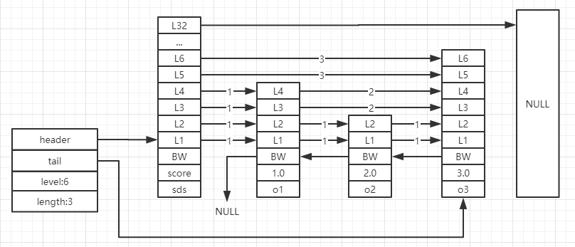

# zskiplist跳跃表

## 简介

---
源码位置：t_zset.c/server.h

  
跳跃表是zset有序集合的底层实现之一。  

</br>
</br>

## 结构体与宏定义

---
**server.h:**

``` c
/* ZSETs use a specialized version of Skiplists */
typedef struct zskiplistNode {
    sds ele;
    double score; // 分值
    struct zskiplistNode *backward; // 后退指针
    struct zskiplistLevel {
        struct zskiplistNode *forward; // 前进指针
        unsigned long span; // 跨度
    } level[]; // 跳跃表的层
} zskiplistNode;

typedef struct zskiplist {
    struct zskiplistNode *header, *tail; // header为跳跃表的表头节点， tail为表尾节点
    unsigned long length; // 跳跃表的长度
    int level; // 跳跃表当前的层数
} zskiplist;

#define ZSKIPLIST_MAXLEVEL 32 /* Should be enough for 2^64 elements */ // 跳跃表层数，最大为32层，当最低层数据达到2^64时，才会能达到最顶层，所以完全足够
#define ZSKIPLIST_P 0.25      /* Skiplist P = 1/4 */ // 用于计算上层被分配到的概率

/* Input flags. */
#define ZADD_NONE 0
#define ZADD_INCR (1<<0)    /* Increment the score instead of setting it. */
#define ZADD_NX (1<<1)      /* Don't touch elements not already existing. */
#define ZADD_XX (1<<2)      /* Only touch elements already existing. */

/* Output flags. */
#define ZADD_NOP (1<<3)     /* Operation not performed because of conditionals.*/
#define ZADD_NAN (1<<4)     /* Only touch elements already existing. */
#define ZADD_ADDED (1<<5)   /* The element was new and was added. */
#define ZADD_UPDATED (1<<6) /* The element already existed, score updated. */

/* Flags only used by the ZADD command but not by zsetAdd() API: */
#define ZADD_CH (1<<16)      /* Return num of elements added or updated. */

/* Struct to hold a inclusive/exclusive range spec by score comparison. */
typedef struct {
    double min, max;
    int minex, maxex; /* are min or max exclusive? */
} zrangespec;

/* Struct to hold an inclusive/exclusive range spec by lexicographic comparison. */
typedef struct {
    sds min, max;     /* May be set to shared.(minstring|maxstring) */
    int minex, maxex; /* are min or max exclusive? */
} zlexrangespec;
```

</br>
</br>

## 函数功能总览

---
**server.h:**  
（不知道为啥zset的函数声明会在server.h里，待以后了解了再写下来吧）

``` c
zskiplist *zslCreate(void); // 创建跳跃表，分配指定级别数的跳跃表节点
void zslFree(zskiplist *zsl); // 释放跳跃表
zskiplistNode *zslInsert(zskiplist *zsl, double score, sds ele); // 跳跃表插入新节点
unsigned char *zzlInsert(unsigned char *zl, sds ele, double score);
int zslDelete(zskiplist *zsl, double score, sds ele, zskiplistNode **node);
zskiplistNode *zslFirstInRange(zskiplist *zsl, zrangespec *range);
zskiplistNode *zslLastInRange(zskiplist *zsl, zrangespec *range);
double zzlGetScore(unsigned char *sptr);
void zzlNext(unsigned char *zl, unsigned char **eptr, unsigned char **sptr);
void zzlPrev(unsigned char *zl, unsigned char **eptr, unsigned char **sptr);
unsigned char *zzlFirstInRange(unsigned char *zl, zrangespec *range);
unsigned char *zzlLastInRange(unsigned char *zl, zrangespec *range);
unsigned long zsetLength(const robj *zobj);
void zsetConvert(robj *zobj, int encoding);
void zsetConvertToZiplistIfNeeded(robj *zobj, size_t maxelelen);
int zsetScore(robj *zobj, sds member, double *score);
unsigned long zslGetRank(zskiplist *zsl, double score, sds o);
int zsetAdd(robj *zobj, double score, sds ele, int *flags, double *newscore);
long zsetRank(robj *zobj, sds ele, int reverse);
int zsetDel(robj *zobj, sds ele);
void genericZpopCommand(client *c, robj **keyv, int keyc, int where, int emitkey, robj *countarg);
sds ziplistGetObject(unsigned char *sptr);
int zslValueGteMin(double value, zrangespec *spec);
int zslValueLteMax(double value, zrangespec *spec);
void zslFreeLexRange(zlexrangespec *spec);
int zslParseLexRange(robj *min, robj *max, zlexrangespec *spec);
unsigned char *zzlFirstInLexRange(unsigned char *zl, zlexrangespec *range);
unsigned char *zzlLastInLexRange(unsigned char *zl, zlexrangespec *range);
zskiplistNode *zslFirstInLexRange(zskiplist *zsl, zlexrangespec *range);
zskiplistNode *zslLastInLexRange(zskiplist *zsl, zlexrangespec *range);
int zzlLexValueGteMin(unsigned char *p, zlexrangespec *spec);
int zzlLexValueLteMax(unsigned char *p, zlexrangespec *spec);
int zslLexValueGteMin(sds value, zlexrangespec *spec);
int zslLexValueLteMax(sds value, zlexrangespec *spec);
```
