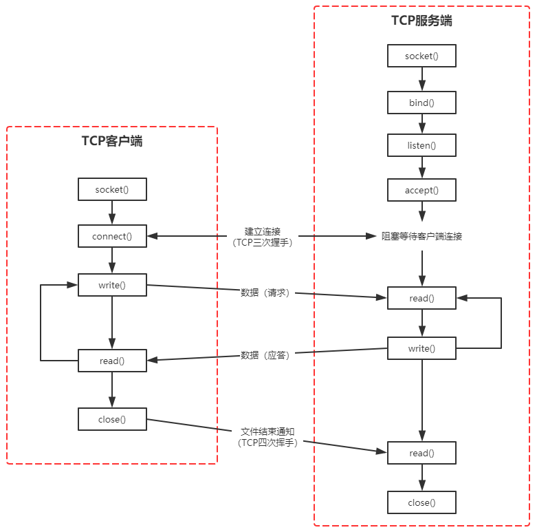
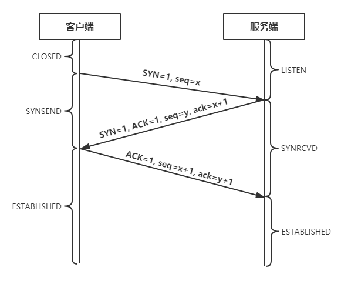
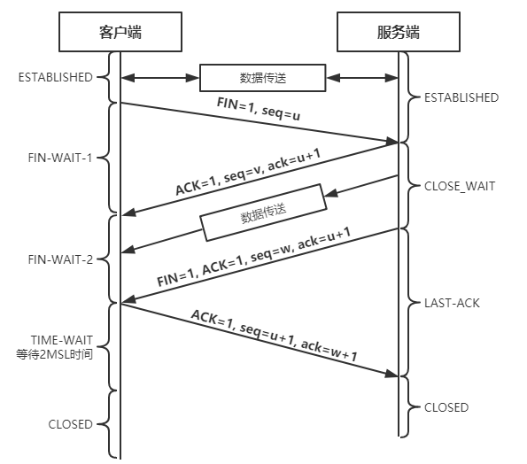

# 网络通信

## 简介

---
源码位置：anet.c/anet.h/networking.c

**1. 简介**
Redis在`anet.c`中对TCP/IP网络中socket api接口和状态设置进行了封装。状态设置主要包括socket连接的阻塞性、tcp的保活定时器的设置、设置发送缓冲区、tcp的nagle算法设置、设置发送/接收超时时间、地址重用的设置和IPv6/IPv4的设置等。
Redis网络通讯的具体实现在`networking.c`中，主要包括如何建立和客户端的连接，并且接收其命令，返回给客户端。

**2. 回顾tcp socket编程**
2.1 TCP客户/服务器程序socket编程流程如下：


2.2 TCP的三次握手


2.3 TCP的四次挥手
TCP的断开连接操作可由**任意一端发起**


**3. anet解析**
anet.h中定义的函数如下：

```c
int anetTcpConnect(char *err, const char *addr, int port); // tcp连接
int anetTcpNonBlockConnect(char *err, const char *addr, int port); // TCP非阻塞连接
int anetTcpNonBlockBindConnect(char *err, const char *addr, int port, const char *source_addr); // TCP非阻塞绑定
int anetTcpNonBlockBestEffortBindConnect(char *err, const char *addr, int port, const char *source_addr); // TCP非阻塞绑定
int anetUnixConnect(char *err, const char *path); // unix socket连接
int anetUnixNonBlockConnect(char *err, const char *path); // unix socket非阻塞连接
int anetRead(int fd, char *buf, int count); // socket读数据
int anetResolve(char *err, char *host, char *ipbuf, size_t ipbuf_len); // 解析所有的东西
int anetResolveIP(char *err, char *host, char *ipbuf, size_t ipbuf_len); // 解析IP
int anetTcpServer(char *err, int port, char *bindaddr, int backlog); // IPv4下创建socket
int anetTcp6Server(char *err, int port, char *bindaddr, int backlog); // IPv6下创建socket
int anetUnixServer(char *err, char *path, mode_t perm, int backlog); // unix创建socket和bind
int anetTcpAccept(char *err, int serversock, char *ip, size_t ip_len, int *port); // tcp socket接收
int anetUnixAccept(char *err, int serversock); // unix tcp socket接收
int anetWrite(int fd, char *buf, int count); // socket写数据
int anetNonBlock(char *err, int fd); // 设置socket为非阻塞
int anetBlock(char *err, int fd); // 设置socket为阻塞
int anetEnableTcpNoDelay(char *err, int fd); // 启用tcp_nodelay选项（关闭Nagle算法）
int anetDisableTcpNoDelay(char *err, int fd); // 禁用tcp_nodelay选项
int anetTcpKeepAlive(char *err, int fd); // 设置tcp keepalive选项
int anetSendTimeout(char *err, int fd, long long ms); // 设置发送超时时间
int anetRecvTimeout(char *err, int fd, long long ms); // 设置接收超时时间
int anetPeerToString(int fd, char *ip, size_t ip_len, int *port); // 获取客户端的ip、port
int anetKeepAlive(char *err, int fd, int interval); // 设置tcp keepalive选项
int anetSockName(int fd, char *ip, size_t ip_len, int *port); // 获取套接字的名字
/* 格式化操作 */
int anetFormatAddr(char *fmt, size_t fmt_len, char *ip, int port);
int anetFormatPeer(int fd, char *fmt, size_t fmt_len);
int anetFormatSock(int fd, char *fmt, size_t fmt_len);
```

Redis服务启动后会调用`server.c/listenToPort()`进行socket相关的设置和端口监听。如果服务器配置不包含要绑定的特定地址，则该函数会尝试IPv6（调用`anetTcp6Server()`）和IPv4（调用`anetTcpServer()`）协议进行绑定。
不管是使用IPv6还是IPv4协议，最终调用的都是`_anetTcpServer()`来创建socket并进行绑定监听，以下是该函数的实现代码：

```c
static int _anetTcpServer(char *err, int port, char *bindaddr, int af, int backlog)
{
    int s = -1, rv;
    char _port[6];  /* strlen("65535") */
    struct addrinfo hints, *servinfo, *p;

    snprintf(_port,6,"%d",port);
    memset(&hints,0,sizeof(hints));
    hints.ai_family = af;
    hints.ai_socktype = SOCK_STREAM;
    hints.ai_flags = AI_PASSIVE;    /* No effect if bindaddr != NULL */

    // 将域名解析成ip地址
    if ((rv = getaddrinfo(bindaddr,_port,&hints,&servinfo)) != 0) {
        anetSetError(err, "%s", gai_strerror(rv));
        return ANET_ERR;
    }
    for (p = servinfo; p != NULL; p = p->ai_next) {
        if ((s = socket(p->ai_family,p->ai_socktype,p->ai_protocol)) == -1)
            continue;

        if (af == AF_INET6 && anetV6Only(err,s) == ANET_ERR) goto error;
        // 设置SO_REUSEADDR允许我们重复bind相同的本地地址
        if (anetSetReuseAddr(err,s) == ANET_ERR) goto error;
        // bind && listen
        if (anetListen(err,s,p->ai_addr,p->ai_addrlen,backlog) == ANET_ERR) s = ANET_ERR;
        goto end;
    }
    if (p == NULL) {
        anetSetError(err, "unable to bind socket, errno: %d", errno);
        goto error;
    }

error:
    if (s != -1) close(s);
    s = ANET_ERR;
end:
    freeaddrinfo(servinfo);
    return s;
}
```

**4. networking解析**
新版本Redis增加了多线程I/O来改进读写缓冲区的性能，而不是改进命令执行的性能主要原因是：

1. 读写缓冲区在命令执行的生命周期中是占了比较大的比重
2. Redis更倾向于保持简单的设计，如果在命令执行部分改用多线程会不得不处理各种问题，例如并发写入、加锁等

那么将读写缓冲区改为多线程后整个模型大致如下：


4.1 线程初始化
首先，如果用户没有开启多线程IO，也就是io_threads_num == 1时直接按照单线程模型处理，如果超过线程数IO_THREADS_MAX_NUM上限则异常退出。

紧接着Redis使用listCreate()创建io_threads_num个线程，并且对主线程（id=0）以外的线程进行处理：

- 初始化线程的等待任务数为0
- 获取锁，使得线程不能进行操作
- 将线程tid与Redis中的线程id（for循环生成）进行映射

```c
void initThreadedIO(void) {
    io_threads_active = 0; /* We start with threads not active. */

    /* 如果io_threads_num为1，则按照单线程模型处理 */
    if (server.io_threads_num == 1) return;

    // 线程数设置超过上限
    if (server.io_threads_num > IO_THREADS_MAX_NUM) {
        serverLog(LL_WARNING,"Fatal: too many I/O threads configured. "
                             "The maximum number is %d.", IO_THREADS_MAX_NUM);
        exit(1);
    }

    /* 生成并初始化对应 io_threads_num 个I/O线程 */
    for (int i = 0; i < server.io_threads_num; i++) {
        io_threads_list[i] = listCreate();
        if (i == 0) continue; /* 0为主线程 */

        /* 非主线程则需要以下处理 */
        pthread_t tid;
        // 为线程初始化对应的锁
        pthread_mutex_init(&io_threads_mutex[i],NULL);
        // 线程等待状态初始化为0
        io_threads_pending[i] = 0;
        // 初始化后将线程暂时锁住
        pthread_mutex_lock(&io_threads_mutex[i]); /* Thread will be stopped. */
        if (pthread_create(&tid,NULL,IOThreadMain,(void*)(long)i) != 0) {
            serverLog(LL_WARNING,"Fatal: Can't initialize IO thread.");
            exit(1);
        }
        // 将index和对应线程ID加以映射
        io_threads[i] = tid;
    }
}
```

4.2 建立连接
Redis服务端会初始化一个socket端口来监听客户端的连接，当一个连接建立后，服务端会对客户端的socket进行设置：

1. 客户端socket设置为非阻塞模式，因为Redis采用的是非阻塞I/O多路复用模型。
2. 客户端socket设置为 TCP_NODELAY 属性，禁用 Nagle 算法。
3. 将该socket绑定读事件到时间loop，用于监听这个客户端socket的数据发送。
4. 建立连接后如果发现已经超过最大连接数，则关闭连接，删除该客户端socket。

```c
client *createClient(connection *conn) {
    client *c = zmalloc(sizeof(client));

    /*
     * 当conn为NULL时，创建无网络连接的伪客户端
     * 当conn不为NULL时，创建带网络连接的客户端
     * 因为 Redis 的命令必须在客户端的上下文中使用，所以在执行 Lua 环境中的命令时
     * 需要用到这种伪终端
     */
    if (conn) {
        // 设置非阻塞
        connNonBlock(conn);
        // 禁用tcp_nodelay
        connEnableTcpNoDelay(conn);
        // 设置 keep alive
        if (server.tcpkeepalive)
            connKeepAlive(conn,server.tcpkeepalive);
        // 绑定读事件和处理函数到事件loop（开始接收命令请求）
        connSetReadHandler(conn, readQueryFromClient);
        // 将私有数据指针与连接相关联
        connSetPrivateData(conn, c);
    }

    // 初始化客户端参数
    selectDb(c,0);
    uint64_t client_id = ++server.next_client_id;
    c->id = client_id;
    c->resp = 2;
    c->conn = conn;
    c->name = NULL;
    c->bufpos = 0;
    c->qb_pos = 0;
    c->querybuf = sdsempty();
    c->pending_querybuf = sdsempty();
    c->querybuf_peak = 0;
    c->reqtype = 0;
    c->argc = 0;
    c->argv = NULL;
    c->cmd = c->lastcmd = NULL;
    c->user = DefaultUser;
    c->multibulklen = 0;
    c->bulklen = -1;
    c->sentlen = 0;
    c->flags = 0;
    c->ctime = c->lastinteraction = server.unixtime;
    /* If the default user does not require authentication, the user is
     * directly authenticated. */
    c->authenticated = (c->user->flags & USER_FLAG_NOPASS) != 0;
    c->replstate = REPL_STATE_NONE;
    c->repl_put_online_on_ack = 0;
    c->reploff = 0;
    c->read_reploff = 0;
    c->repl_ack_off = 0;
    c->repl_ack_time = 0;
    c->slave_listening_port = 0;
    c->slave_ip[0] = '\0';
    c->slave_capa = SLAVE_CAPA_NONE;
    c->reply = listCreate();
    c->reply_bytes = 0;
    c->obuf_soft_limit_reached_time = 0;
    listSetFreeMethod(c->reply,freeClientReplyValue);
    listSetDupMethod(c->reply,dupClientReplyValue);
    c->btype = BLOCKED_NONE;
    c->bpop.timeout = 0;
    c->bpop.keys = dictCreate(&objectKeyHeapPointerValueDictType,NULL);
    c->bpop.target = NULL;
    c->bpop.xread_group = NULL;
    c->bpop.xread_consumer = NULL;
    c->bpop.xread_group_noack = 0;
    c->bpop.numreplicas = 0;
    c->bpop.reploffset = 0;
    c->woff = 0;
    c->watched_keys = listCreate();
    c->pubsub_channels = dictCreate(&objectKeyPointerValueDictType,NULL);
    c->pubsub_patterns = listCreate();
    c->peerid = NULL;
    c->client_list_node = NULL;
    c->client_tracking_redirection = 0;
    c->client_tracking_prefixes = NULL;
    c->auth_callback = NULL;
    c->auth_callback_privdata = NULL;
    c->auth_module = NULL;
    listSetFreeMethod(c->pubsub_patterns,decrRefCountVoid);
    listSetMatchMethod(c->pubsub_patterns,listMatchObjects);
    if (conn) linkClient(c); // 如果不是伪客户端，那么添加到服务器的客户端链表中
    initClientMultiState(c); // 初始化客户端的事务状态
    return c;
}
```

4.3 读事件到来
读事件到来，Redis需要判断是否满足Threaded IO条件。如果符合，则将client放到等待读取的队列中，并将client的flag设置为等待读取；如果不符合，则按照单线程模型往下继续处理。
等待读取队列由server维护，包含了所有处于读事件pending的客户端列表。

```c
void readQueryFromClient(connection *conn) {
    // 获取客户端结构体
    client *c = connGetPrivateData(conn);
    int nread, readlen;
    size_t qblen;

    /* 如果启动了 I/O 线程，则将客户端加到server.clients_pending_read列表中 */
    if (postponeClientRead(c)) return;

    readlen = PROTO_IOBUF_LEN; // 通用缓冲区大小 1024*16
    /* 如果是批量请求，则需要提高缓冲区的大小 */
    if (c->reqtype == PROTO_REQ_MULTIBULK && c->multibulklen && c->bulklen != -1
        && c->bulklen >= PROTO_MBULK_BIG_ARG)
    {
        ssize_t remaining = (size_t)(c->bulklen+2)-sdslen(c->querybuf);

        /* 在某些边缘情况下，“remaining”变量可能为零，例如，在客户端暂停后恢复被阻塞的客户端。 */
        if (remaining > 0 && remaining < readlen) readlen = remaining;
    }

    /* 获取缓冲区内当前内容的长度
     * 如果读取出现 short read ，那么可能会有内容滞留在读取缓冲区里面
     * 这些滞留内容也许不能完整构成一个符合协议的命令 */
    qblen = sdslen(c->querybuf);
    // 如果有需要，更新缓冲区内容长度的峰值（peak）
    if (c->querybuf_peak < qblen) c->querybuf_peak = qblen;
    c->querybuf = sdsMakeRoomFor(c->querybuf, readlen); // 扩容querybuf的大小
    nread = connRead(c->conn, c->querybuf+qblen, readlen); // 读取内容到缓存中
    if (nread == -1) {
        // 读取错误
        if (connGetState(conn) == CONN_STATE_CONNECTED) {
            return;
        } else {
            serverLog(LL_VERBOSE, "Reading from client: %s",connGetLastError(c->conn));
            freeClientAsync(c);
            return;
        }
    } else if (nread == 0) {
        // EOF
        serverLog(LL_VERBOSE, "Client closed connection");
        freeClientAsync(c);
        return;
    } else if (c->flags & CLIENT_MASTER) {
        /* 将缓冲区内的内容追加到pending缓冲区中，稍后将使用这个缓冲区，以便在执行最后一个命令时应用字符串的副本 */
        c->pending_querybuf = sdscatlen(c->pending_querybuf,
                                        c->querybuf+qblen,nread);
    }

    // 根据内容，更新查询缓冲区（SDS） free 和 len 属性
    // 并将 '\0' 正确地放到内容的最后
    sdsIncrLen(c->querybuf,nread);
    // 记录服务器和客户端最后一次互动的时间
    c->lastinteraction = server.unixtime;
    // 如果客户端是 master 的话，更新它的复制偏移量
    if (c->flags & CLIENT_MASTER) c->read_reploff += nread;
    server.stat_net_input_bytes += nread;
    // 查询缓冲区长度超出服务器最大缓冲区长度
    // 清空缓冲区并释放客户端
    if (sdslen(c->querybuf) > server.client_max_querybuf_len) {
        sds ci = catClientInfoString(sdsempty(),c), bytes = sdsempty();

        bytes = sdscatrepr(bytes,c->querybuf,64);
        serverLog(LL_WARNING,"Closing client that reached max query buffer length: %s (qbuf initial bytes: %s)", ci, bytes);
        sdsfree(ci);
        sdsfree(bytes);
        freeClientAsync(c);
        return;
    }

    /* 客户端输入缓冲区中有更多数据，继续分析以防有完整的命令要执行. */
     processInputBufferAndReplicate(c);
}
```

如果开启了Threaded-IO，如何分配读取pending的client给thread呢？`handleClientsWithPendingReadsUsingThreads()`

```c
int handleClientsWithPendingReadsUsingThreads(void) {
    if (!io_threads_active || !server.io_threads_do_reads) return 0;
    // 检查有多少等待读的client
    int processed = listLength(server.clients_pending_read);
    if (processed == 0) return 0;

    if (tio_debug) printf("%d TOTAL READ pending clients\n", processed);

    listIter li;
    listNode *ln;
    listRewind(server.clients_pending_read,&li);
    int item_id = 0;
    // 将每个等待的client分配给线程，当等待长度超过线程数时，每个线程分配到的client可能会超过1个
    while((ln = listNext(&li))) {
        client *c = listNodeValue(ln);
        int target_id = item_id % server.io_threads_num;
        listAddNodeTail(io_threads_list[target_id],c);
        item_id++;
    }

    /* 修改每个线程需要完成的数量 */
    io_threads_op = IO_THREADS_OP_READ;
    for (int j = 1; j < server.io_threads_num; j++) {
        int count = listLength(io_threads_list[j]);
        io_threads_pending[j] = count;
    }

    /* 也可以使用主线程来处理客户端的一部分 */
    listRewind(io_threads_list[0],&li);
    while((ln = listNext(&li))) {
        client *c = listNodeValue(ln);
        readQueryFromClient(c->conn);
    }
    listEmpty(io_threads_list[0]);

    /* 等待线程处理直到没有剩余任务 */
    while(1) {
        unsigned long pending = 0;
        for (int j = 1; j < server.io_threads_num; j++)
            pending += io_threads_pending[j];
        if (pending == 0) break;
    }
    if (tio_debug) printf("I/O READ All threads finshed\n");

    /* 再次运行客户端列表以处理新的缓冲区 */
    listRewind(server.clients_pending_read,&li);
    while((ln = listNext(&li))) {
        client *c = listNodeValue(ln);
        c->flags &= ~CLIENT_PENDING_READ;
        if (c->flags & CLIENT_PENDING_COMMAND) {
            c->flags &= ~ CLIENT_PENDING_COMMAND;
            processCommandAndResetClient(c);
        }
        processInputBufferAndReplicate(c);
    }
    // 清空client_pending_read
    listEmpty(server.clients_pending_read);
    return processed;
}
```

如何处理读请求？
在上面的过程中，当任务分发完毕后，每个线程按照正常流程将自己负责的Client的读取缓冲区的内容进行处理，和原来的单线程没有太大差异。

每轮处理中，需要将各个线程的锁开启，打开标志：

```c
void startThreadedIO(void) {
    if (tio_debug) { printf("S"); fflush(stdout); }
    if (tio_debug) printf("--- STARTING THREADED IO ---\n");
    serverAssert(io_threads_active == 0);
    for (int j = 1; j < server.io_threads_num; j++)
        // 解开线程的锁定状态
        pthread_mutex_unlock(&io_threads_mutex[j]);
    // 现在可以开始多线程IO执行对应读/写任务
    io_threads_active = 1;
}
```

同样结束时，首先需要检查是否有剩余待读的IO，如果没有，将线程锁定，标志关闭：

```c
void stopThreadedIO(void) {
    // 需要停止的时候可能还有等待读的Client 在停止前进行处理
    handleClientsWithPendingReadsUsingThreads();
    if (tio_debug) { printf("E"); fflush(stdout); }
    if (tio_debug) printf("--- STOPPING THREADED IO [R%d] [W%d] ---\n",
        (int) listLength(server.clients_pending_read),
        (int) listLength(server.clients_pending_write));
    serverAssert(io_threads_active == 1);
    for (int j = 1; j < server.io_threads_num; j++)
        // 本轮IO结束 将所有线程上锁
        pthread_mutex_lock(&io_threads_mutex[j]);
    // IO状态设置为关闭
    io_threads_active = 0;
}
```

4.3 写入返回缓冲区
众多的`addReply*()`方法最终会调用`_addReplyToBuffer()`函数在缓冲区中添加回复数据。

```c
int _addReplyToBuffer(client *c, const char *s, size_t len) {
    size_t available = sizeof(c->buf)-c->bufpos;

    // 正准备关闭客户端，无需回复任何内容
    if (c->flags & CLIENT_CLOSE_AFTER_REPLY) return C_OK;

    /* 如果回复列表中已经有内容，则无法向静态缓冲区添加更多内容 */
    if (listLength(c->reply) > 0) return C_ERR;

    /* 检查缓冲区是否有足够的空间用于该字符串 */
    if (len > available) return C_ERR;

    // 内容追加到c->buf中
    memcpy(c->buf+c->bufpos,s,len);
    c->bufpos+=len;
    return C_OK;
}
```

如果调用`_addReplyToBuffer()`函数失败，将会调用另一个函数`_addReplyProtoToList()`

```c
void _addReplyProtoToList(client *c, const char *s, size_t len) {
    if (c->flags & CLIENT_CLOSE_AFTER_REPLY) return;

    listNode *ln = listLast(c->reply);
    clientReplyBlock *tail = ln? listNodeValue(ln): NULL;

    /* Note that 'tail' may be NULL even if we have a tail node, becuase when
     * addDeferredMultiBulkLength() is used, it sets a dummy node to NULL just
     * fo fill it later, when the size of the bulk length is set. */

    /* Append to tail string when possible. */
    if (tail) {
        /* Copy the part we can fit into the tail, and leave the rest for a
         * new node */
        size_t avail = tail->size - tail->used;
        size_t copy = avail >= len? len: avail;
        memcpy(tail->buf + tail->used, s, copy);
        tail->used += copy;
        s += copy;
        len -= copy;
    }
    if (len) {
        /* Create a new node, make sure it is allocated to at
         * least PROTO_REPLY_CHUNK_BYTES */
        size_t size = len < PROTO_REPLY_CHUNK_BYTES? PROTO_REPLY_CHUNK_BYTES: len;
        tail = zmalloc(size + sizeof(clientReplyBlock));
        /* take over the allocation's internal fragmentation */
        tail->size = zmalloc_usable(tail) - sizeof(clientReplyBlock);
        tail->used = len;
        memcpy(tail->buf, s, len);
        listAddNodeTail(c->reply, tail);
        c->reply_bytes += tail->size;
    }
    asyncCloseClientOnOutputBufferLimitReached(c);
}
```
