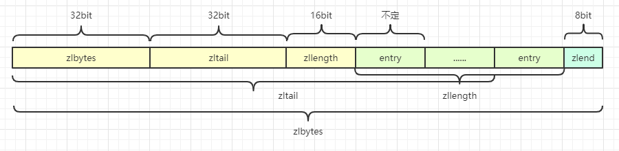
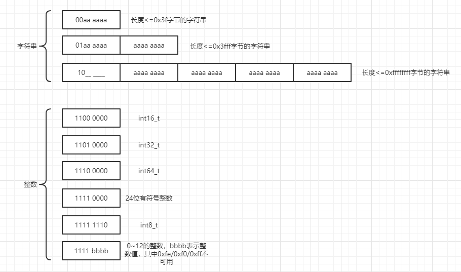

# ziplist压缩列表

## 简介

---
源码位置：ziplist.c/ziplist.h

Redis3.2版本以前的列表底层的编码是ziplist和linkedlist(adlist.c)实现的，3.2版本后重新引入了quicklist的数据结构，列表底层都由quicklist来实现。但我认为ziplist还是有学习的必要，知其然，更要知其所以然，因为只有看懂了ziplist，才能知道Redis为什么选择quicklist而不是ziplist。  

ziplist没有定义专门的结构体，其在内存块中的表示如下图所示：  
**ziplist结构：**  
  
|属性       |类型       |长度        |用途        |
|---        |---        |---        |---        |
|zlbytes    |uint_32t   |4B         |记录整个压缩列表占用的内存字节数：在对压缩列表进行内存重分配， 或者计算 zlend的位置时使用 |
|zltail     |uint_32t   |4B         |记录压缩列表表尾节点距离压缩列表的起始地址有多少字节：通过这个偏移量，程序无须遍历整个压缩列表就可以确定表尾节点的地址。|
|zllen      |uint_16t   |2B         |记录了压缩列表包含的节点数量： 当这个属性的值小于UINT16_ MAX （65535）时， 这个属性的值就是压缩列表包含节点的数量； 当这个值等于 UINT16_MAX 时， 节点的真实数量需要遍历整个压缩列表才能计算得出。|
|entry      |列表节点    |不定       |压缩列表包含的各个节点，节点的长度由节点保存的内容决定。|
|zlend      |uint_8t    |1B         | 0xFF（255），用于标记压缩列表的末端。|  

**entry结构：**  
  
prevrawlen：前置节点的长度  

1. 如果长度小于254个字节，则使用1字节（uint8_t）来存储prevrawlen。

2. 如果长度大于或等于254字节，则使用4字节(uint32_t)来存储prevrawlen。  

len/encoding：当前节点的长度（编码类型）  


data：数据  

实际上，源码里有定义zlentry的结构体，但是这个结构体并不是实际上存储的节点结构，它仅做中间结构操作使用。  

</br>

**时间复杂度：**
| 函数          | 作用          | 时间复杂度 |
| ---           |---           |---        |
|ziplistNew     |创建跳跃表     |O(1)       |
|ziplistInsert  |插入节点       |平均O(N)（耗时在连锁更新）       |
|ziplistDelete  |删除节点       |平均O(N)（耗时在连锁更新）       |
|ziplistFind    |查找节点       |平均O(N)   |
</br>
</br>

## 结构体与宏定义

---

``` c
// ziplist.h:
#define ZIPLIST_HEAD 0
#define ZIPLIST_TAIL 1

// ziplist.c:
#define ZIP_END 255         /* Special "end of ziplist" entry. */ // 列表末尾值
#define ZIP_BIG_PREVLEN 254 /* Max number of bytes of the previous entry, for
                               the "prevlen" field prefixing each entry, to be
                               represented with just a single byte. Otherwise
                               it is represented as FF AA BB CC DD, where
                               AA BB CC DD are a 4 bytes unsigned integer
                               representing the previous entry len. */ // 列表的最大长度

/* Different encoding/length possibilities */
#define ZIP_STR_MASK 0xc0
#define ZIP_INT_MASK 0x30
#define ZIP_STR_06B (0 << 6)        // 00aaaaaa : 高位2个bit00表示len只有一个字节，后面6个bit表示数据长度值，最高可以表示63字节（2^6-1）
#define ZIP_STR_14B (1 << 6)        // 01aaaaaa aaaaaaaa : 高位2个bit01表示len有两个字节，剩余的14个bit表示数据长度值，最高可以表示16383字节（2^14-1）
#define ZIP_STR_32B (2 << 6)        // 10______ aaaaaaaa aaaaaaaa aaaaaaaa aaaaaaaa : 高位2个bit10表示len有五个字节，接下来的6个bit不使用，剩余的bit表示数据长度值，最高可以表示16383字节（2^14-1）
#define ZIP_INT_16B (0xc0 | 0<<4)   // 11000000 ：int16_t
#define ZIP_INT_32B (0xc0 | 1<<4)   // 11010000 ：int32_t
#define ZIP_INT_64B (0xc0 | 2<<4)   // 11100000 ：int64_t
#define ZIP_INT_24B (0xc0 | 3<<4)   // 11110000 ：24位有符号整数
#define ZIP_INT_8B 0xfe             // 11111110 ：8位有符号整数

/* 4 bit integer immediate encoding |1111xxxx| with xxxx between
 * 0001 and 1101. */
#define ZIP_INT_IMM_MASK 0x0f   /* Mask to extract the 4 bits value. To add
                                   one is needed to reconstruct the value. */
#define ZIP_INT_IMM_MIN 0xf1    /* 11110001 */
#define ZIP_INT_IMM_MAX 0xfd    /* 11111101 */

#define INT24_MAX 0x7fffff
#define INT24_MIN (-INT24_MAX - 1)

/* Macro to determine if the entry is a string. String entries never start
 * with "11" as most significant bits of the first byte. */
#define ZIP_IS_STR(enc) (((enc) & ZIP_STR_MASK) < ZIP_STR_MASK) // 判断是不是字符串

/* Utility macros.*/

/* Return total bytes a ziplist is composed of. */
#define ZIPLIST_BYTES(zl)       (*((uint32_t*)(zl)))

/* Return the offset of the last item inside the ziplist. */
#define ZIPLIST_TAIL_OFFSET(zl) (*((uint32_t*)((zl)+sizeof(uint32_t))))

/* Return the length of a ziplist, or UINT16_MAX if the length cannot be
 * determined without scanning the whole ziplist. */
#define ZIPLIST_LENGTH(zl)      (*((uint16_t*)((zl)+sizeof(uint32_t)*2)))

/* The size of a ziplist header: two 32 bit integers for the total
 * bytes count and last item offset. One 16 bit integer for the number
 * of items field. */
#define ZIPLIST_HEADER_SIZE     (sizeof(uint32_t)*2+sizeof(uint16_t))

/* Size of the "end of ziplist" entry. Just one byte. */
#define ZIPLIST_END_SIZE        (sizeof(uint8_t))

/* Return the pointer to the first entry of a ziplist. */
#define ZIPLIST_ENTRY_HEAD(zl)  ((zl)+ZIPLIST_HEADER_SIZE)

/* Return the pointer to the last entry of a ziplist, using the
 * last entry offset inside the ziplist header. */
#define ZIPLIST_ENTRY_TAIL(zl)  ((zl)+intrev32ifbe(ZIPLIST_TAIL_OFFSET(zl)))

/* Return the pointer to the last byte of a ziplist, which is, the
 * end of ziplist FF entry. */
#define ZIPLIST_ENTRY_END(zl)   ((zl)+intrev32ifbe(ZIPLIST_BYTES(zl))-1)

/* Increment the number of items field in the ziplist header. Note that this
 * macro should never overflow the unsigned 16 bit integer, since entries are
 * always pushed one at a time. When UINT16_MAX is reached we want the count
 * to stay there to signal that a full scan is needed to get the number of
 * items inside the ziplist. */
#define ZIPLIST_INCR_LENGTH(zl,incr) { \
    if (ZIPLIST_LENGTH(zl) < UINT16_MAX) \
        ZIPLIST_LENGTH(zl) = intrev16ifbe(intrev16ifbe(ZIPLIST_LENGTH(zl))+incr); \
}

// 压缩列表的节点
/* We use this function to receive information about a ziplist entry.
 * Note that this is not how the data is actually encoded, is just what we
 * get filled by a function in order to operate more easily. */
typedef struct zlentry {
    // 编码 prevrawlen 所需的字节大小
    unsigned int prevrawlensize; /* Bytes used to encode the previous entry len*/
    // 前置节点的长度
    unsigned int prevrawlen;     /* Previous entry len. */
    // 编码 len 所需的字节大小
    unsigned int lensize;        /* Bytes used to encode this entry type/len.
                                    For example strings have a 1, 2 or 5 bytes
                                    header. Integers always use a single byte.*/
    // 当前节点的长度
    unsigned int len;            /* Bytes used to represent the actual entry.
                                    For strings this is just the string length
                                    while for integers it is 1, 2, 3, 4, 8 or
                                    0 (for 4 bit immediate) depending on the
                                    number range. */
    // 当前节点 header 的大小，prevrawlensize + lensize
    unsigned int headersize;     /* prevrawlensize + lensize. */
    // 类型编码:3种字符编码+6种整数编码
    unsigned char encoding;      /* Set to ZIP_STR_* or ZIP_INT_* depending on
                                    the entry encoding. However for 4 bits
                                    immediate integers this can assume a range
                                    of values and must be range-checked. */
    unsigned char *p;            /* Pointer to the very start of the entry, that
                                    is, this points to prev-entry-len field. */
} zlentry;

#define ZIPLIST_ENTRY_ZERO(zle) { \
    (zle)->prevrawlensize = (zle)->prevrawlen = 0; \
    (zle)->lensize = (zle)->len = (zle)->headersize = 0; \
    (zle)->encoding = 0; \
    (zle)->p = NULL; \
}

/* Extract the encoding from the byte pointed by 'ptr' and set it into
 * 'encoding' field of the zlentry structure. */
#define ZIP_ENTRY_ENCODING(ptr, encoding) do {  \
    (encoding) = (ptr[0]); \
    if ((encoding) < ZIP_STR_MASK) (encoding) &= ZIP_STR_MASK; \
} while(0)
```

</br>

## 函数功能总览

``` c
unsigned char *ziplistNew(void);
unsigned char *ziplistMerge(unsigned char **first, unsigned char **second);
unsigned char *ziplistPush(unsigned char *zl, unsigned char *s, unsigned int slen, int where);
unsigned char *ziplistIndex(unsigned char *zl, int index);
unsigned char *ziplistNext(unsigned char *zl, unsigned char *p);
unsigned char *ziplistPrev(unsigned char *zl, unsigned char *p);
unsigned int ziplistGet(unsigned char *p, unsigned char **sval, unsigned int *slen, long long *lval);
unsigned char *ziplistInsert(unsigned char *zl, unsigned char *p, unsigned char *s, unsigned int slen);
unsigned char *ziplistDelete(unsigned char *zl, unsigned char **p);
unsigned char *ziplistDeleteRange(unsigned char *zl, int index, unsigned int num);
unsigned int ziplistCompare(unsigned char *p, unsigned char *s, unsigned int slen);
unsigned char *ziplistFind(unsigned char *p, unsigned char *vstr, unsigned int vlen, unsigned int skip);
unsigned int ziplistLen(unsigned char *zl);
size_t ziplistBlobLen(unsigned char *zl);
void ziplistRepr(unsigned char *zl);
```

</br>

## 主要函数实现

---

**创建：**

``` c
// 创建新的压缩列表
/* Create a new empty ziplist. */
unsigned char *ziplistNew(void) {
    unsigned int bytes = ZIPLIST_HEADER_SIZE+ZIPLIST_END_SIZE;
    unsigned char *zl = zmalloc(bytes);
    ZIPLIST_BYTES(zl) = intrev32ifbe(bytes); // 大端模式转小端模式
    ZIPLIST_TAIL_OFFSET(zl) = intrev32ifbe(ZIPLIST_HEADER_SIZE);
    ZIPLIST_LENGTH(zl) = 0;
    zl[bytes-1] = ZIP_END;
    return zl;
}

// 重新分配ziplist内存大小
/* Resize the ziplist. */
unsigned char *ziplistResize(unsigned char *zl, unsigned int len) {
    zl = zrealloc(zl,len);
    ZIPLIST_BYTES(zl) = intrev32ifbe(len);
    zl[len-1] = ZIP_END;
    return zl;
}
```

**插入：**

``` c
unsigned char *ziplistPush(unsigned char *zl, unsigned char *s, unsigned int slen, int where) {
    unsigned char *p;
    p = (where == ZIPLIST_HEAD) ? ZIPLIST_ENTRY_HEAD(zl) : ZIPLIST_ENTRY_END(zl);
    return __ziplistInsert(zl,p,s,slen);
}

/* Insert an entry at "p". */
unsigned char *ziplistInsert(unsigned char *zl, unsigned char *p, unsigned char *s, unsigned int slen) {
    return __ziplistInsert(zl,p,s,slen);
}

/* Insert item at "p". */
unsigned char *__ziplistInsert(unsigned char *zl, unsigned char *p, unsigned char *s, unsigned int slen) {
    size_t curlen = intrev32ifbe(ZIPLIST_BYTES(zl)), reqlen; // reqlen用于计算存储当前节点需要的字节数
    unsigned int prevlensize, prevlen = 0;
    size_t offset;
    int nextdiff = 0;
    unsigned char encoding = 0;
    long long value = 123456789; /* initialized to avoid warning. Using a value
                                    that is easy to see if for some reason
                                    we use it uninitialized. */
    zlentry tail;

    /* Find out prevlen for the entry that is inserted. */
    // 以下步骤是为了获取前一个节点的长度
    if (p[0] != ZIP_END) {
        ZIP_DECODE_PREVLEN(p, prevlensize, prevlen);
    } else {
        unsigned char *ptail = ZIPLIST_ENTRY_TAIL(zl);
        if (ptail[0] != ZIP_END) {
            prevlen = zipRawEntryLength(ptail);
        }
    }

    /* See if the entry can be encoded */
    // 尝试进行整数字符串编码
    if (zipTryEncoding(s,slen,&value,&encoding)) {
        /* 'encoding' is set to the appropriate integer encoding */
        reqlen = zipIntSize(encoding); // 获取数据存储需要的字节数（data部分）
    } else {
        /* 'encoding' is untouched, however zipStoreEntryEncoding will use the
         * string length to figure out how to encode it. */
        reqlen = slen; // 字符串长度
    }
    /* We need space for both the length of the previous entry and
     * the length of the payload. */
    reqlen += zipStorePrevEntryLength(NULL,prevlen); // 存储前节点长度需要的字节数
    reqlen += zipStoreEntryEncoding(NULL,encoding,slen); // 存储当前节点encoding需要的字节数

    /* When the insert position is not equal to the tail, we need to
     * make sure that the next entry can hold this entry's length in
     * its prevlen field. */
    int forcelarge = 0;
    nextdiff = (p[0] != ZIP_END) ? zipPrevLenByteDiff(p,reqlen) : 0; // 看是否会引起后面节点的长度变化，如果有变化，需要进行联锁更新
    if (nextdiff == -4 && reqlen < 4) {
        nextdiff = 0;
        forcelarge = 1;
    }

    /* Store offset because a realloc may change the address of zl. */
    offset = p-zl;
    zl = ziplistResize(zl,curlen+reqlen+nextdiff); // 重新分配ziplist的大小，为插入节点做准备，给新的尾部节点赋值FF，更新头部节点zlbyte的值
    p = zl+offset;

    /* Apply memory move when necessary and update tail offset. */
    // 更新zltail信息
    if (p[0] != ZIP_END) {
        /* Subtract one because of the ZIP_END bytes */
        memmove(p+reqlen,p-nextdiff,curlen-offset-1+nextdiff); // 数据往后移动，并根据nextdiff进行调整

        /* Encode this entry's raw length in the next entry. */
        if (forcelarge)
            zipStorePrevEntryLengthLarge(p+reqlen,reqlen);
        else
            zipStorePrevEntryLength(p+reqlen,reqlen);

        /* Update offset for tail */
        // 更新zltail的值
        ZIPLIST_TAIL_OFFSET(zl) =
            intrev32ifbe(intrev32ifbe(ZIPLIST_TAIL_OFFSET(zl))+reqlen);

        /* When the tail contains more than one entry, we need to take
         * "nextdiff" in account as well. Otherwise, a change in the
         * size of prevlen doesn't have an effect on the *tail* offset. */
        zipEntry(p+reqlen, &tail); // 构造节点
        if (p[reqlen+tail.headersize+tail.len] != ZIP_END) {
            // 尾结点的值也需要根据nextdiff进行微调
            ZIPLIST_TAIL_OFFSET(zl) =
                intrev32ifbe(intrev32ifbe(ZIPLIST_TAIL_OFFSET(zl))+nextdiff);
        }
    } else {
        /* This element will be the new tail. */
        ZIPLIST_TAIL_OFFSET(zl) = intrev32ifbe(p-zl);
    }

    /* When nextdiff != 0, the raw length of the next entry has changed, so
     * we need to cascade the update throughout the ziplist */
    if (nextdiff != 0) {
        // 如果后面节点有长度变化，需要更新之后的所有节点的变化
        offset = p-zl; // 记录新节点的偏移量
        zl = __ziplistCascadeUpdate(zl,p+reqlen); // 连锁更新
        p = zl+offset;
    }

    /* Write the entry */
    // 编辑新节点的值
    p += zipStorePrevEntryLength(p,prevlen);
    p += zipStoreEntryEncoding(p,encoding,slen);
    if (ZIP_IS_STR(encoding)) {
        memcpy(p,s,slen);
    } else {
        zipSaveInteger(p,value,encoding);
    }
    ZIPLIST_INCR_LENGTH(zl,1);
    return zl;
}
```

**编码encoding字段相关：**

``` c
// 判断是不是整数字符串，如果是，确定其编码类型
/* Check if string pointed to by 'entry' can be encoded as an integer.
 * Stores the integer value in 'v' and its encoding in 'encoding'. */
int zipTryEncoding(unsigned char *entry, unsigned int entrylen, long long *v, unsigned char *encoding) {
    long long value;

    if (entrylen >= 32 || entrylen == 0) return 0;
    if (string2ll((char*)entry,entrylen,&value)) {
        /* Great, the string can be encoded. Check what's the smallest
         * of our encoding types that can hold this value. */
        if (value >= 0 && value <= 12) {
            *encoding = ZIP_INT_IMM_MIN+value;
        } else if (value >= INT8_MIN && value <= INT8_MAX) {
            *encoding = ZIP_INT_8B;
        } else if (value >= INT16_MIN && value <= INT16_MAX) {
            *encoding = ZIP_INT_16B;
        } else if (value >= INT24_MIN && value <= INT24_MAX) {
            *encoding = ZIP_INT_24B;
        } else if (value >= INT32_MIN && value <= INT32_MAX) {
            *encoding = ZIP_INT_32B;
        } else {
            *encoding = ZIP_INT_64B;
        }
        *v = value;
        return 1;
    }
    return 0;
}

/* Store integer 'value' at 'p', encoded as 'encoding' */
void zipSaveInteger(unsigned char *p, int64_t value, unsigned char encoding) {
    int16_t i16;
    int32_t i32;
    int64_t i64;
    if (encoding == ZIP_INT_8B) {
        ((int8_t*)p)[0] = (int8_t)value;
    } else if (encoding == ZIP_INT_16B) {
        i16 = value;
        memcpy(p,&i16,sizeof(i16));
        memrev16ifbe(p);
    } else if (encoding == ZIP_INT_24B) {
        i32 = value<<8;
        memrev32ifbe(&i32);
        memcpy(p,((uint8_t*)&i32)+1,sizeof(i32)-sizeof(uint8_t));
    } else if (encoding == ZIP_INT_32B) {
        i32 = value;
        memcpy(p,&i32,sizeof(i32));
        memrev32ifbe(p);
    } else if (encoding == ZIP_INT_64B) {
        i64 = value;
        memcpy(p,&i64,sizeof(i64));
        memrev64ifbe(p);
    } else if (encoding >= ZIP_INT_IMM_MIN && encoding <= ZIP_INT_IMM_MAX) {
        /* Nothing to do, the value is stored in the encoding itself. */
    } else {
        assert(NULL);
    }
}

/* Read integer encoded as 'encoding' from 'p' */
int64_t zipLoadInteger(unsigned char *p, unsigned char encoding) {
    int16_t i16;
    int32_t i32;
    int64_t i64, ret = 0;
    if (encoding == ZIP_INT_8B) {
        ret = ((int8_t*)p)[0];
    } else if (encoding == ZIP_INT_16B) {
        memcpy(&i16,p,sizeof(i16));
        memrev16ifbe(&i16);
        ret = i16;
    } else if (encoding == ZIP_INT_32B) {
        memcpy(&i32,p,sizeof(i32));
        memrev32ifbe(&i32);
        ret = i32;
    } else if (encoding == ZIP_INT_24B) {
        i32 = 0;
        memcpy(((uint8_t*)&i32)+1,p,sizeof(i32)-sizeof(uint8_t));
        memrev32ifbe(&i32);
        ret = i32>>8;
    } else if (encoding == ZIP_INT_64B) {
        memcpy(&i64,p,sizeof(i64));
        memrev64ifbe(&i64);
        ret = i64;
    } else if (encoding >= ZIP_INT_IMM_MIN && encoding <= ZIP_INT_IMM_MAX) {
        ret = (encoding & ZIP_INT_IMM_MASK)-1;
    } else {
        assert(NULL);
    }
    return ret;
}
```

**删除：**

``` c
/* Delete a single entry from the ziplist, pointed to by *p.
 * Also update *p in place, to be able to iterate over the
 * ziplist, while deleting entries. */
unsigned char *ziplistDelete(unsigned char *zl, unsigned char **p) {
    size_t offset = *p-zl;
    zl = __ziplistDelete(zl,*p,1);

    /* Store pointer to current element in p, because ziplistDelete will
     * do a realloc which might result in a different "zl"-pointer.
     * When the delete direction is back to front, we might delete the last
     * entry and end up with "p" pointing to ZIP_END, so check this. */
    *p = zl+offset;
    return zl;
}

/* Delete "num" entries, starting at "p". Returns pointer to the ziplist. */
unsigned char *__ziplistDelete(unsigned char *zl, unsigned char *p, unsigned int num) {
    unsigned int i, totlen, deleted = 0;
    size_t offset;
    int nextdiff = 0;
    zlentry first, tail;

    zipEntry(p, &first);
    for (i = 0; p[0] != ZIP_END && i < num; i++) {
        p += zipRawEntryLength(p);
        deleted++;
    }

    totlen = p-first.p; /* Bytes taken by the element(s) to delete. */
    if (totlen > 0) {
        if (p[0] != ZIP_END) {
            /* Storing `prevrawlen` in this entry may increase or decrease the
             * number of bytes required compare to the current `prevrawlen`.
             * There always is room to store this, because it was previously
             * stored by an entry that is now being deleted. */
            nextdiff = zipPrevLenByteDiff(p,first.prevrawlen); // 比较删除的节点和之后的节点长度之间有没有变化，有变化就需要连锁更新

            /* Note that there is always space when p jumps backward: if
             * the new previous entry is large, one of the deleted elements
             * had a 5 bytes prevlen header, so there is for sure at least
             * 5 bytes free and we need just 4. */
            p -= nextdiff;
            zipStorePrevEntryLength(p,first.prevrawlen);

            /* Update offset for tail */
            ZIPLIST_TAIL_OFFSET(zl) =
                intrev32ifbe(intrev32ifbe(ZIPLIST_TAIL_OFFSET(zl))-totlen);

            /* When the tail contains more than one entry, we need to take
             * "nextdiff" in account as well. Otherwise, a change in the
             * size of prevlen doesn't have an effect on the *tail* offset. */
            zipEntry(p, &tail);
            if (p[tail.headersize+tail.len] != ZIP_END) {
                ZIPLIST_TAIL_OFFSET(zl) =
                   intrev32ifbe(intrev32ifbe(ZIPLIST_TAIL_OFFSET(zl))+nextdiff);
            }

            /* Move tail to the front of the ziplist */
            memmove(first.p,p,
                intrev32ifbe(ZIPLIST_BYTES(zl))-(p-zl)-1);
        } else {
            /* The entire tail was deleted. No need to move memory. */
            ZIPLIST_TAIL_OFFSET(zl) =
                intrev32ifbe((first.p-zl)-first.prevrawlen);
        }

        /* Resize and update length */
        offset = first.p-zl;
        zl = ziplistResize(zl, intrev32ifbe(ZIPLIST_BYTES(zl))-totlen+nextdiff);
        ZIPLIST_INCR_LENGTH(zl,-deleted);
        p = zl+offset;

        /* When nextdiff != 0, the raw length of the next entry has changed, so
         * we need to cascade the update throughout the ziplist */
        if (nextdiff != 0)
            zl = __ziplistCascadeUpdate(zl,p);
    }
    return zl;
}
```

**查找：**

``` c
/* Find pointer to the entry equal to the specified entry. Skip 'skip' entries
 * between every comparison. Returns NULL when the field could not be found. */
unsigned char *ziplistFind(unsigned char *p, unsigned char *vstr, unsigned int vlen, unsigned int skip) {
    int skipcnt = 0;
    unsigned char vencoding = 0;
    long long vll = 0;

    while (p[0] != ZIP_END) {
        unsigned int prevlensize, encoding, lensize, len;
        unsigned char *q;

        ZIP_DECODE_PREVLENSIZE(p, prevlensize); // 获取当前节点prelen的size，为了P往后偏移取出encoding
        ZIP_DECODE_LENGTH(p + prevlensize, encoding, lensize, len); // 获取当前节点encoding的size和数据size
        q = p + prevlensize + lensize; // q指向该节点存储的数据地址

        if (skipcnt == 0) {
            /* Compare current entry with specified entry */
            if (ZIP_IS_STR(encoding)) {
                if (len == vlen && memcmp(q, vstr, vlen) == 0) {
                    return p;
                }
            } else {
                /* Find out if the searched field can be encoded. Note that
                 * we do it only the first time, once done vencoding is set
                 * to non-zero and vll is set to the integer value. */
                if (vencoding == 0) {
                    if (!zipTryEncoding(vstr, vlen, &vll, &vencoding)) {
                        /* If the entry can't be encoded we set it to
                         * UCHAR_MAX so that we don't retry again the next
                         * time. */
                        vencoding = UCHAR_MAX;
                    }
                    /* Must be non-zero by now */
                    assert(vencoding);
                }

                /* Compare current entry with specified entry, do it only
                 * if vencoding != UCHAR_MAX because if there is no encoding
                 * possible for the field it can't be a valid integer. */
                if (vencoding != UCHAR_MAX) {
                    long long ll = zipLoadInteger(q, encoding);
                    if (ll == vll) {
                        return p;
                    }
                }
            }

            /* Reset skip count */
            skipcnt = skip;
        } else {
            /* Skip entry */
            skipcnt--;
        }

        /* Move to next entry */
        p = q + len;
    }

    return NULL;
}
```
