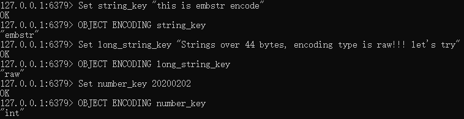
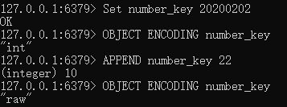
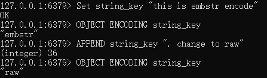

# t_string字符串对象

## 简介

---
源码位置：t_string.c/server.h

字符串是redis中最常用的数据结构，在对象系统object一文中我们提到，字符串数据结构根据场景会有三种编码类型：OBJ_ENCODING_RAW、OBJ_ENCODING_INT、OBJ_ENCODING_EMBSTR，分别对应底层数据结构：sds、int、sds。下面说说这三种编码类型的使用场景。  

根据redisObject数据结构可以得知，一般创建object对象时，object和数据本身在内存中是分开的，要进行两次内存分配。  

``` c
typedef struct redisObject {
    unsigned type:4;
    unsigned encoding:4;
    unsigned lru:LRU_BITS;
    int refcount;
    void *ptr;
} robj;
```

而OBJ_ENCODING_EMBSTR的做法是，创建object之前，先计算object和数据的大小总和，然后一次性申请足够的内存空间，数据直接跟在object对象后面。这种编码是有大小限制的，因为redis采用jemalloc内存分配器，可以分配8，16，32，64字节大小的内存空间，所以申请内存时，redisObject占用16字节，sdshdr8占用3字节，数据结尾'\0'占用1字节，那么实际数据的长度限制为：64-16-8-1=44字节。

``` c
#define OBJ_ENCODING_EMBSTR_SIZE_LIMIT 44
```

所以当数据长度小于44时，用EMBSTR编码，否则使用OBJ_ENCODING_RAW编码。如果一个字符串对象保存的是整数值，并且可以用long类型来表示，则将字符串对象转为long，设置编码类型为OBJ_ENCODING_INT。  

下面让我们看看实例：  
  

INT和EMBSTR编码的字符串对象在条件满足的情况下，会转换为RAW编码。  
比如INT编码对象在执行APPEND命令追加一段字符串时，将会转换为RAW编码，因为追加操作只支持字符串值，所以会把之前保存的整数值转为字符串后，再执行追加操作，这时就会转为RAW编码。  
  

而redis没有提供对EMBSTR编码的字符串对象的修改操作，所以当进行追加操作时，也会先转为RAW编码，然后再进行追加。  
  

|命令|功能|时间复杂度|
|---|---|---|
|GET|获取key对应的value|O(1)|
|MGET|获取多个keys对应的values|O(N)，N为key的数量|
|GETRANGE|返回key对应的字符串value的子串，由start和end位移决定|O(N)，N为字符串长度|
|SET|设置一个key的value值|O(1)|
|MSET|设置多个keys的values值|O(1)|
|SETNX|key不存在时才设置value值（可通过set命令+NX参数实现）|O(1)|
|MSETNX|keys不存在时才设置values值|O(1)|
|SETEX|key存在时才设置值，到期时间以秒为单位（可通过set命令+XX参数实现）|O(1)|
|PSETEX|和setex唯一的区别是到期时间以毫秒为单位（可通过set命令+XX+PX参数实现）|O(1)|
|SETRANGE|覆盖key对应的string的一部分，从指定长度offset处开始，覆盖value的长度|O(1)|
|APPEND|指定key的值结尾追加字符串|O(1)|
|GETSET|自动将key对应到value并且返回原来key对应的value|O(1)|
|INCR|对存储在指定key的数值执行原子的加1操作|O(1)|
|INCRBY|将key对应的数字加上指定的整数值|O(1)|
|INCRBYFLOAT|将key对应的数字加上指定的浮点数值|O(1)|
|DECR|对key对应的数字做减1操作|O(1)|
|DECRBY|将key对应的数字减去指定的整数值|O(1)|
|STRLEN|获取指定key对应value的长度|O(1)|

</br>
</br>

## 函数功能总览

---

``` c
void setCommand(client *c); // set命令
void setnxCommand(client *c); // setnx命令
void setexCommand(client *c); // setex命令
void psetexCommand(client *c); // psetex命令
void msetCommand(client *c); // mset命令
void msetnxCommand(client *c); // msetnx命令
void setrangeCommand(client *c); // setrange命令
void getrangeCommand(client *c); // getrange命令
void getCommand(client *c); // get命令
void mgetCommand(client *c); // mget命令
void getsetCommand(client *c); // getset命令
void incrCommand(client *c); // incr命令
void decrCommand(client *c); // decr命令
void incrbyCommand(client *c); // incrby命令
void decrbyCommand(client *c); // decrby命令
void incrbyfloatCommand(client *c); // incrbyfloat命令
void appendCommand(client *c); // append命令
void strlenCommand(client *c); // strlen命令
```

</br>

## Redis命令实现

---

插入命令：

``` c
SET key value [NX] [XX] [KEEPTTL] [EX <seconds>] [PX <milliseconds>]
```

参数含义：

* EX seconds – 设置键key的过期时间，单位时秒  
* PX milliseconds – 设置键key的过期时间，单位时毫秒  
* NX – 只有键key不存在的时候才会设置key的值  
* XX – 只有键key存在的时候才会设置key的值  

代码：  

``` c
void setCommand(client *c) {
    int j;
    robj *expire = NULL;
    int unit = UNIT_SECONDS;
    int flags = OBJ_SET_NO_FLAGS;

    // 解析命令中的参数
    for (j = 3; j < c->argc; j++) {
        char *a = c->argv[j]->ptr;
        robj *next = (j == c->argc-1) ? NULL : c->argv[j+1];

        if ((a[0] == 'n' || a[0] == 'N') &&
            (a[1] == 'x' || a[1] == 'X') && a[2] == '\0' &&
            !(flags & OBJ_SET_XX))
        {
            flags |= OBJ_SET_NX;
        } else if ((a[0] == 'x' || a[0] == 'X') &&
                   (a[1] == 'x' || a[1] == 'X') && a[2] == '\0' &&
                   !(flags & OBJ_SET_NX))
        {
            flags |= OBJ_SET_XX;
        } else if (!strcasecmp(c->argv[j]->ptr,"KEEPTTL") &&
                   !(flags & OBJ_SET_EX) && !(flags & OBJ_SET_PX))
        {
            flags |= OBJ_SET_KEEPTTL;
        } else if ((a[0] == 'e' || a[0] == 'E') &&
                   (a[1] == 'x' || a[1] == 'X') && a[2] == '\0' &&
                   !(flags & OBJ_SET_KEEPTTL) &&
                   !(flags & OBJ_SET_PX) && next)
        {
            flags |= OBJ_SET_EX;
            unit = UNIT_SECONDS;
            expire = next;
            j++;
        } else if ((a[0] == 'p' || a[0] == 'P') &&
                   (a[1] == 'x' || a[1] == 'X') && a[2] == '\0' &&
                   !(flags & OBJ_SET_KEEPTTL) &&
                   !(flags & OBJ_SET_EX) && next)
        {
            flags |= OBJ_SET_PX;
            unit = UNIT_MILLISECONDS;
            expire = next;
            j++;
        } else {
            addReply(c,shared.syntaxerr);
            return;
        }
    }

    // 判断value是否可以进行整数编码，如果可以则使用INT编码
    c->argv[2] = tryObjectEncoding(c->argv[2]);
    // 开始执行插入操作
    setGenericCommand(c,flags,c->argv[1],c->argv[2],expire,unit,NULL,NULL);
}

void setGenericCommand(client *c, int flags, robj *key, robj *val, robj *expire, int unit, robj *ok_reply, robj *abort_reply) {
    long long milliseconds = 0; /* initialized to avoid any harmness warning */

    if (expire) { // 如果设定了过期时间，则将时间格式化为毫秒
        if (getLongLongFromObjectOrReply(c, expire, &milliseconds, NULL) != C_OK)
            return;
        if (milliseconds <= 0) {
            addReplyErrorFormat(c,"invalid expire time in %s",c->cmd->name);
            return;
        }
        if (unit == UNIT_SECONDS) milliseconds *= 1000;
    }

    // 判断key是否存在，并根据NX/XX参数来决定是否插入value
    if ((flags & OBJ_SET_NX && lookupKeyWrite(c->db,key) != NULL) ||
        (flags & OBJ_SET_XX && lookupKeyWrite(c->db,key) == NULL))
    {
        addReply(c, abort_reply ? abort_reply : shared.null[c->resp]);
        return;
    }
    // 将键值对插入到db中
    genericSetKey(c->db,key,val,flags & OBJ_SET_KEEPTTL);
    server.dirty++; // 存储上次保存前所有数据变动的长度+1
    if (expire) setExpire(c,c->db,key,mstime()+milliseconds); // 设定过期时间
    notifyKeyspaceEvent(NOTIFY_STRING,"set",key,c->db->id); // 发送set事件通知
    if (expire) notifyKeyspaceEvent(NOTIFY_GENERIC,
        "expire",key,c->db->id); // 发送定期事件通知
    addReply(c, ok_reply ? ok_reply : shared.ok); // 向客户端返回结果
}
```

其他与set相关的命令不做代码解析了，可以自行查看源码。

``` c
SETNX key value
SETEX key value
PSETEX key milliseconds value
MSET key value [key value ...]
MSETNX key value [key value ...]
APPEND key value
```

</br>

---

获取命令：

``` c
GET key
```

代码：  

``` c
void getCommand(client *c) {
    getGenericCommand(c);
}

int getGenericCommand(client *c) {
    // 判断key是否存在，存在则返回value，不存在则返回对应错误
    robj *o;

    if ((o = lookupKeyReadOrReply(c,c->argv[1],shared.null[c->resp])) == NULL)
        return C_OK;

    if (o->type != OBJ_STRING) {
        addReply(c,shared.wrongtypeerr);
        return C_ERR;
    } else {
        addReplyBulk(c,o);
        return C_OK;
    }
}
```

其他与set相关的命令不做代码解析了，可以自行查看源码。

``` c
MGET key [key ...]
GETRANGE key start end
GETSET key value
```

</br>

---

自增自减命令：

``` c
INCR key
DECR key
```

代码：  

``` c
// INCR
void incrCommand(client *c) {
    incrDecrCommand(c,1);
}
//DECR
void decrCommand(client *c) {
    incrDecrCommand(c,-1);
}

void incrDecrCommand(client *c, long long incr) {
    long long value, oldvalue;
    robj *o, *new;

    // 获取db中的键值对
    o = lookupKeyWrite(c->db,c->argv[1]);
    if (o != NULL && checkType(c,o,OBJ_STRING)) return; // 类型检查
    if (getLongLongFromObjectOrReply(c,o,&value,NULL) != C_OK) return; // 是否能转为整数型，不能则返回

    oldvalue = value;
    // 值范围检查
    if ((incr < 0 && oldvalue < 0 && incr < (LLONG_MIN-oldvalue)) ||
        (incr > 0 && oldvalue > 0 && incr > (LLONG_MAX-oldvalue))) {
        addReplyError(c,"increment or decrement would overflow");
        return;
    }
    value += incr;

    if (o && o->refcount == 1 && o->encoding == OBJ_ENCODING_INT &&
        (value < 0 || value >= OBJ_SHARED_INTEGERS) &&
        value >= LONG_MIN && value <= LONG_MAX)
    {
        new = o;
        o->ptr = (void*)((long)value);
    } else {
        new = createStringObjectFromLongLongForValue(value); // 通过value的类型创建新的字符串对象
        if (o) {
            dbOverwrite(c->db,c->argv[1],new); // db中已存在，则覆盖
        } else {
            dbAdd(c->db,c->argv[1],new); // 不存在则插入
        }
    }
    signalModifiedKey(c->db,c->argv[1]); // 发送修改key的信号
    notifyKeyspaceEvent(NOTIFY_STRING,"incrby",c->argv[1],c->db->id); // 事件通知
    server.dirty++; // 存储上次保存前所有数据变动的长度+1
    // 客户端回复
    addReply(c,shared.colon);
    addReply(c,new);
    addReply(c,shared.crlf);
}
```

其他与INCR和DECR相关的命令不做代码解析了，可以自行查看源码。

``` c
INCRBY key increment
DECRBY key increment
INCRBYFLOAT key increment
```

</br>

---

获取字符串长度命令：

``` c
STRLEN key
```

代码：  

``` c
void strlenCommand(client *c) {
    robj *o;
    // 从DB中获取键值对
    if ((o = lookupKeyReadOrReply(c,c->argv[1],shared.czero)) == NULL ||
        checkType(c,o,OBJ_STRING)) return;
    // 返回给客户端字符串长度
    addReplyLongLong(c,stringObjectLen(o));
}
```
