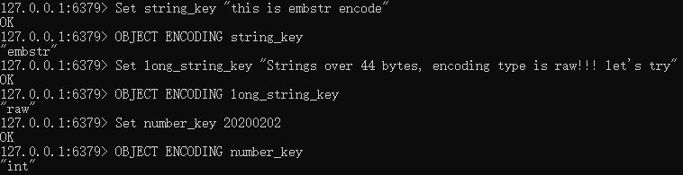
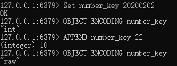

# t_string字符串

## 简介

---
源码位置：t_string.c/server.h

字符串是redis中最常用的数据结构，在对象系统object一文中我们提到，字符串数据结构根据场景会有三种编码类型：OBJ_ENCODING_RAW、OBJ_ENCODING_INT、OBJ_ENCODING_EMBSTR，分别对应底层数据结构：sds、int、sds。下面说说这三种编码类型的使用场景。  
根据redisObject数据结构可以得知，一般创建object对象时，object和数据本身在内存中是分开的，要进行两次内存分配。  

``` c
typedef struct redisObject {
    unsigned type:4;
    unsigned encoding:4;
    unsigned lru:LRU_BITS;
    int refcount;
    void *ptr;
} robj;
```

而OBJ_ENCODING_EMBSTR的做法是，创建object之前，先计算object和数据的大小总和，然后一次性申请足够的内存空间，数据直接跟在object对象后面。这种编码是有大小限制的，因为redis采用jemalloc内存分配器，可以分配8，16，32，64字节大小的内存空间，所以申请内存时，redisObject占用16字节，sdshdr8占用3字节，数据结尾'\0'占用1字节，那么实际数据的长度限制为：64-16-8-1=44字节。

``` c
#define OBJ_ENCODING_EMBSTR_SIZE_LIMIT 44
```

所以当数据长度小于44时，用EMBSTR编码，否则使用OBJ_ENCODING_RAW编码。如果一个字符串对象保存的是整数值，并且可以用long类型来表示，则将字符串对象转为long，设置编码类型为OBJ_ENCODING_INT。  
下面让我们看看实例：  
  
INT和EMBSTR编码的字符串对象在条件满足的情况下，会转换为RAW编码。  
比如INT编码对象在执行APPEND命令追加一段字符串时，将会转换为RAW编码，因为追加操作只支持字符串值，所以会把之前保存的整数值转为字符串后，再执行追加操作，这时就会转为RAW编码。  
  
而redis没有提供对EMBSTR编码的字符串对象的修改操作，所以当进行追加操作时，也会先转为RAW编码，然后再进行追加。  
  

</br>
</br>

## 函数功能总览

---

``` c
void setCommand(client *c); // set命令，设定键值对
void setnxCommand(client *c); // setnx命令，key不存在时才设置值（可通过set命令+NX参数实现）
void setexCommand(client *c); // setex命令，key存在时才设置值，到期时间以秒为单位（可通过set命令+XX参数实现）
void psetexCommand(client *c); // psetex命令，和setex唯一的区别是到期时间以毫秒为单位（可通过set命令+XX+PX参数实现）
void getCommand(client *c); // get命令，获取键对应的值
void delCommand(client *c); // del命令，删除键值对
void setrangeCommand(client *c); // setrange命令，覆盖key对应的string的一部分，从指定长度offset处开始，覆盖value的长度
void getrangeCommand(client *c); // getrange命令，返回key对应的字符串value的子串，由start和end位移决定
void incrCommand(client *c); // incr命令，对存储在指定key的数值执行原子的加1操作
void decrCommand(client *c); // decr命令，对key对应的数字做减1操作
void incrbyCommand(client *c); // incrby命令，将key对应的数字加上指定的整数值
void decrbyCommand(client *c); // decrby命令，将key对应的数字减去指定的整数值
void incrbyfloatCommand(client *c); // incrbyfloat命令，将key对应的数字加上指定的浮点数值
void appendCommand(client *c); // append命令，指定key的值结尾追加字符串
void msetCommand(client *c); // mset命令，设定多个键值对
void msetnxCommand(client *c); // msetnx命令，keys不存在时才设置values
void mgetCommand(client *c); // mget命令，获取多个keys对应的values
void strlenCommand(client *c); // strlen命令，获取指定key对应value的长度
```

</br>

## Redis命令实现

---

``` c
SET key value [NX] [XX] [KEEPTTL] [EX <seconds>] [PX <milliseconds>]
```

参数含义：

* EX seconds – 设置键key的过期时间，单位时秒  
* PX milliseconds – 设置键key的过期时间，单位时毫秒  
* NX – 只有键key不存在的时候才会设置key的值  
* XX – 只有键key存在的时候才会设置key的值  
