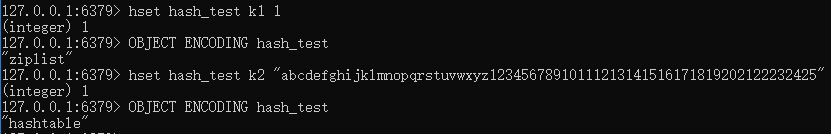
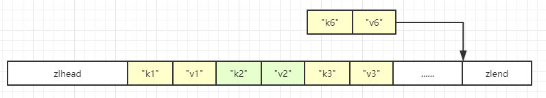

# hash散列对象

## 简介

---
源码位置：t_hash.c/server.h  

hash对象底层编码方式有两种，`ziplist`或`hashtable`。  
使用ziplist编码需要同时满足以下条件：  

* hash对象保存的键值对的键和值的字符串长度小于64字节（可通过redis.conf配置：hash_max_ziplist_value）
* hash对象保存的键值对数小于512个（可通过redis.conf配置：hash_max_ziplist_entries）

让我们来测试一下：  
  
可以看到，当k2的value长度大于64字节时，不满足第一个条件，redis会将ziplist转为hashtable。  
第二个条件可以自行测试。  

下面介绍一下hash对象是如何使用ziplist进行存储的：  
当有新的键值对需要加入hash对象中时，程序会先将保存了键的节点推入到压缩列表的表尾，然后再将存有值的节点推入到压缩列表表尾。所以，同一个键值对的两个节点总是紧挨在一起的，键在前，值在后。


ziplist的实现方式可查看[Redis源码-压缩列表ziplist](../first_stage/Redis源码-压缩列表ziplist.md)。  
hashtable的实现方式可查看[Redis源码-字典dict](../first_stage/Redis源码-字典dict.md)。

</br>

|命令|功能|时间复杂度|
|---|---|---|
|HSET|设置key指定的哈希集中指定字段的值|O(1)|
|HSETNX|只在key指定的哈希集中不存在指定的字段时，设置字段的值|O(1)|
|HMSET|设置key指定的哈希集中指定多个字段的值|O(N)，N为字段数|
|HGET|返回key指定的哈希集中该字段所关联的值|O(1)|
|HMGET|返回key指定的哈希集中指定多个字段的值|O(N)，N为字段数|
|HGETALL|返回key指定的哈希集中所有的字段和值|O(N)，N为hash的size|
|HVALS|返回key指定的哈希集中所有字段的值|O(N)，N为hash的size|
|HDEL|从key指定的哈希集中移除指定的域|O(N)，N是被删除的字段数量|
|HEXISTS|返回hash里面field是否存在|O(1)|
|HKEYS|返回key指定的哈希集中所有字段的名字|O(N)，N为hash的size|
|HLEN|返回key指定的哈希集包含的字段的数量|O(1)|
|HSCAN|用于迭代Hash类型中的键值对|O(1)|
|HSTRLEN|返回hash指定field的value的字符串长度，如果hash或者field不存在，返回0|O(1)|
|HINCRBY|增加key指定的哈希集中指定字段的数值|O(1)|
|HINCRBYFLOAT|为指定key的hash的field字段值执行float类型的increment加|O(1)|

</br>
</br>

## 函数功能总览

---

``` c
void hsetCommand(client *c); // hset命令
void hsetnxCommand(client *c); // hsetnx命令
void hmsetCommand(client *c); // hmset命令
void hgetCommand(client *c); // hget命令
void hmgetCommand(client *c); // hmget命令
void hgetallCommand(client *c); // hgetall命令
void hvalsCommand(client *c); // hvals命令
void hdelCommand(client *c); // hdel命令
void hexistsCommand(client *c); // hexists命令
void hkeysCommand(client *c); // hkeys命令
void hlenCommand(client *c); // hlen命令
void hscanCommand(client *c); // hscan命令
void hstrlenCommand(client *c); // hstrlen命令
void hincrbyCommand(client *c); // hincrby命令
void hincrbyfloatCommand(client *c); // hincrbyfloat命令
```

</br>

## Redis命令实现

---

插入命令：

``` c
HSET key field value
```

代码：  

``` c
void hsetCommand(client *c) {
    int i, created = 0;
    robj *o;

    if ((c->argc % 2) == 1) {
        addReplyError(c,"wrong number of arguments for HMSET");
        return;
    }

    // 从db中查找hash对象，如果不存在则创建
    if ((o = hashTypeLookupWriteOrCreate(c,c->argv[1])) == NULL) return;
    hashTypeTryConversion(o,c->argv,2,c->argc-1); // 判断是否需要转成hashtable编码

    for (i = 2; i < c->argc; i += 2)
        created += !hashTypeSet(o,c->argv[i]->ptr,c->argv[i+1]->ptr,HASH_SET_COPY); // 插入键值对

    /* HMSET (deprecated) and HSET return value is different. */
    char *cmdname = c->argv[0]->ptr;
    if (cmdname[1] == 's' || cmdname[1] == 'S') {
        /* HSET */
        addReplyLongLong(c, created);
    } else {
        /* HMSET */
        addReply(c, shared.ok);
    }
    signalModifiedKey(c->db,c->argv[1]);
    notifyKeyspaceEvent(NOTIFY_HASH,"hset",c->argv[1],c->db->id);
    server.dirty++;
}

void hashTypeTryConversion(robj *o, robj **argv, int start, int end) {
    int i;

    if (o->encoding != OBJ_ENCODING_ZIPLIST) return;

    for (i = start; i <= end; i++) {
        if (sdsEncodedObject(argv[i]) &&
            sdslen(argv[i]->ptr) > server.hash_max_ziplist_value)
        {
            // 如果插入的键值对单个字符大于hash_max_ziplist_value（默认64字节），则需要转成hashtable编码
            hashTypeConvert(o, OBJ_ENCODING_HT);
            break;
        }
    }
}

void hashTypeConvert(robj *o, int enc) {
    if (o->encoding == OBJ_ENCODING_ZIPLIST) {
        hashTypeConvertZiplist(o, enc);
    } else if (o->encoding == OBJ_ENCODING_HT) {
        serverPanic("Not implemented");
    } else {
        serverPanic("Unknown hash encoding");
    }
}

void hashTypeConvertZiplist(robj *o, int enc) {
    serverAssert(o->encoding == OBJ_ENCODING_ZIPLIST);

    if (enc == OBJ_ENCODING_ZIPLIST) {
        /* Nothing to do... */

    } else if (enc == OBJ_ENCODING_HT) {
        hashTypeIterator *hi;
        dict *dict;
        int ret;

        hi = hashTypeInitIterator(o); // 获取hash对象（不同编码的）迭代器
        dict = dictCreate(&hashDictType, NULL); // 创建字典

        // 遍历ziplist取出键值对并存入dict中
        while (hashTypeNext(hi) != C_ERR) {
            sds key, value;

            key = hashTypeCurrentObjectNewSds(hi,OBJ_HASH_KEY);
            value = hashTypeCurrentObjectNewSds(hi,OBJ_HASH_VALUE);
            ret = dictAdd(dict, key, value);
            if (ret != DICT_OK) {
                serverLogHexDump(LL_WARNING,"ziplist with dup elements dump",
                    o->ptr,ziplistBlobLen(o->ptr));
                serverPanic("Ziplist corruption detected");
            }
        }
        hashTypeReleaseIterator(hi);
        zfree(o->ptr);
        o->encoding = OBJ_ENCODING_HT;
        o->ptr = dict;
    } else {
        serverPanic("Unknown hash encoding");
    }
}

int hashTypeSet(robj *o, sds field, sds value, int flags) {
    int update = 0;

    if (o->encoding == OBJ_ENCODING_ZIPLIST) { // ziplist操作
        unsigned char *zl, *fptr, *vptr;

        zl = o->ptr;
        fptr = ziplistIndex(zl, ZIPLIST_HEAD);
        if (fptr != NULL) {
            // 查找是否存在field，如果存在，则更新value，不存在则将键值对推入ziplist尾部
            fptr = ziplistFind(fptr, (unsigned char*)field, sdslen(field), 1);
            if (fptr != NULL) {
                /* Grab pointer to the value (fptr points to the field) */
                vptr = ziplistNext(zl, fptr);
                serverAssert(vptr != NULL);
                update = 1;

                /* Delete value */
                zl = ziplistDelete(zl, &vptr);

                /* Insert new value */
                zl = ziplistInsert(zl, vptr, (unsigned char*)value,
                        sdslen(value));
            }
        }

        if (!update) { // 不存在则将键值对推入ziplist尾部
            /* Push new field/value pair onto the tail of the ziplist */
            zl = ziplistPush(zl, (unsigned char*)field, sdslen(field),
                    ZIPLIST_TAIL);
            zl = ziplistPush(zl, (unsigned char*)value, sdslen(value),
                    ZIPLIST_TAIL);
        }
        o->ptr = zl;

        /* Check if the ziplist needs to be converted to a hash table */
        if (hashTypeLength(o) > server.hash_max_ziplist_entries) // 插入键值对后，判断是否需要转换为hashtable编码
            hashTypeConvert(o, OBJ_ENCODING_HT);
    } else if (o->encoding == OBJ_ENCODING_HT) { // hashtable操作
        dictEntry *de = dictFind(o->ptr,field); // 查找dict中是否存在field
        if (de) {
            sdsfree(dictGetVal(de));
            if (flags & HASH_SET_TAKE_VALUE) {
                dictGetVal(de) = value;
                value = NULL;
            } else { // 存在则更新value
                dictGetVal(de) = sdsdup(value);
            }
            update = 1;
        } else {
            sds f,v;
            if (flags & HASH_SET_TAKE_FIELD) {
                f = field;
                field = NULL;
            } else {
                f = sdsdup(field);
            }
            if (flags & HASH_SET_TAKE_VALUE) {
                v = value;
                value = NULL;
            } else {
                v = sdsdup(value);
            }
            dictAdd(o->ptr,f,v); // 不存在则插入一条键值对
        }
    } else {
        serverPanic("Unknown hash encoding");
    }

    /* Free SDS strings we did not referenced elsewhere if the flags
     * want this function to be responsible. */
    if (flags & HASH_SET_TAKE_FIELD && field) sdsfree(field);
    if (flags & HASH_SET_TAKE_VALUE && value) sdsfree(value);
    return update;
}
```

其他与hset相关的命令不做代码解析了，可以自行查看源码。

``` c
HSETNX key field value
HMSET key field value [field value ...]
```

</br>

---

获取命令：

``` c
HGET key field
```

代码：  

``` c
// 很简单，基本上就是调用ziplist或dict的find接口获取
void hgetCommand(client *c) {
    robj *o;

    if ((o = lookupKeyReadOrReply(c,c->argv[1],shared.null[c->resp])) == NULL ||
        checkType(c,o,OBJ_HASH)) return;

    addHashFieldToReply(c, o, c->argv[2]->ptr);
}

static void addHashFieldToReply(client *c, robj *o, sds field) {
    int ret;

    if (o == NULL) {
        addReplyNull(c);
        return;
    }

    if (o->encoding == OBJ_ENCODING_ZIPLIST) {
        unsigned char *vstr = NULL;
        unsigned int vlen = UINT_MAX;
        long long vll = LLONG_MAX;

        ret = hashTypeGetFromZiplist(o, field, &vstr, &vlen, &vll);
        if (ret < 0) {
            addReplyNull(c);
        } else {
            if (vstr) {
                addReplyBulkCBuffer(c, vstr, vlen);
            } else {
                addReplyBulkLongLong(c, vll);
            }
        }

    } else if (o->encoding == OBJ_ENCODING_HT) {
        sds value = hashTypeGetFromHashTable(o, field);
        if (value == NULL)
            addReplyNull(c);
        else
            addReplyBulkCBuffer(c, value, sdslen(value));
    } else {
        serverPanic("Unknown hash encoding");
    }
}
```

其他与hset相关的命令不做代码解析了，可以自行查看源码。

``` c
HMGET key field [field ...]
```

</br>

---

其他命令：

``` c
HVALS key
HGETALL key
HKEYS key
```

代码：

``` c
void hkeysCommand(client *c) {
    genericHgetallCommand(c,OBJ_HASH_KEY);
}

void hvalsCommand(client *c) {
    genericHgetallCommand(c,OBJ_HASH_VALUE);
}

void hgetallCommand(client *c) {
    genericHgetallCommand(c,OBJ_HASH_KEY|OBJ_HASH_VALUE);
}

void genericHgetallCommand(client *c, int flags) {
    robj *o;
    hashTypeIterator *hi;
    int length, count = 0;

    if ((o = lookupKeyReadOrReply(c,c->argv[1],shared.emptymap[c->resp]))
        == NULL || checkType(c,o,OBJ_HASH)) return;

    /* We return a map if the user requested keys and values, like in the
     * HGETALL case. Otherwise to use a flat array makes more sense. */
    length = hashTypeLength(o);
    if (flags & OBJ_HASH_KEY && flags & OBJ_HASH_VALUE) {
        addReplyMapLen(c, length);
    } else {
        addReplyArrayLen(c, length);
    }

    hi = hashTypeInitIterator(o);
    while (hashTypeNext(hi) != C_ERR) {
        if (flags & OBJ_HASH_KEY) {
            addHashIteratorCursorToReply(c, hi, OBJ_HASH_KEY);
            count++;
        }
        if (flags & OBJ_HASH_VALUE) {
            addHashIteratorCursorToReply(c, hi, OBJ_HASH_VALUE);
            count++;
        }
    }

    hashTypeReleaseIterator(hi);

    /* Make sure we returned the right number of elements. */
    if (flags & OBJ_HASH_KEY && flags & OBJ_HASH_VALUE) count /= 2;
    serverAssert(count == length);
}
```

剩余的命令不做代码解析了，可自行查看源码。

``` c
HEXISTS key field
HINCRBY key field increment
HINCRBYFLOAT key field increment
HLEN key
HSCAN key cursor [MATCH pattern] [COUNT count]
HSTRLEN key field
```
