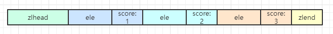

# zset有序集合对象

## 简介

---
源码位置：t_zset.c/server.h

zset对象底层编码方式有两种，`ziplist`或`skiplist`。  
使用ziplist编码需要同时满足以下两个条件：  

* 有序集合对象中所有元素的大小都小于64字节。（可通过redis.conf配置：zset_max_ziplist_value）
* 有序集合对象保存的元素个数不超过128个。（可通过redis.conf配置：zset_max_ziplist_entries）

ziplist的结构如下：  
  
如上图，集合的元素由两个紧挨着的节点来保存，第一个节点保存元素的成员，第二个节点保存元素的分值。压缩列表内的元素按照分值从小到大排序，分值小的靠近表头，分值大的靠近表尾。  

zset编码底层实际上是由skiplist和dict构成的：  

``` c
typedef struct zset {
    dict *dict;
    zskiplist *zsl;
} zset;
```

为什么会使用两种数据结构呢？其实，使用单一的数据结构也是可以实现有序集合对象的，比如单独使用字典，查找时间复杂度为O(1)，因为字典是无序的，所以当执行范围型操作时，首先要对所有元素进行排序，这里就会增加时间复杂度和空间复杂度了。当单独使用跳跃表时，查找的时间复杂度将会是O(logN)。所以，将两者的优势结合，将会很大的提高性能。另外，两种数据结构都会通过指针来共享相同的元素和分值，所以不会对内存造成不必要的浪费。

</br>

|命令|功能|时间复杂度|
|---|---|---|
|ZCARD|返回key的有序集元素个数|O(1)|
|ZCOUNT|返回有序集key中，score值在min和max之间(默认包括score值等于min或max)的成员|O(log(N))|
|ZINCRBY|为有序集key的成员member的score值加上增量increment|O(log(N))|
|ZINTERSTORE|计算给定的numkeys个有序集合的交集，并且把结果放到destination中|O(N*K)+O(M*log(M))，最坏的情况，N是最小的输入排序集，K是输入排序集的数量，M是结果排序集中的元素的数量|
|ZLEXCOUNT|用于计算有序集合中指定成员之间的成员数量|O(log(N))|
|ZPOPMAX|删除并返回有序集合key中的最多count个具有最高得分的成员|O(log(N)*M)|
|ZPOPMIN|删除并返回有序集合key中的最多count个具有最低得分的成员|O(log(N)*M)|
|ZRANGE|返回存储在有序集合key中的指定范围的元素|O(log(N)+M)|
|ZRANGEBYLEX|返回指定成员区间内的成员，按成员字典正序排序, 分数必须相同|O(log(N)+M)|
|ZREVRANGEBYLEX|返回指定成员区间内的成员，按成员字典倒序排序, 分数必须相同|O(log(N)+M)|
|ZRANGEBYSCORE|返回指定分数范围的元素列表|O(log(N)+M)|
|ZRANK|返回有序集key中成员member的排名|O(log(N))|
|ZREM|在key集合中移除指定的元素|O(M*log(N))|
|ZREMRANGEBYLEX|删除名称按字典由低到高排序成员之间所有成员|O(log(N)+M)|
|ZREMRANGEBYRANK|移除有序集key中，指定排名(rank)区间内的所有成员|O(log(N)+M)|
|ZREMRANGEBYSCORE|移除有序集key中，所有score值介于min和max之间(包括等于min或max)的成员|O(log(N)+M)|
|ZREVRANGE|返回有序集key中，指定区间内的成员|O(log(N)+M)|
|ZREVRANGEBYSCORE|返回有序集合中指定分数区间内的成员，分数由高到低排序|O(log(N)+M)|
|ZREVRANK|返回有序集key中成员member的排名，其中有序集成员按score值从大到小排列|O(log(N))|
|ZSCORE|返回有序集key中，成员member的score值|O(1)|
|ZUNIONSTORE|计算给定的numkeys个有序集合的并集，并且把结果放到destination中|O(N)+O(M log(M))|
|ZSCAN|用于迭代集合类型中的集合成员|O(1)|

</br>
</br>

## 函数功能总览

---

``` c
void zaddCommand(client *c);
void zcardCommand(client *c);
void zcountCommand(client *c);
void zincrbyCommand(client *c);
void zinterstoreCommand(client *c);
void zlexcountCommand(client *c);
void zpopmaxCommand(client *c);
void zpopminCommand(client *c);
void zrangeCommand(client *c);
void zrangebylexCommand(client *c);
void zrevrangebylexCommand(client *c);
void zrangebyscoreCommand(client *c);
void zrankCommand(client *c);
void zremCommand(client *c);
void zremrangebylexCommand(client *c);
void zremrangebyrankCommand(client *c);
void zremrangebyscoreCommand(client *c);
void zrevrangeCommand(client *c);
void zrevrangebyscoreCommand(client *c);
void zrevrankCommand(client *c);
void zscoreCommand(client *c);
void zunionstoreCommand(client *c);
void zscanCommand(client *c);
```

</br>

## Redis命令实现

---

添加命令：

``` c
ZADD key [NX|XX] [CH] [INCR] score member [score member ...]
/*
* 参数含义：  
* XX: 仅仅更新存在的成员，不添加新成员。
* NX: 不更新存在的成员。只添加新成员。
* CH: 修改返回值为发生变化的成员总数，原始是返回新添加成员的总数 (CH 是 changed 的意思)。
*     更改的元素是新添加的成员，已经存在的成员更新分数。 所以在命令中指定的成员有相同的分数将不
*     被计算在内。注：在通常情况下，ZADD返回值只计算新添加成员的数量。
* INCR: 当ZADD指定这个选项时，成员的操作就等同ZINCRBY命令，对成员的分数进行递增操作。 */
ZINCRBY key increment member
```

代码：  

``` c
void zaddCommand(client *c) {
    zaddGenericCommand(c,ZADD_NONE);
}

void zincrbyCommand(client *c) {
    zaddGenericCommand(c,ZADD_INCR);
}

void zaddGenericCommand(client *c, int flags) {
    static char *nanerr = "resulting score is not a number (NaN)";
    robj *key = c->argv[1];
    robj *zobj;
    sds ele;
    double score = 0, *scores = NULL;
    int j, elements;
    int scoreidx = 0;
    int added = 0;      /* Number of new elements added. */
    int updated = 0;    /* Number of elements with updated score. */
    int processed = 0;  /* Number of elements processed, may remain zero with
                           options like XX. */

    /* 解析命令参数 */
    scoreidx = 2;
    while(scoreidx < c->argc) {
        char *opt = c->argv[scoreidx]->ptr;
        if (!strcasecmp(opt,"nx")) flags |= ZADD_NX;
        else if (!strcasecmp(opt,"xx")) flags |= ZADD_XX;
        else if (!strcasecmp(opt,"ch")) flags |= ZADD_CH;
        else if (!strcasecmp(opt,"incr")) flags |= ZADD_INCR;
        else break;
        scoreidx++;
    }

    int incr = (flags & ZADD_INCR) != 0;
    int nx = (flags & ZADD_NX) != 0;
    int xx = (flags & ZADD_XX) != 0;
    int ch = (flags & ZADD_CH) != 0;

    /* 判断参数合法性（元素-分值对） */
    elements = c->argc-scoreidx;
    if (elements % 2 || !elements) {
        addReply(c,shared.syntaxerr);
        return;
    }
    elements /= 2;

    /* 检查不兼容的选项 */
    if (nx && xx) {
        addReplyError(c,
            "XX and NX options at the same time are not compatible");
        return;
    }

    if (incr && elements > 1) {
        addReplyError(c,
            "INCR option supports a single increment-element pair");
        return;
    }

    /* 检查分数参数是否合格 */
    scores = zmalloc(sizeof(double)*elements);
    for (j = 0; j < elements; j++) {
        if (getDoubleFromObjectOrReply(c,c->argv[scoreidx+j*2],&scores[j],NULL)
            != C_OK) goto cleanup;
    }

    /* db中查找集合 */
    zobj = lookupKeyWrite(c->db,key);
    if (zobj == NULL) {
        if (xx) goto reply_to_client; /* 没有找到key，并且设置了 XX 参数，则什么都不做 */
        // 如果db中没有key，则创建zset对象
        if (server.zset_max_ziplist_entries == 0 ||
            server.zset_max_ziplist_value < sdslen(c->argv[scoreidx+1]->ptr))
        {
            zobj = createZsetObject();
        } else {
            zobj = createZsetZiplistObject();
        }
        dbAdd(c->db,key,zobj);
    } else {
        if (zobj->type != OBJ_ZSET) {
            addReply(c,shared.wrongtypeerr);
            goto cleanup;
        }
    }

    for (j = 0; j < elements; j++) {
        double newscore;
        score = scores[j];
        int retflags = flags;

        ele = c->argv[scoreidx+1+j*2]->ptr;
        // 插入元素
        int retval = zsetAdd(zobj, score, ele, &retflags, &newscore);
        if (retval == 0) {
            addReplyError(c,nanerr);
            goto cleanup;
        }
        if (retflags & ZADD_ADDED) added++;
        if (retflags & ZADD_UPDATED) updated++;
        if (!(retflags & ZADD_NOP)) processed++;
        score = newscore;
    }
    server.dirty += (added+updated);

reply_to_client:
    if (incr) { /* ZINCRBY or INCR option. */
        if (processed)
            addReplyDouble(c,score);
        else
            addReplyNull(c);
    } else { /* ZADD. */
        addReplyLongLong(c,ch ? added+updated : added);
    }

cleanup:
    zfree(scores);
    if (added || updated) {
        signalModifiedKey(c->db,key);
        notifyKeyspaceEvent(NOTIFY_ZSET,
            incr ? "zincr" : "zadd", key, c->db->id);
    }
}
```

</br>

---

其他命令：

``` c
ZCARD key
ZCOUNT key min max
ZINTERSTORE destination numkeys key [key ...] [WEIGHTS weight] [SUM|MIN|MAX]
ZLEXCOUNT key min max
ZPOPMAX key [count]
ZPOPMIN key [count]
ZRANGE key start stop [WITHSCORES]
ZRANGEBYLEX key min max [LIMIT offset count]
ZREVRANGEBYLEX key max min [LIMIT offset count]
ZRANGEBYSCORE key min max [WITHSCORES] [LIMIT offset count]
ZRANK key member
ZREM key member [member ...]
ZREMRANGEBYLEX key min max
ZREMRANGEBYRANK key start stop
ZREMRANGEBYSCORE key min max
ZREVRANGE key start stop [WITHSCORES]
ZREVRANGEBYSCORE key max min [WITHSCORES] [LIMIT offset count]
ZREVRANK key member
ZSCORE key member
ZUNIONSTORE destination numkeys key [key ...] [WEIGHTS weight] [SUM|MIN|MAX]
ZSCAN key cursor [MATCH pattern] [COUNT count]
```
