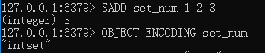
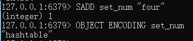
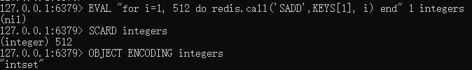
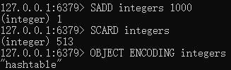

# zset有序集合对象

## 简介

---
源码位置：t_zset.c/server.h

zset对象底层编码方式有两种，ziplist或skiplist。  
使用intset编码的条件：  

* 集合对象中所有元素都是整数值。
* 集合对象保存的元素个数不超过512个。（可通过redis.conf配置：set_max_intset_entries）

下面让我们测试一下：  
例1：  
  
当添加非整数的字符串时，则会转为hashtable编码  
  

例2：  
插入512个整数，使用的是intset编码  
  
当插入第513个整数时，将会转为hashtable编码  
  

</br>

|命令|功能|时间复杂度|
|---|---|---|
|SADD|添加一个或多个元素到集合里|O(N)，N为添加的元素个数|
|SCARD|返回集合存储的key的基数 (集合元素的数量)|O(1)|
|SISMEMBER|返回成员member是否是存储的集合key的成员|O(1)|
|SINTER|返回指定所有的集合的成员的交集|O(N*M)，其中N是最小集合的基数，M是集合的数目|
|SINTERSTORE|类似SINTER，将结果存放到destination集合中，如果destination存在，则覆盖重写|O(N*M)，其中N是最小集合的基数，M是集合的数目|
|SDIFF|返回一个集合与给定集合的差集的元素|O(N)，N为所有集合的元素总数|
|SDIFFSTORE|类似SDIFF，将结果存放到destination集合中，如果destination存在，则覆盖重写|O(N)，N为所有集合的元素总数|
|SUNION|返回给定的多个集合的并集中的所有成员|O(N)|
|SUNIONSTORE|类似SUNION，将结果存放到destination集合中，如果destination存在，则覆盖重写|平均O(N)|
|SMEMBERS|返回key集合所有的元素，由SINTER实现|O(N)，N为该集合元素总数|
|SMOVE|将member从source集合移动到destination集合中|O(1)|
|SPOP|从存储在key的集合中移除并返回一个或多个随机元素|O(1)|
|SRANDMEMBER|类似SPOP，区别是该命令不删除元素|O(N)，N为指定count的值|
|SREM|在key集合中移除指定的元素|O(N)，N为指定的元素个数|
|SSCAN|用于迭代集合类型中的集合成员|O(1)|

</br>
</br>

## 函数功能总览

---

``` c
```
