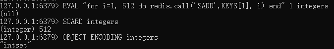

# set集合对象

## 简介

---
源码位置：t_set.c/server.h

set对象底层编码方式有两种，`intset`或`hashtable`。  
使用intset编码的条件：  

* 集合对象中所有元素都是整数值。
* 集合对象保存的元素个数不超过512个。（可通过redis.conf配置：set_max_intset_entries）

下面让我们测试一下：  
例1：  
  
当添加非整数的字符串时，则会转为hashtable编码  
  

例2：  
插入512个整数，使用的是intset编码  
  
当插入第513个整数时，将会转为hashtable编码  
  

</br>

|命令|功能|时间复杂度|
|---|---|---|
|SADD|添加一个或多个元素到集合里|O(N)，N为添加的元素个数|
|SCARD|返回集合存储的key的基数 (集合元素的数量)|O(1)|
|SISMEMBER|返回成员member是否是存储的集合key的成员|O(1)|
|SINTER|返回指定所有的集合的成员的交集|O(N*M)，其中N是最小集合的基数，M是集合的数目|
|SINTERSTORE|类似SINTER，将结果存放到destination集合中，如果destination存在，则覆盖重写|O(N*M)，其中N是最小集合的基数，M是集合的数目|
|SDIFF|返回一个集合与给定集合的差集的元素|O(N)，N为所有集合的元素总数|
|SDIFFSTORE|类似SDIFF，将结果存放到destination集合中，如果destination存在，则覆盖重写|O(N)，N为所有集合的元素总数|
|SUNION|返回给定的多个集合的并集中的所有成员|O(N)|
|SUNIONSTORE|类似SUNION，将结果存放到destination集合中，如果destination存在，则覆盖重写|平均O(N)|
|SMEMBERS|返回key集合所有的元素，由SINTER实现|O(N)，N为该集合元素总数|
|SMOVE|将member从source集合移动到destination集合中|O(1)|
|SPOP|从存储在key的集合中移除并返回一个或多个随机元素|O(1)|
|SRANDMEMBER|类似SPOP，区别是该命令不删除元素|O(N)，N为指定count的值|
|SREM|在key集合中移除指定的元素|O(N)，N为指定的元素个数|
|SSCAN|用于迭代集合类型中的集合成员|O(1)|

</br>
</br>

## 函数功能总览

---

``` c
void saddCommand(client *c); // sadd命令
void scardCommand(client *c); // scard命令
void sdiffCommand(client *c); // sdiff命令
void sdiffstoreCommand(client *c); // sdiffstore命令
void sinterCommand(client *c); // sinter和smembers命令
void sinterstoreCommand(client *c); // sinterstore命令
void sismemberCommand(client *c); // sismember命令
void smoveCommand(client *c); // smove命令
void spopCommand(client *c); // spop命令
void srandmemberCommand(client *c); // srandmember命令
void sremCommand(client *c); // srem命令
void sscanCommand(client *c); // sscan命令
void sunionCommand(client *c); // sunion命令
void sunionstoreCommand(client *c); // sunionstore命令
```

</br>

## Redis命令实现

---

插入命令：

``` c
SADD key member [member ...]
```

代码：  

``` c
void saddCommand(client *c) {
    robj *set;
    int j, added = 0;

    set = lookupKeyWrite(c->db,c->argv[1]);
    if (set == NULL) {
        // 如果db中不存在该key，则根据元素类型选择使用intset编码或者hashtable编码创建set集合
        set = setTypeCreate(c->argv[2]->ptr);
        dbAdd(c->db,c->argv[1],set);
    } else {
        if (set->type != OBJ_SET) {
            addReply(c,shared.wrongtypeerr);
            return;
        }
    }

    for (j = 2; j < c->argc; j++) {
        // 添加元素
        if (setTypeAdd(set,c->argv[j]->ptr)) added++;
    }
    if (added) {
        signalModifiedKey(c->db,c->argv[1]);
        notifyKeyspaceEvent(NOTIFY_SET,"sadd",c->argv[1],c->db->id);
    }
    server.dirty += added;
    addReplyLongLong(c,added);
}

int setTypeAdd(robj *subject, sds value) {
    long long llval;
    if (subject->encoding == OBJ_ENCODING_HT) {
        dict *ht = subject->ptr;
        dictEntry *de = dictAddRaw(ht,value,NULL);
        if (de) {
            dictSetKey(ht,de,sdsdup(value));
            dictSetVal(ht,de,NULL);
            return 1;
        }
    } else if (subject->encoding == OBJ_ENCODING_INTSET) {
        if (isSdsRepresentableAsLongLong(value,&llval) == C_OK) {
            uint8_t success = 0;
            subject->ptr = intsetAdd(subject->ptr,llval,&success);
            if (success) {
                /* Convert to regular set when the intset contains
                 * too many entries. */
                if (intsetLen(subject->ptr) > server.set_max_intset_entries)
                    setTypeConvert(subject,OBJ_ENCODING_HT);
                return 1;
            }
        } else {
            /* Failed to get integer from object, convert to regular set. */
            setTypeConvert(subject,OBJ_ENCODING_HT);

            /* The set *was* an intset and this value is not integer
             * encodable, so dictAdd should always work. */
            serverAssert(dictAdd(subject->ptr,sdsdup(value),NULL) == DICT_OK);
            return 1;
        }
    } else {
        serverPanic("Unknown set encoding");
    }
    return 0;
}
```

---

交集命令：

``` c
SINTER key [key ...]
SINTERSTORE destination key [key ...]
SMEMBERS key // 该命令是通过SINTER命令实现的
```

代码：  

``` c
void sinterCommand(client *c) {
    sinterGenericCommand(c,c->argv+1,c->argc-1,NULL);
}

void sinterstoreCommand(client *c) {
    sinterGenericCommand(c,c->argv+2,c->argc-2,c->argv[1]);
}

// setkeys：集合数组指针
// setnum：集合数量（命令中key的个数）
// dstkey：结果集是否添加到新的集合中
void sinterGenericCommand(client *c, robj **setkeys,
                          unsigned long setnum, robj *dstkey) {
    robj **sets = zmalloc(sizeof(robj*)*setnum);
    setTypeIterator *si;
    robj *dstset = NULL;
    sds elesds;
    int64_t intobj;
    void *replylen = NULL;
    unsigned long j, cardinality = 0;
    int encoding;

    for (j = 0; j < setnum; j++) {
        robj *setobj = dstkey ?
            lookupKeyWrite(c->db,setkeys[j]) :
            lookupKeyRead(c->db,setkeys[j]);
        if (!setobj) {
            zfree(sets);
            if (dstkey) {
                if (dbDelete(c->db,dstkey)) {
                    signalModifiedKey(c->db,dstkey);
                    server.dirty++;
                }
                addReply(c,shared.czero);
            } else {
                addReply(c,shared.emptyset[c->resp]);
            }
            return;
        }
        if (checkType(c,setobj,OBJ_SET)) {
            zfree(sets);
            return;
        }
        sets[j] = setobj; // 从db中获取的集合对象存入到临时数组中
    }
    // 根据集合的大小从小到大进行排序
    qsort(sets,setnum,sizeof(robj*),qsortCompareSetsByCardinality);

    if (!dstkey) {
        replylen = addReplyDeferredLen(c);
    } else {
        dstset = createIntsetObject();
    }

    si = setTypeInitIterator(sets[0]); // 从第一个集合开始遍历
    // 此处是while+for循环，所有时间复杂度是O(N*M)
    while((encoding = setTypeNext(si,&elesds,&intobj)) != -1) {
        for (j = 1; j < setnum; j++) {
            // 判断第一个集合的元素是否在集合j中
            if (sets[j] == sets[0]) continue;
            if (encoding == OBJ_ENCODING_INTSET) {
                if (sets[j]->encoding == OBJ_ENCODING_INTSET &&
                    !intsetFind((intset*)sets[j]->ptr,intobj))
                {
                    break;
                } else if (sets[j]->encoding == OBJ_ENCODING_HT) {
                    elesds = sdsfromlonglong(intobj);
                    if (!setTypeIsMember(sets[j],elesds)) {
                        sdsfree(elesds);
                        break;
                    }
                    sdsfree(elesds);
                }
            } else if (encoding == OBJ_ENCODING_HT) {
                if (!setTypeIsMember(sets[j],elesds)) {
                    break;
                }
            }
        }

        if (j == setnum) {
            if (!dstkey) {
                if (encoding == OBJ_ENCODING_HT)
                    addReplyBulkCBuffer(c,elesds,sdslen(elesds));
                else
                    addReplyBulkLongLong(c,intobj);
                cardinality++;
            } else {
                if (encoding == OBJ_ENCODING_INTSET) {
                    elesds = sdsfromlonglong(intobj);
                    setTypeAdd(dstset,elesds);
                    sdsfree(elesds);
                } else {
                    setTypeAdd(dstset,elesds);
                }
            }
        }
    }
    setTypeReleaseIterator(si);

    if (dstkey) {
        int deleted = dbDelete(c->db,dstkey);
        if (setTypeSize(dstset) > 0) {
            dbAdd(c->db,dstkey,dstset);
            addReplyLongLong(c,setTypeSize(dstset));
            notifyKeyspaceEvent(NOTIFY_SET,"sinterstore",
                dstkey,c->db->id);
        } else {
            decrRefCount(dstset);
            addReply(c,shared.czero);
            if (deleted)
                notifyKeyspaceEvent(NOTIFY_GENERIC,"del",
                    dstkey,c->db->id);
        }
        signalModifiedKey(c->db,dstkey);
        server.dirty++;
    } else {
        setDeferredSetLen(c,replylen,cardinality);
    }
    zfree(sets);
}
```

---

并集&差集命令：

``` c
并集：
SUNION key [key ...]
SUNIONSTORE destination key [key ...]
差集：
SDIFF key [key ...]
SDIFFSTORE destination key [key ...]
```

代码：

``` c
void sunionCommand(client *c) {
    sunionDiffGenericCommand(c,c->argv+1,c->argc-1,NULL,SET_OP_UNION);
}

void sunionstoreCommand(client *c) {
    sunionDiffGenericCommand(c,c->argv+2,c->argc-2,c->argv[1],SET_OP_UNION);
}

void sdiffCommand(client *c) {
    sunionDiffGenericCommand(c,c->argv+1,c->argc-1,NULL,SET_OP_DIFF);
}

void sdiffstoreCommand(client *c) {
    sunionDiffGenericCommand(c,c->argv+2,c->argc-2,c->argv[1],SET_OP_DIFF);
}

void sunionDiffGenericCommand(client *c, robj **setkeys, int setnum,
                              robj *dstkey, int op) {
    robj **sets = zmalloc(sizeof(robj*)*setnum);
    setTypeIterator *si;
    robj *dstset = NULL;
    sds ele;
    int j, cardinality = 0;
    int diff_algo = 1;

    for (j = 0; j < setnum; j++) {
        robj *setobj = dstkey ?
            lookupKeyWrite(c->db,setkeys[j]) :
            lookupKeyRead(c->db,setkeys[j]);
        if (!setobj) {
            sets[j] = NULL;
            continue;
        }
        if (checkType(c,setobj,OBJ_SET)) {
            zfree(sets);
            return;
        }
        sets[j] = setobj;
    }

    /* 差集算法有两种：
     * 算法1： 时间复杂度为O(N*M)，N是第一个集合的大小，M是集合的总数
     * 算法2： 时间复杂度为O(N)，N是所有集合的元素总数
     * 根据输入条件计算选择使用哪种算法 */
    if (op == SET_OP_DIFF && sets[0]) {
        long long algo_one_work = 0, algo_two_work = 0;

        for (j = 0; j < setnum; j++) {
            if (sets[j] == NULL) continue;

            algo_one_work += setTypeSize(sets[0]);
            algo_two_work += setTypeSize(sets[j]);
        }

        /* 算法1 具有更好的常数时间，并且如果有共同的元素，则执行的操作更少。 */
        algo_one_work /= 2;
        diff_algo = (algo_one_work <= algo_two_work) ? 1 : 2;

        if (diff_algo == 1 && setnum > 1) {
            qsort(sets+1,setnum-1,sizeof(robj*),
                qsortCompareSetsByRevCardinality);
        }
    }

    /* 创建一个临时的set进行存储元素，如果是store模式，则存储该临时集合 */
    dstset = createIntsetObject();

    if (op == SET_OP_UNION) {
        /* 并集很简单，只需要把所有集合的元素放入到临时集合中就能得出 */
        for (j = 0; j < setnum; j++) {
            if (!sets[j]) continue; /* non existing keys are like empty sets */

            si = setTypeInitIterator(sets[j]);
            while((ele = setTypeNextObject(si)) != NULL) {
                if (setTypeAdd(dstset,ele)) cardinality++;
                sdsfree(ele);
            }
            setTypeReleaseIterator(si);
        }
    } else if (op == SET_OP_DIFF && sets[0] && diff_algo == 1) {
        /* 差集算法1:
         * 通过迭代第一个集合的所有元素来进行差集判断，
         * 当第一个集合的元素不存在于其他所有的集合中时，
         * 才将元素插入到临时集合中。*/
        si = setTypeInitIterator(sets[0]);
        while((ele = setTypeNextObject(si)) != NULL) {
            for (j = 1; j < setnum; j++) {
                if (!sets[j]) continue; /* no key is an empty set. */
                if (sets[j] == sets[0]) break; /* same set! */
                if (setTypeIsMember(sets[j],ele)) break;
            }
            if (j == setnum) {
                /* 当前元素不存在与其他集合中时，添加到临时集合dstset中 */
                setTypeAdd(dstset,ele);
                cardinality++;
            }
            sdsfree(ele);
        }
        setTypeReleaseIterator(si);
    } else if (op == SET_OP_DIFF && sets[0] && diff_algo == 2) {
        /* 差集算法2:
         * 首先将第一个集合的元素插入到临时集合中，
         * 然后从中移除其他集合的所有元素。 */
        for (j = 0; j < setnum; j++) {
            if (!sets[j]) continue;

            si = setTypeInitIterator(sets[j]);
            while((ele = setTypeNextObject(si)) != NULL) {
                if (j == 0) {
                    // 把第一个集合的元素添加到dstset中
                    if (setTypeAdd(dstset,ele)) cardinality++;
                } else {
                    // 从dstset中移除其他集合的元素
                    if (setTypeRemove(dstset,ele)) cardinality--;
                }
                sdsfree(ele);
            }
            setTypeReleaseIterator(si);

            /* 如果临时集合dstset为空，则表示第一个集合的元素在其他集合中都存在，
             * 没有差集，直接退出循环 */
            if (cardinality == 0) break;
        }
    }

    if (!dstkey) {
        addReplySetLen(c,cardinality);
        si = setTypeInitIterator(dstset);
        while((ele = setTypeNextObject(si)) != NULL) {
            addReplyBulkCBuffer(c,ele,sdslen(ele));
            sdsfree(ele);
        }
        setTypeReleaseIterator(si);
        server.lazyfree_lazy_server_del ? freeObjAsync(dstset) :
                                          decrRefCount(dstset);
    } else {
        /* If we have a target key where to store the resulting set
         * create this key with the result set inside */
        int deleted = dbDelete(c->db,dstkey);
        if (setTypeSize(dstset) > 0) {
            dbAdd(c->db,dstkey,dstset);
            addReplyLongLong(c,setTypeSize(dstset));
            notifyKeyspaceEvent(NOTIFY_SET,
                op == SET_OP_UNION ? "sunionstore" : "sdiffstore",
                dstkey,c->db->id);
        } else {
            decrRefCount(dstset);
            addReply(c,shared.czero);
            if (deleted)
                notifyKeyspaceEvent(NOTIFY_GENERIC,"del",
                    dstkey,c->db->id);
        }
        signalModifiedKey(c->db,dstkey);
        server.dirty++;
    }
    zfree(sets);
}
```

---

其他命令：

``` c
SISMEMBER key member
SCARD key
SMOVE source destination member
SPOP key [count]
SRANDMEMBER key [count]
SREM key member [member ...]
SSCAN key cursor [MATCH pattern] [COUNT count]
```
