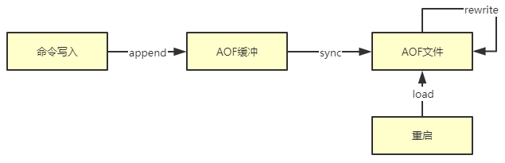
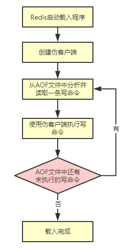

# AOF持久化

## 简介

---
源码位置：aof.c/rio.c/rio.h

**1. 前言**
除了RDB持久化功能以外，Redis还提供了AOF(Append Only File)持久化功能。与RDB持久化通过保存数据库中的键值对来记录数据库状态不同，AOF持久化是通过保存Redis所执行的写命令来记录数据库状态的。

**2. RDB和AOF的区别**
antirez 在《Redis 持久化解密》一文中讲述了 RDB 和 AOF 各自的优缺点：

* RDB 是一个紧凑压缩的二进制文件，代表 Redis 在某个时间点上的数据备份。非常适合备份，全量复制等场景。比如每6小时执行 bgsave 备份，并把 RDB 文件拷贝到远程机器或者文件系统中，用于灾难恢复。
* Redis 加载 RDB 恢复数据远远快于 AOF 的方式
* RDB 方式数据没办法做到实时持久化，而 AOF 方式可以做到。

**3. AOF持久化的实现**

如上图所示，AOF 持久化功能的实现可以分为命令追加( append )、文件写入( write )、文件同步( sync )、文件重写(rewrite)和重启加载(load)。其流程如下：

* 所有的写命令会追加到 AOF 缓冲中。
* AOF 缓冲区根据对应的策略向硬盘进行同步操作。
* 随着 AOF 文件越来越大，需要定期对 AOF 文件进行重写，达到压缩的目的。
* 当 Redis 重启时，可以加载 AOF 文件进行数据恢复。

**命令追加**
当 AOF 持久化功能处于打开状态（配置文件中：`appendonly yes`）时，Redis 在执行完一个写命令之后，调用`feedAppendOnlyFile`函数，以协议格式(也就是RESP，即 Redis 客户端和服务器交互的通信协议 )将被执行的写命令追加到 Redis 服务端维护的 AOF 缓冲区末尾（sds类型变量：`aof_buf`）。

比如说 SET mykey myvalue 这条命令就以如下格式记录到 AOF 缓冲中。

```c
"*3\r\n$3\r\nSET\r\n$5\r\nmykey\r\n$7\r\nmyvalue\r\n"
```

**文件写入与同步**
Redis的服务器进程是一个事件循环，文件事件负责处理客户端的命令请求，而时间事件负责执行`serverCron`函数这样的定时运行的函数。在处理文件事件执行写命令，使得命令被追加到`aof_buf`中，然后在处理时间事件执行`serverCron`函数会调用`flushAppendOnlyFile`函数进行文件的写入和同步。
flushAppendOnlyFile函数的行为由服务器配置的`appendfsync`选项的值决定，该选项有三个可选值，分别是`always`、`everysec` 和 `no`：

* **always： 每执行一个命令保存一次。** Redis 在每个事件循环都要将 AOF 缓冲区中的所有内容写入到 AOF 文件，并且同步 AOF 文件，所以 always 的效率是 appendfsync 选项三个值当中最差的一个，但从安全性来说，也是最安全的。当发生故障停机时，AOF 持久化也只会丢失一个事件循环中所产生的命令数据。
* **everysec： 每一秒钟保存一次。** Redis 在每个事件循环都要将 AOF 缓冲区中的所有内容写入到 AOF 文件中，并且每隔一秒就要在子线程中对 AOF 文件进行一次同步。从效率上看，该模式足够快。当发生故障停机时，只会丢失一秒钟的命令数据。
* **no：不保存。** 将aof_buf中的所有内容写入到aof文件，但不对aof文件同步，`fsync` 由操作系统执行。

Redis的 `write` 操作会触发延迟写（delayed write）机制，在同步文件之前，如果此时系统故障宕机，缓冲区内数据将丢失。
>**延迟写机制：** 传统的UNIX实现在内核中设有缓冲区高速缓存或页面高速缓存，大多数磁盘I/O都通过缓冲进行。 当将数据写入文件时，内核通常先将该数据复制到其中一个缓冲区中，如果该缓冲区尚未写满，则 并不将其排入输出队列，而是等待其写满或者当内核需要重用该缓冲区以便存放其他磁盘块数据时， 再将该缓冲排入到输出队列，然后待其到达队首时，才进行实际的I/O操作。这种输出方式就被称为延迟写。

而 `fsync` 针对单个文件操作，对其进行强制硬盘同步，`fsync` 将阻塞直到写入磁盘完成后返回，保证了数据持久化。

三种AOF模式在安全性和性能方面的区别如下：

* **no：** `write` 和 `fsync` 都由主进程执行，两个操作都会阻塞主进程。因为 `fsync` 操作只会在AOF 关闭或 Redis 关闭时执行，或者由操作系统触发。所以当系统故障宕机，那么丢失数据的数量由操作系统的缓存冲洗策略决定。
* **always：** 该模式的安全性最高，但性能也是最差的，因为服务器必须阻塞直到命令信息被写入并保存到磁盘之后，才能继续处理请求。
* **everysec：** `write` 操作由主进程执行，阻塞主进程。`fsync` 操作由子线程执行，不直接阻塞主进程，但`fsync` 操作完成的快慢会影响 `write` 操作的阻塞时长。因为是一秒执行一次，所以它的安全性高于`no`模式，系统故障宕机将会丢失一秒钟的命令数据。

`appendfsync` 的三个值代表着三种不同的调用 `fsync` 的策略。调用 `fsync` 周期越频繁，读写效率就越差，但是相应的安全性越高，发生宕机时丢失的数据越少。

**4. AOF数据恢复**
AOF文件中包含了重建Redis数据所需的所有命令，所以Redis只要读入并重新执行一遍 AOF 文件里边保存的写命令，就可以还原 Redis 关闭之前的状态。


**5. AOF重写**
因为AOF持久化是通过保存被执行的写命令来记录Redis状态的，所以随着Redis长时间运行，AOF文件中的内容越来越多，文件的体积也会越来越大，如果不加以控制，Redis通过AOF文件还原数据库需要的时间将会变得很久，同时AOF文件很可能会对Redis甚至宿主主机造成影响。
为了解决上诉问题，Redis提供了AOF文件重写（rewrite）功能。通过该功能，Redis 可以创建一个新的 AOF 文件来替代现有的 AOF 文件。新旧两个 AOF 文件所保存的 Redis 状态相同，但是新的 AOF 文件不会包含任何浪费空间的冗余命令，所以新 AOF 文件的体积通常比旧 AOF 文件的体积要小得很多。
>例如：
>重写前AOF文件命令记录:
>RPUSH list "A","B"
>RPUSH list "C","D"
>LPOP list
>LPOP list
>RPUSH list "E","F"
>
>重写后AOF文件命令记录：
>RPUSH list "C","D","E","F"

如上所示，重写前，AOF文件要保存5条命令，重写后只需要保存一条，所以重写后的文件要小很多。

**AOF重写实现**
AOF文件重写通过 `rewriteAppendOnlyFileBackground()` 实现，重写不需要对现有的AOF文件进行任何读取、分析或者写入操作，而是读取服务器当前的数据库状态来实现的（`rewriteAppendOnlyFileRio()`）。首先从数据库中读取键对应的值，然后用一条命令去记录键值对，代替之前的多条命令，这就是AOF重写功能实现。

在实际过程中，为了避免在执行命令时造成客户端输入缓冲区溢出，AOF 重写在处理列表、哈希表、集合和有序集合这四种可能会带有多个元素的键时，会先检查键所包含的元素数量，如果数量超`REDIS_AOF_REWRITE_ITEMS_PER_CMD` ( 一般为64 )常量，则使用多条命令记录该键的值，而不是一条命令。

AOF重写函数会进行大量的写入操作，调用该函数的线程将被长时间阻塞，所以Redis在子进程中执行AOF重写操作。

* 子进程重写期间，主线程可以继续处理客户端命令请求。
* 子进程带有主线程的内存数据拷贝副本，这样就可以避免与主进程竞争db->dict，在不用锁的情况下，也能保证数据的安全性。

AOF重写期间，主进程依然能接收处理命令，会对现有的Redis数据库进行修改，从而导致AOF重写后的数据与现有的数据库数据不一致。因此，Redis设置了AOF重写缓冲区，在创建子进程后，主进程每执行一个写命令都会写到缓冲区中。在子进程完成重写后，主进程会将AOF重写缓冲区的数据写入到重写后的AOF文件中，以此保证数据的一致性。

</br>

## 函数主要功能

---

```c
void flushAppendOnlyFile(int force); // 将缓冲区的数据刷入到磁盘文件中
void feedAppendOnlyFile(struct redisCommand *cmd, int dictid, robj **argv, int argc); // 将写操作的数据添加到AOF缓冲区末尾
int rewriteAppendOnlyFileBackground(void); // AOF文件重写
int loadAppendOnlyFile(char *filename); // 加载AOF文件恢复数据
void stopAppendOnly(void); // 停止
int startAppendOnly(void); // 启动
void backgroundRewriteDoneHandler(int exitcode, int bysignal); // 子进程重写完成信号
void aofRewriteBufferReset(void); // 清空AOF重写缓冲区
unsigned long aofRewriteBufferSize(void); // 获取AOF重写缓冲区的大小
```

</br>

## 主要函数实现

---

**写操作命令追加到AOF缓冲区：**

```c
void feedAppendOnlyFile(struct redisCommand *cmd, int dictid, robj **argv, int argc) {
    sds buf = sdsempty();
    robj *tmpargv[3];

    if (dictid != server.aof_selected_db) {
        char seldb[64];

        // 切换dbid，追加select命令
        snprintf(seldb,sizeof(seldb),"%d",dictid);
        buf = sdscatprintf(buf,"*2\r\n$6\r\nSELECT\r\n$%lu\r\n%s\r\n",
            (unsigned long)strlen(seldb),seldb);
        server.aof_selected_db = dictid;
    }

    if (cmd->proc == expireCommand || cmd->proc == pexpireCommand ||
        cmd->proc == expireatCommand) {
        /* 将EXPIRE/PEXPIRE/EXPIREAT转化成PEXPIREAT生成命令协议格式的字符串 */
        buf = catAppendOnlyExpireAtCommand(buf,cmd,argv[1],argv[2]);
    } else if (cmd->proc == setexCommand || cmd->proc == psetexCommand) {
        /* 将SETEX/PSETEX转换成SET和PEXPIREAT生成命令协议格式的字符串 */
        tmpargv[0] = createStringObject("SET",3);
        tmpargv[1] = argv[1];
        tmpargv[2] = argv[3];
        buf = catAppendOnlyGenericCommand(buf,3,tmpargv);
        decrRefCount(tmpargv[0]);
        buf = catAppendOnlyExpireAtCommand(buf,cmd,argv[1],argv[2]);
    } else if (cmd->proc == setCommand && argc > 3) {
        int i;
        robj *exarg = NULL, *pxarg = NULL;
        buf = catAppendOnlyGenericCommand(buf,3,argv);
        for (i = 3; i < argc; i ++) {
            if (!strcasecmp(argv[i]->ptr, "ex")) exarg = argv[i+1];
            if (!strcasecmp(argv[i]->ptr, "px")) pxarg = argv[i+1];
        }
        serverAssert(!(exarg && pxarg));
        if (exarg)
            buf = catAppendOnlyExpireAtCommand(buf,server.expireCommand,argv[1],
                                               exarg);
        if (pxarg)
            buf = catAppendOnlyExpireAtCommand(buf,server.pexpireCommand,argv[1],
                                               pxarg);
    } else {
        /* 将写命令生成命令协议格式的字符串 */
        buf = catAppendOnlyGenericCommand(buf,argc,argv);
    }

    /* 将命令的协议格式的字符串追加到aof_buf */
    if (server.aof_state == AOF_ON)
        server.aof_buf = sdscatlen(server.aof_buf,buf,sdslen(buf));

    /* 如果当前正在做AOF重写，则将命令的协议格式的字符串追加到AOF重写缓存区 */
    if (server.aof_child_pid != -1)
        aofRewriteBufferAppend((unsigned char*)buf,sdslen(buf));

    sdsfree(buf);
}
```

**AOF缓冲区的数据刷入到AOF文件中：**

```c
void flushAppendOnlyFile(int force) {
    ssize_t nwritten;
    int sync_in_progress = 0;
    mstime_t latency;

    if (sdslen(server.aof_buf) == 0) {
        if (server.aof_fsync == AOF_FSYNC_EVERYSEC &&
            server.aof_fsync_offset != server.aof_current_size &&
            server.unixtime > server.aof_last_fsync &&
            !(sync_in_progress = aofFsyncInProgress())) {
            goto try_fsync;
        } else {
            return;
        }
    }

    if (server.aof_fsync == AOF_FSYNC_EVERYSEC)
        // 如果AOF fsync当前已在BIO线程中进行返回true
        sync_in_progress = aofFsyncInProgress();

    if (server.aof_fsync == AOF_FSYNC_EVERYSEC && !force) {
        /* 使用这个append fsync策略，我们进行后台fsync。如果fsync仍在进行中，我们可以尝试将写入延迟几秒钟。 */
        if (sync_in_progress) {
            if (server.aof_flush_postponed_start == 0) {
                server.aof_flush_postponed_start = server.unixtime;
                return;
            } else if (server.unixtime - server.aof_flush_postponed_start < 2) {
                return;
            }
            server.aof_delayed_fsync++;
            serverLog(LL_NOTICE,"Asynchronous AOF fsync is taking too long (disk is busy?). Writing the AOF buffer without waiting for fsync to complete, this may slow down Redis.");
        }
    }

    if (server.aof_flush_sleep && sdslen(server.aof_buf)) {
        usleep(server.aof_flush_sleep);
    }

    // 将aof_buf中的内容写入到AOF文件中
    latencyStartMonitor(latency);
    nwritten = aofWrite(server.aof_fd,server.aof_buf,sdslen(server.aof_buf));
    latencyEndMonitor(latency);

    if (sync_in_progress) {
        latencyAddSampleIfNeeded("aof-write-pending-fsync",latency);
    } else if (hasActiveChildProcess()) {
        latencyAddSampleIfNeeded("aof-write-active-child",latency);
    } else {
        latencyAddSampleIfNeeded("aof-write-alone",latency);
    }
    latencyAddSampleIfNeeded("aof-write",latency);

    server.aof_flush_postponed_start = 0;

    if (nwritten != (ssize_t)sdslen(server.aof_buf)) {
        static time_t last_write_error_log = 0;
        int can_log = 0;

        if ((server.unixtime - last_write_error_log) > AOF_WRITE_LOG_ERROR_RATE) {
            can_log = 1;
            last_write_error_log = server.unixtime;
        }

        if (nwritten == -1) {
            if (can_log) {
                serverLog(LL_WARNING,"Error writing to the AOF file: %s",
                    strerror(errno));
                server.aof_last_write_errno = errno;
            }
        } else {
            if (can_log) {
                serverLog(LL_WARNING,"Short write while writing to "
                                       "the AOF file: (nwritten=%lld, "
                                       "expected=%lld)",
                                       (long long)nwritten,
                                       (long long)sdslen(server.aof_buf));
            }

            if (ftruncate(server.aof_fd, server.aof_current_size) == -1) {
                if (can_log) {
                    serverLog(LL_WARNING, "Could not remove short write "
                             "from the append-only file.  Redis may refuse "
                             "to load the AOF the next time it starts.  "
                             "ftruncate: %s", strerror(errno));
                }
            } else {
                nwritten = -1;
            }
            server.aof_last_write_errno = ENOSPC;
        }

        if (server.aof_fsync == AOF_FSYNC_ALWAYS) {
            serverLog(LL_WARNING,"Can't recover from AOF write error when the AOF fsync policy is 'always'. Exiting...");
            exit(1);
        } else {
            server.aof_last_write_status = C_ERR;

            if (nwritten > 0) {
                server.aof_current_size += nwritten;
                sdsrange(server.aof_buf,nwritten,-1);
            }
            return;
        }
    } else {
        if (server.aof_last_write_status == C_ERR) {
            serverLog(LL_WARNING,
                "AOF write error looks solved, Redis can write again.");
            server.aof_last_write_status = C_OK;
        }
    }
    server.aof_current_size += nwritten;

    if ((sdslen(server.aof_buf)+sdsavail(server.aof_buf)) < 4000) {
        sdsclear(server.aof_buf);
    } else {
        sdsfree(server.aof_buf);
        server.aof_buf = sdsempty();
    }

try_fsync:
    // appendfsync为no或者有后台进程在进行aof或rdb，不进行文件同步
    if (server.aof_no_fsync_on_rewrite && hasActiveChildProcess())
        return;

    if (server.aof_fsync == AOF_FSYNC_ALWAYS) {
        latencyStartMonitor(latency);
        redis_fsync(server.aof_fd); /* Let's try to get this data on the disk */
        latencyEndMonitor(latency);
        latencyAddSampleIfNeeded("aof-fsync-always",latency);
        server.aof_fsync_offset = server.aof_current_size;
        server.aof_last_fsync = server.unixtime;
    } else if ((server.aof_fsync == AOF_FSYNC_EVERYSEC &&
                server.unixtime > server.aof_last_fsync)) {
        if (!sync_in_progress) {
            aof_background_fsync(server.aof_fd);
            server.aof_fsync_offset = server.aof_current_size;
        }
        server.aof_last_fsync = server.unixtime;
    }
}
```

**AOF重写：**

```c
int rewriteAppendOnlyFileBackground(void) {
    pid_t childpid;

    if (hasActiveChildProcess()) return C_ERR;
    if (aofCreatePipes() != C_OK) return C_ERR; //创建父进程与子进程的管道
    openChildInfoPipe();
    if ((childpid = redisFork()) == 0) {
        char tmpfile[256];

        /* Child */
        redisSetProcTitle("redis-aof-rewrite");
        snprintf(tmpfile,256,"temp-rewriteaof-bg-%d.aof", (int) getpid());
        // 通过子进程来重写AOF文件
        if (rewriteAppendOnlyFile(tmpfile) == C_OK) {
            sendChildCOWInfo(CHILD_INFO_TYPE_AOF, "AOF rewrite");
            exitFromChild(0);
        } else {
            exitFromChild(1);
        }
    } else {
        /* Parent */
        if (childpid == -1) {
            closeChildInfoPipe();
            serverLog(LL_WARNING,
                "Can't rewrite append only file in background: fork: %s",
                strerror(errno));
            aofClosePipes();
            return C_ERR;
        }
        serverLog(LL_NOTICE,
            "Background append only file rewriting started by pid %d",childpid);
        server.aof_rewrite_scheduled = 0;
        server.aof_rewrite_time_start = time(NULL);
        server.aof_child_pid = childpid;
        server.aof_selected_db = -1;
        replicationScriptCacheFlush();
        return C_OK;
    }
    return C_OK; /* unreached */
}
// AOF重写实现
int rewriteAppendOnlyFile(char *filename) {
    rio aof;
    FILE *fp;
    char tmpfile[256];
    char byte;

    snprintf(tmpfile,256,"temp-rewriteaof-%d.aof", (int) getpid());
    fp = fopen(tmpfile,"w");
    if (!fp) {
        serverLog(LL_WARNING, "Opening the temp file for AOF rewrite in rewriteAppendOnlyFile(): %s", strerror(errno));
        return C_ERR;
    }

    server.aof_child_diff = sdsempty();
    rioInitWithFile(&aof,fp);

    if (server.aof_rewrite_incremental_fsync)
        rioSetAutoSync(&aof,REDIS_AUTOSYNC_BYTES);

    startSaving(RDBFLAGS_AOF_PREAMBLE);

    if (server.aof_use_rdb_preamble) {
        int error;
        if (rdbSaveRio(&aof,&error,RDBFLAGS_AOF_PREAMBLE,NULL) == C_ERR) {
            errno = error;
            goto werr;
        }
    } else {
        // 读取Redis数据库状态进行重写操作
        if (rewriteAppendOnlyFileRio(&aof) == C_ERR) goto werr;
    }

    // 将数据刷入到新的AOF文件中
    if (fflush(fp) == EOF) goto werr;
    if (fsync(fileno(fp)) == -1) goto werr;

    /* 从父进程的重写缓冲区获取更多数据，如果20ms内没有新数据，则退出循环 */
    int nodata = 0;
    mstime_t start = mstime();
    while(mstime()-start < 1000 && nodata < 20) {
        if (aeWait(server.aof_pipe_read_data_from_parent, AE_READABLE, 1) <= 0)
        {
            nodata++;
            continue;
        }
        nodata = 0;
        aofReadDiffFromParent();
    }

    /* 请求主进程停止发送差异. */
    if (write(server.aof_pipe_write_ack_to_parent,"!",1) != 1) goto werr;
    if (anetNonBlock(NULL,server.aof_pipe_read_ack_from_parent) != ANET_OK)
        goto werr;
    /* 设定10秒超时时间来接受主进程的相应 */
    if (syncRead(server.aof_pipe_read_ack_from_parent,&byte,1,5000) != 1 ||
        byte != '!') goto werr;
    serverLog(LL_NOTICE,"Parent agreed to stop sending diffs. Finalizing AOF...");

    /* 读取最终差异. */
    aofReadDiffFromParent();

    /* 将接收到的差异写入文件中 */
    serverLog(LL_NOTICE,
        "Concatenating %.2f MB of AOF diff received from parent.",
        (double) sdslen(server.aof_child_diff) / (1024*1024));
    if (rioWrite(&aof,server.aof_child_diff,sdslen(server.aof_child_diff)) == 0)
        goto werr;

    /* 确保数据不会保留在操作系统的输出缓冲区中 */
    if (fflush(fp) == EOF) goto werr;
    if (fsync(fileno(fp)) == -1) goto werr;
    if (fclose(fp) == EOF) goto werr;

    /* 重命名. */
    if (rename(tmpfile,filename) == -1) {
        serverLog(LL_WARNING,"Error moving temp append only file on the final destination: %s", strerror(errno));
        unlink(tmpfile);
        stopSaving(0);
        return C_ERR;
    }
    serverLog(LL_NOTICE,"SYNC append only file rewrite performed");
    stopSaving(1);
    return C_OK;

werr:
    serverLog(LL_WARNING,"Write error writing append only file on disk: %s", strerror(errno));
    fclose(fp);
    unlink(tmpfile);
    stopSaving(0);
    return C_ERR;
}
```

**从AOF文件中恢复数据：**

```c
int loadAppendOnlyFile(char *filename) {
    struct client *fakeClient;
    FILE *fp = fopen(filename,"r");
    struct redis_stat sb;
    int old_aof_state = server.aof_state;
    long loops = 0;
    off_t valid_up_to = 0;
    off_t valid_before_multi = 0;

    if (fp == NULL) {
        serverLog(LL_WARNING,"Fatal error: can't open the append log file for reading: %s",strerror(errno));
        exit(1);
    }

        /* 处理长度为0的AOF文件，服务启动后，如果没有写操作，则AOF文件的长度为0，是特殊情况 */
    if (fp && redis_fstat(fileno(fp),&sb) != -1 && sb.st_size == 0) {
        server.aof_current_size = 0;
        server.aof_fsync_offset = server.aof_current_size;
        fclose(fp);
        return C_ERR;
    }

    /* 暂时禁用AOF，以防止读取同一文件的同时，有客户端进行写操作命令 */
    server.aof_state = AOF_OFF;

    // 创建伪客户端
    fakeClient = createAOFClient();
    // 开始加载文件的初始化工作
    startLoadingFile(fp, filename, RDBFLAGS_AOF_PREAMBLE);

    /* 检查这个AOF文件是否有RDB前导码。在这种情况下，我们需要加载RDB文件，然后继续加载AOF tail. */
    char sig[5]; /* "REDIS" */
    if (fread(sig,1,5,fp) != 5 || memcmp(sig,"REDIS",5) != 0) {
        if (fseek(fp,0,SEEK_SET) == -1) goto readerr;
    } else {
        rio rdb;

        serverLog(LL_NOTICE,"Reading RDB preamble from AOF file...");
        if (fseek(fp,0,SEEK_SET) == -1) goto readerr;
        rioInitWithFile(&rdb,fp);
        if (rdbLoadRio(&rdb,RDBFLAGS_AOF_PREAMBLE,NULL) != C_OK) {
            serverLog(LL_WARNING,"Error reading the RDB preamble of the AOF file, AOF loading aborted");
            goto readerr;
        } else {
            serverLog(LL_NOTICE,"Reading the remaining AOF tail...");
        }
    }

    /* 解析AOF文件内容. */
    while(1) {
        int argc, j;
        unsigned long len;
        robj **argv;
        char buf[128];
        sds argsds;
        struct redisCommand *cmd;

        /* Serve the clients from time to time */
        if (!(loops++ % 1000)) {
            loadingProgress(ftello(fp));
            processEventsWhileBlocked();
            processModuleLoadingProgressEvent(1);
        }

        if (fgets(buf,sizeof(buf),fp) == NULL) {
            if (feof(fp))
                break;
            else
                goto readerr;
        }
        if (buf[0] != '*') goto fmterr;
        if (buf[1] == '\0') goto readerr;
        argc = atoi(buf+1); // 命令的参数个数
        if (argc < 1) goto fmterr;

        argv = zmalloc(sizeof(robj*)*argc);
        fakeClient->argc = argc;
        fakeClient->argv = argv;

        for (j = 0; j < argc; j++) {
            /* 解析参数长度. */
            char *readres = fgets(buf,sizeof(buf),fp);
            if (readres == NULL || buf[0] != '$') {
                fakeClient->argc = j; /* Free up to j-1. */
                freeFakeClientArgv(fakeClient);
                if (readres == NULL)
                    goto readerr;
                else
                    goto fmterr;
            }
            len = strtol(buf+1,NULL,10);

            argsds = sdsnewlen(SDS_NOINIT,len);
            if (len && fread(argsds,len,1,fp) == 0) {
                sdsfree(argsds);
                fakeClient->argc = j; /* Free up to j-1. */
                freeFakeClientArgv(fakeClient);
                goto readerr;
            }
            argv[j] = createObject(OBJ_STRING,argsds);

            if (fread(buf,2,1,fp) == 0) {
                fakeClient->argc = j+1; /* Free up to j. */
                freeFakeClientArgv(fakeClient);
                goto readerr;
            }
        }

        /* 执行命令 */
        cmd = lookupCommand(argv[0]->ptr);
        if (!cmd) {
            serverLog(LL_WARNING,
                "Unknown command '%s' reading the append only file",
                (char*)argv[0]->ptr);
            exit(1);
        }

        if (cmd == server.multiCommand) valid_before_multi = valid_up_to;

        /* 在伪客户端中执行该命令 */
        fakeClient->cmd = cmd;
        if (fakeClient->flags & CLIENT_MULTI &&
            fakeClient->cmd->proc != execCommand)
        {
            queueMultiCommand(fakeClient);
        } else {
            cmd->proc(fakeClient);
        }

        serverAssert(fakeClient->bufpos == 0 &&
                     listLength(fakeClient->reply) == 0);

        serverAssert((fakeClient->flags & CLIENT_BLOCKED) == 0);

        /* 清理伪客户端中的命令. */
        freeFakeClientArgv(fakeClient);
        fakeClient->cmd = NULL;
        if (server.aof_load_truncated) valid_up_to = ftello(fp);
        if (server.key_load_delay)
            usleep(server.key_load_delay);
    }

    if (fakeClient->flags & CLIENT_MULTI) {
        serverLog(LL_WARNING,
            "Revert incomplete MULTI/EXEC transaction in AOF file");
        valid_up_to = valid_before_multi;
        goto uxeof;
    }

loaded_ok: /* DB loaded, cleanup and return C_OK to the caller. */
    fclose(fp);
    freeFakeClient(fakeClient);
    server.aof_state = old_aof_state;
    stopLoading(1);
    aofUpdateCurrentSize();
    server.aof_rewrite_base_size = server.aof_current_size;
    server.aof_fsync_offset = server.aof_current_size;
    return C_OK;

readerr: /* Read error. If feof(fp) is true, fall through to unexpected EOF. */
    if (!feof(fp)) {
        if (fakeClient) freeFakeClient(fakeClient); /* avoid valgrind warning */
        fclose(fp);
        serverLog(LL_WARNING,"Unrecoverable error reading the append only file: %s", strerror(errno));
        exit(1);
    }

uxeof: /* Unexpected AOF end of file. */
    if (server.aof_load_truncated) {
        serverLog(LL_WARNING,"!!! Warning: short read while loading the AOF file !!!");
        serverLog(LL_WARNING,"!!! Truncating the AOF at offset %llu !!!",
            (unsigned long long) valid_up_to);
        if (valid_up_to == -1 || truncate(filename,valid_up_to) == -1) {
            if (valid_up_to == -1) {
                serverLog(LL_WARNING,"Last valid command offset is invalid");
            } else {
                serverLog(LL_WARNING,"Error truncating the AOF file: %s",
                    strerror(errno));
            }
        } else {
            /* Make sure the AOF file descriptor points to the end of the
             * file after the truncate call. */
            if (server.aof_fd != -1 && lseek(server.aof_fd,0,SEEK_END) == -1) {
                serverLog(LL_WARNING,"Can't seek the end of the AOF file: %s",
                    strerror(errno));
            } else {
                serverLog(LL_WARNING,
                    "AOF loaded anyway because aof-load-truncated is enabled");
                goto loaded_ok;
            }
        }
    }
    if (fakeClient) freeFakeClient(fakeClient); /* avoid valgrind warning */
    fclose(fp);
    serverLog(LL_WARNING,"Unexpected end of file reading the append only file. You can: 1) Make a backup of your AOF file, then use ./redis-check-aof --fix <filename>. 2) Alternatively you can set the 'aof-load-truncated' configuration option to yes and restart the server.");
    exit(1);

fmterr: /* Format error. */
    if (fakeClient) freeFakeClient(fakeClient); /* avoid valgrind warning */
    fclose(fp);
    serverLog(LL_WARNING,"Bad file format reading the append only file: make a backup of your AOF file, then use ./redis-check-aof --fix <filename>");
    exit(1);
}
```
