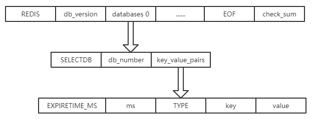

# RDB持久化

## 简介

---
源码位置：rdb.c/rdb.h/rio.c/rio.h

**1. 前言**
Redis是内存数据库，所有的数据都是存在内存中，这样就会存在一个问题，就是当服务进程退出，所有数据都将会丢失，所以Redis提供了两种数据持久化的机制，分别是RDB(Redis DataBase)和AOF(Append Only File)。这两种机制的区别将在后面介绍AOF持久化中介绍。  

RDB其实就是把数据以快照的形式保存在磁盘上。什么是快照呢，你可以理解成把当前时刻的数据拍成一张照片保存下来。  
RDB持久化是指在指定的时间间隔内将内存中的数据集快照写入磁盘。也是默认的持久化方式，这种方式是就是将内存中数据以快照的方式写入到二进制文件中，默认的文件名为`dump.rdb`。

**2. RDB持久化的方式**
RDB持久化有三种方式，分别是：SAVE、BGSAVE、根据配置定期执行。
①.SAVE触发
该命令会阻塞当前Redis服务器，执行save命令期间，Redis不能处理其他命令，直到RDB过程完成为止。
②.BGSAVE触发
执行该命令时，Redis会派生出一个子进程，然后由子进程负责创建 RDB 文件，父进程继续处理命令请求。
③.定期执行
定期执行的触发是由我们的配置文件来完成的。在redis.conf配置文件中，里面有如下配置，我们可以去设置：

* **save**：这里是用来配置触发 Redis的 RDB 持久化条件，也就是什么时候将内存中的数据保存到硬盘。比如"save m n"。表示m秒内数据集存在n次修改时，自动触发bgsave。
* **stop-writes-on-bgsave-error**：默认值为yes。当启用了RDB且最后一次后台保存数据失败，Redis是否停止接收数据。这会让用户意识到数据没有正确持久化到磁盘上，否则没有人会注意到灾难（disaster）发生了。如果Redis重启了，那么又可以重新开始接收数据了。
* **rdbcompression**：默认值是yes。对于存储到磁盘中的快照，可以设置是否进行压缩存储。
* **rdbchecksum**：默认值是yes。在存储快照后，我们还可以让redis使用CRC64算法来进行数据校验，但是这样做会增加大约10%的性能消耗，如果希望获取到最大的性能提升，可以关闭此功能。
* **dbfilename**：设置快照的文件名，默认是 dump.rdb。
* **dir**:设置快照文件的存放路径，这个配置项一定是个目录，而不能是文件名。

|命令|SAVE|BGSAVE|
|---|---|---|
|IO类型|同步|异步|
|阻塞状态|是|是（阻塞发生在fork）|
|复杂度|O(n)|O(n)|
|优点|不会消耗额外内存|不阻塞客户端命令|
|缺点|阻塞客户端命令|需要fork，消耗内存|

**3. RDB的优势和劣势**
**优势：**

* RDB文件紧凑，全量备份，非常适合用于进行备份和灾难恢复。
* 生成RDB文件的时候，redis主进程会fork()一个子进程来处理所有保存工作，主进程不需要进行任何磁盘IO操作。
* RDB 在恢复大数据集时的速度比 AOF 的恢复速度要快。

**劣势：**
RDB快照是一次全量备份，存储的是内存数据的二进制序列化形式，存储上非常紧凑。当进行快照持久化时，会开启一个子进程专门负责快照持久化，子进程会拥有父进程的内存数据，父进程修改内存子进程不会反应出来，所以在快照持久化期间修改的数据不会被保存，可能丢失数据。

**4. RDB文件结构**
一个rdb可以分为以下几个部分：

* REDIS：5字节，保存着 "REDIS" 五个字符
* db_version：4字节，RDB文件的版本号
* databases：数据库中的键值对
  * SELECTDB：1字节常量
  * db_number：数据库号码
  * key_value_pairs：键值对（含过期时间的键值对会带有 EXPIRETIME_MS 和过期时间 ms）
    * EXPIRETIME_MS：标识符，对应的值是该key的过期时间戳，含过期时间的键值对才有该数据
    * ms：过期时间戳，含过期时间的键值对才有该数据
    * TYPE：该key的数据类型
    * key：key对应的字符串
    * value：key对应的值
* EOF：标志着数据库内容的结尾（不是文件的结尾）

  ```c
  #define REDIS_RDB_OPCODE_EOF        255
  ```

* check_sum：校验和（CRC64），用来检查RDB文件是否出错

图示如下：


**4.1 TYPE编码**
`TYPE`常量记录了值对象的类型和编码，规则如下：

```c
#define RDB_TYPE_STRING 0
#define RDB_TYPE_LIST   1
#define RDB_TYPE_SET    2
#define RDB_TYPE_ZSET   3
#define RDB_TYPE_HASH   4
#define RDB_TYPE_ZSET_2 5
#define RDB_TYPE_MODULE 6
#define RDB_TYPE_MODULE_2 7
/* Object types for encoded objects. */
#define RDB_TYPE_HASH_ZIPMAP    9
#define RDB_TYPE_LIST_ZIPLIST  10
#define RDB_TYPE_SET_INTSET    11
#define RDB_TYPE_ZSET_ZIPLIST  12
#define RDB_TYPE_HASH_ZIPLIST  13
#define RDB_TYPE_LIST_QUICKLIST 14
#define RDB_TYPE_STREAM_LISTPACKS 15
```

**4.2 key**
在RDB文件中有很多地方需要存储长度信息，如字符串长度、list长度等等。如果使用固定的int或long类型来存储该信息，在长度值比较小的时候会造成较大的空间浪费。为了节省空间，Redis也是无所不用其极，设计了一套特殊的方法对长度进行编码后再存储。

RDB文件中的长度编码主要通过读取第一字节的最高 2 位来决定接下来如何解析长度信息，在 `rdbSaveLen()` 函数中，我们可以看到有以下四种方式：
|编码方式|占用字节数|说明|
|---|---|---|
|00\|000000|1byte|这一字节的其余 6 位表示长度，可以保存的最大长度是 63 （包括在内）|
|01\|000000 00000000|2byte|长度为 14 位，当前字节 6 位，加上下个字节 8 位|
|10\|000000 [32 bit integer]|5byte|长度由随后的 32 位整数保存|
|11\|000000||后跟一个特殊编码的对象。字节中的 6 位（实际上只用到两个bit）指定对象的类型，用来确定怎样读取和解析接下来的数据|

`rdbSaveLen()`的实现：

```c
int rdbSaveLen(rio *rdb, uint64_t len) {
    unsigned char buf[2];
    size_t nwritten;

    if (len < (1<<6)) {
        /* Save a 6 bit len */
        buf[0] = (len&0xFF)|(RDB_6BITLEN<<6);
        if (rdbWriteRaw(rdb,buf,1) == -1) return -1;
        nwritten = 1;
    } else if (len < (1<<14)) {
        /* Save a 14 bit len */
        buf[0] = ((len>>8)&0xFF)|(RDB_14BITLEN<<6);
        buf[1] = len&0xFF;
        if (rdbWriteRaw(rdb,buf,2) == -1) return -1;
        nwritten = 2;
    } else if (len <= UINT32_MAX) {
        /* Save a 32 bit len */
        buf[0] = RDB_32BITLEN;
        if (rdbWriteRaw(rdb,buf,1) == -1) return -1;
        uint32_t len32 = htonl(len);
        if (rdbWriteRaw(rdb,&len32,4) == -1) return -1;
        nwritten = 1+4;
    } else {
        /* Save a 64 bit len */
        buf[0] = RDB_64BITLEN;
        if (rdbWriteRaw(rdb,buf,1) == -1) return -1;
        len = htonu64(len);
        if (rdbWriteRaw(rdb,&len,8) == -1) return -1;
        nwritten = 1+8;
    }
    return nwritten;
}
```

</br>

## 函数主要功能

---

```c
int rdbSave(char *filename, rdbSaveInfo *rsi); // 保存
int rdbSaveRio(rio *rdb, int *error, int rdbflags, rdbSaveInfo *rsi);
int rdbLoad(char *filename, rdbSaveInfo *rsi, int rdbflags); // 加载
int rdbLoadRio(rio *rdb, int rdbflags, rdbSaveInfo *rsi);
```

</br>

## 主要函数实现

---

**数据保存到rdb文件中：**

```c
int rdbSave(char *filename, rdbSaveInfo *rsi) {
    char tmpfile[256];
    char cwd[MAXPATHLEN]; /* Current working dir path for error messages. */
    FILE *fp;
    rio rdb;
    int error = 0;

    // 创建rdb文件
    snprintf(tmpfile,256,"temp-%d.rdb", (int) getpid());
    fp = fopen(tmpfile,"w");
    if (!fp) {
        char *cwdp = getcwd(cwd,MAXPATHLEN);
        serverLog(LL_WARNING,
            "Failed opening the RDB file %s (in server root dir %s) "
            "for saving: %s",
            filename,
            cwdp ? cwdp : "unknown",
            strerror(errno));
        return C_ERR;
    }

    // 初始化rio
    rioInitWithFile(&rdb,fp);
    startSaving(RDBFLAGS_NONE);

    if (server.rdb_save_incremental_fsync)
        rioSetAutoSync(&rdb,REDIS_AUTOSYNC_BYTES);

    // 将db中的数据存入到rio中
    if (rdbSaveRio(&rdb,&error,RDBFLAGS_NONE,rsi) == C_ERR) {
        errno = error;
        goto werr;
    }

    /* Make sure data will not remain on the OS's output buffers */
    // 同步数据到磁盘文件中
    if (fflush(fp) == EOF) goto werr;
    if (fsync(fileno(fp)) == -1) goto werr;
    if (fclose(fp) == EOF) goto werr;

    /* Use RENAME to make sure the DB file is changed atomically only
     * if the generate DB file is ok. */
    // 重命名rdb文件
    if (rename(tmpfile,filename) == -1) {
        char *cwdp = getcwd(cwd,MAXPATHLEN);
        serverLog(LL_WARNING,
            "Error moving temp DB file %s on the final "
            "destination %s (in server root dir %s): %s",
            tmpfile,
            filename,
            cwdp ? cwdp : "unknown",
            strerror(errno));
        unlink(tmpfile);
        stopSaving(0);
        return C_ERR;
    }

    serverLog(LL_NOTICE,"DB saved on disk");
    server.dirty = 0;
    server.lastsave = time(NULL);
    server.lastbgsave_status = C_OK;
    stopSaving(1);
    return C_OK;

werr:
    serverLog(LL_WARNING,"Write error saving DB on disk: %s", strerror(errno));
    fclose(fp);
    unlink(tmpfile);
    stopSaving(0);
    return C_ERR;
}

int rdbSaveRio(rio *rdb, int *error, int rdbflags, rdbSaveInfo *rsi) {
    dictIterator *di = NULL;
    dictEntry *de;
    char magic[10];
    int j;
    uint64_t cksum;
    size_t processed = 0;

    if (server.rdb_checksum)
        rdb->update_cksum = rioGenericUpdateChecksum;
    snprintf(magic,sizeof(magic),"REDIS%04d",RDB_VERSION);
    // 保存REDIS RDB_VERSION
    if (rdbWriteRaw(rdb,magic,9) == -1) goto werr;
    // 保存一些生产rdb文件的默认字段信息
    if (rdbSaveInfoAuxFields(rdb,rdbflags,rsi) == -1) goto werr;
    if (rdbSaveModulesAux(rdb, REDISMODULE_AUX_BEFORE_RDB) == -1) goto werr;

    // 保存数据库信息
    for (j = 0; j < server.dbnum; j++) {
        redisDb *db = server.db+j;
        dict *d = db->dict;
        if (dictSize(d) == 0) continue;
        di = dictGetSafeIterator(d);

        /* Write the SELECT DB opcode */
        // 保存SELECTDB常量和dbid
        if (rdbSaveType(rdb,RDB_OPCODE_SELECTDB) == -1) goto werr;
        if (rdbSaveLen(rdb,j) == -1) goto werr;

        /* Write the RESIZE DB opcode. We trim the size to UINT32_MAX, which
         * is currently the largest type we are able to represent in RDB sizes.
         * However this does not limit the actual size of the DB to load since
         * these sizes are just hints to resize the hash tables. */
        uint64_t db_size, expires_size;
        db_size = dictSize(db->dict);
        expires_size = dictSize(db->expires);
        // 保存RESIZEDB常量，数据库size和设置expire的key-value的size
        if (rdbSaveType(rdb,RDB_OPCODE_RESIZEDB) == -1) goto werr;
        if (rdbSaveLen(rdb,db_size) == -1) goto werr;
        if (rdbSaveLen(rdb,expires_size) == -1) goto werr;

        /* Iterate this DB writing every entry */
        // 遍历数据库的键空间，将数据库中的key-value存到rdb文件
        while((de = dictNext(di)) != NULL) {
            sds keystr = dictGetKey(de);
            robj key, *o = dictGetVal(de);
            long long expire;

            initStaticStringObject(key,keystr);
            expire = getExpire(db,&key);
            if (rdbSaveKeyValuePair(rdb,&key,o,expire) == -1) goto werr;

            /* When this RDB is produced as part of an AOF rewrite, move
             * accumulated diff from parent to child while rewriting in
             * order to have a smaller final write. */
            if (rdbflags & RDBFLAGS_AOF_PREAMBLE &&
                rdb->processed_bytes > processed+AOF_READ_DIFF_INTERVAL_BYTES)
            {
                processed = rdb->processed_bytes;
                aofReadDiffFromParent();
            }
        }
        dictReleaseIterator(di);
        di = NULL; /* So that we don't release it again on error. */
    }

    /* If we are storing the replication information on disk, persist
     * the script cache as well: on successful PSYNC after a restart, we need
     * to be able to process any EVALSHA inside the replication backlog the
     * master will send us. */
    if (rsi && dictSize(server.lua_scripts)) {
        di = dictGetIterator(server.lua_scripts);
        while((de = dictNext(di)) != NULL) {
            robj *body = dictGetVal(de);
            if (rdbSaveAuxField(rdb,"lua",3,body->ptr,sdslen(body->ptr)) == -1)
                goto werr;
        }
        dictReleaseIterator(di);
        di = NULL; /* So that we don't release it again on error. */
    }

    if (rdbSaveModulesAux(rdb, REDISMODULE_AUX_AFTER_RDB) == -1) goto werr;

    /* EOF opcode */
    if (rdbSaveType(rdb,RDB_OPCODE_EOF) == -1) goto werr;

    /* CRC64 checksum. It will be zero if checksum computation is disabled, the
     * loading code skips the check in this case. */
    cksum = rdb->cksum;
    memrev64ifbe(&cksum);
    if (rioWrite(rdb,&cksum,8) == 0) goto werr;
    return C_OK;

werr:
    if (error) *error = errno;
    if (di) dictReleaseIterator(di);
    return C_ERR;
}
```

**从rdb文件中加载数据：**

```c
int rdbLoad(char *filename, rdbSaveInfo *rsi, int rdbflags) {
    FILE *fp;
    rio rdb;
    int retval;

    if ((fp = fopen(filename,"r")) == NULL) return C_ERR;
    // 获取文件状态写入server结构体中（如加载的文件大小、加载时间等）
    startLoadingFile(fp, filename,rdbflags);
    rioInitWithFile(&rdb,fp); // 初始化rio
    retval = rdbLoadRio(&rdb,rdbflags,rsi);
    fclose(fp);
    stopLoading(retval==C_OK);
    return retval;
}

int rdbLoadRio(rio *rdb, int rdbflags, rdbSaveInfo *rsi) {
    uint64_t dbid;
    int type, rdbver;
    redisDb *db = server.db+0;
    char buf[1024];

    rdb->update_cksum = rdbLoadProgressCallback;
    rdb->max_processing_chunk = server.loading_process_events_interval_bytes;
    // 读取REDIS RDB_VERSION
    if (rioRead(rdb,buf,9) == 0) goto eoferr;
    buf[9] = '\0';
    // 检查REDIS RDB_VERSION
    if (memcmp(buf,"REDIS",5) != 0) {
        serverLog(LL_WARNING,"Wrong signature trying to load DB from file");
        errno = EINVAL;
        return C_ERR;
    }
    rdbver = atoi(buf+5);
    if (rdbver < 1 || rdbver > RDB_VERSION) {
        serverLog(LL_WARNING,"Can't handle RDB format version %d",rdbver);
        errno = EINVAL;
        return C_ERR;
    }

    /* Key-specific attributes, set by opcodes before the key type. */
    long long lru_idle = -1, lfu_freq = -1, expiretime = -1, now = mstime();
    long long lru_clock = LRU_CLOCK();

    // 开始读取数据写入到数据库中
    while(1) {
        robj *key, *val;

        /* Read type. */
        // 读取数据的类型
        if ((type = rdbLoadType(rdb)) == -1) goto eoferr;

        /* Handle special types. */
        // 根据不同的类型进行相应的处理
        if (type == RDB_OPCODE_EXPIRETIME) {
            /* EXPIRETIME: load an expire associated with the next key
             * to load. Note that after loading an expire we need to
             * load the actual type, and continue. */
            expiretime = rdbLoadTime(rdb);
            expiretime *= 1000;
            if (rioGetReadError(rdb)) goto eoferr;
            continue; /* Read next opcode. */
        } else if (type == RDB_OPCODE_EXPIRETIME_MS) {
            /* EXPIRETIME_MS: milliseconds precision expire times introduced
             * with RDB v3. Like EXPIRETIME but no with more precision. */
            expiretime = rdbLoadMillisecondTime(rdb,rdbver);
            if (rioGetReadError(rdb)) goto eoferr;
            continue; /* Read next opcode. */
        } else if (type == RDB_OPCODE_FREQ) {
            /* FREQ: LFU frequency. */
            uint8_t byte;
            if (rioRead(rdb,&byte,1) == 0) goto eoferr;
            lfu_freq = byte;
            continue; /* Read next opcode. */
        } else if (type == RDB_OPCODE_IDLE) {
            /* IDLE: LRU idle time. */
            uint64_t qword;
            if ((qword = rdbLoadLen(rdb,NULL)) == RDB_LENERR) goto eoferr;
            lru_idle = qword;
            continue; /* Read next opcode. */
        } else if (type == RDB_OPCODE_EOF) {
            /* EOF: End of file, exit the main loop. */
            break;
        } else if (type == RDB_OPCODE_SELECTDB) {
            /* SELECTDB: Select the specified database. */
            if ((dbid = rdbLoadLen(rdb,NULL)) == RDB_LENERR) goto eoferr;
            if (dbid >= (unsigned)server.dbnum) {
                serverLog(LL_WARNING,
                    "FATAL: Data file was created with a Redis "
                    "server configured to handle more than %d "
                    "databases. Exiting\n", server.dbnum);
                exit(1);
            }
            db = server.db+dbid;
            continue; /* Read next opcode. */
        } else if (type == RDB_OPCODE_RESIZEDB) {
            /* RESIZEDB: Hint about the size of the keys in the currently
             * selected data base, in order to avoid useless rehashing. */
            uint64_t db_size, expires_size;
            if ((db_size = rdbLoadLen(rdb,NULL)) == RDB_LENERR)
                goto eoferr;
            if ((expires_size = rdbLoadLen(rdb,NULL)) == RDB_LENERR)
                goto eoferr;
            dictExpand(db->dict,db_size);
            dictExpand(db->expires,expires_size);
            continue; /* Read next opcode. */
        } else if (type == RDB_OPCODE_AUX) {
            /* AUX: generic string-string fields. Use to add state to RDB
             * which is backward compatible. Implementations of RDB loading
             * are requierd to skip AUX fields they don't understand.
             *
             * An AUX field is composed of two strings: key and value. */
            robj *auxkey, *auxval;
            if ((auxkey = rdbLoadStringObject(rdb)) == NULL) goto eoferr;
            if ((auxval = rdbLoadStringObject(rdb)) == NULL) goto eoferr;

            if (((char*)auxkey->ptr)[0] == '%') {
                /* All the fields with a name staring with '%' are considered
                 * information fields and are logged at startup with a log
                 * level of NOTICE. */
                serverLog(LL_NOTICE,"RDB '%s': %s",
                    (char*)auxkey->ptr,
                    (char*)auxval->ptr);
            } else if (!strcasecmp(auxkey->ptr,"repl-stream-db")) {
                if (rsi) rsi->repl_stream_db = atoi(auxval->ptr);
            } else if (!strcasecmp(auxkey->ptr,"repl-id")) {
                if (rsi && sdslen(auxval->ptr) == CONFIG_RUN_ID_SIZE) {
                    memcpy(rsi->repl_id,auxval->ptr,CONFIG_RUN_ID_SIZE+1);
                    rsi->repl_id_is_set = 1;
                }
            } else if (!strcasecmp(auxkey->ptr,"repl-offset")) {
                if (rsi) rsi->repl_offset = strtoll(auxval->ptr,NULL,10);
            } else if (!strcasecmp(auxkey->ptr,"lua")) {
                /* Load the script back in memory. */
                if (luaCreateFunction(NULL,server.lua,auxval) == NULL) {
                    rdbExitReportCorruptRDB(
                        "Can't load Lua script from RDB file! "
                        "BODY: %s", auxval->ptr);
                }
            } else if (!strcasecmp(auxkey->ptr,"redis-ver")) {
                serverLog(LL_NOTICE,"Loading RDB produced by version %s",
                    (char*)auxval->ptr);
            } else if (!strcasecmp(auxkey->ptr,"ctime")) {
                time_t age = time(NULL)-strtol(auxval->ptr,NULL,10);
                if (age < 0) age = 0;
                serverLog(LL_NOTICE,"RDB age %ld seconds",
                    (unsigned long) age);
            } else if (!strcasecmp(auxkey->ptr,"used-mem")) {
                long long usedmem = strtoll(auxval->ptr,NULL,10);
                serverLog(LL_NOTICE,"RDB memory usage when created %.2f Mb",
                    (double) usedmem / (1024*1024));
            } else if (!strcasecmp(auxkey->ptr,"aof-preamble")) {
                long long haspreamble = strtoll(auxval->ptr,NULL,10);
                if (haspreamble) serverLog(LL_NOTICE,"RDB has an AOF tail");
            } else if (!strcasecmp(auxkey->ptr,"redis-bits")) {
                /* Just ignored. */
            } else {
                /* We ignore fields we don't understand, as by AUX field
                 * contract. */
                serverLog(LL_DEBUG,"Unrecognized RDB AUX field: '%s'",
                    (char*)auxkey->ptr);
            }

            decrRefCount(auxkey);
            decrRefCount(auxval);
            continue; /* Read type again. */
        } else if (type == RDB_OPCODE_MODULE_AUX) {
            /* Load module data that is not related to the Redis key space.
             * Such data can be potentially be stored both before and after the
             * RDB keys-values section. */
            uint64_t moduleid = rdbLoadLen(rdb,NULL);
            int when_opcode = rdbLoadLen(rdb,NULL);
            int when = rdbLoadLen(rdb,NULL);
            if (rioGetReadError(rdb)) goto eoferr;
            if (when_opcode != RDB_MODULE_OPCODE_UINT)
                rdbReportReadError("bad when_opcode");
            moduleType *mt = moduleTypeLookupModuleByID(moduleid);
            char name[10];
            moduleTypeNameByID(name,moduleid);

            if (!rdbCheckMode && mt == NULL) {
                /* Unknown module. */
                serverLog(LL_WARNING,"The RDB file contains AUX module data I can't load: no matching module '%s'", name);
                exit(1);
            } else if (!rdbCheckMode && mt != NULL) {
                if (!mt->aux_load) {
                    /* Module doesn't support AUX. */
                    serverLog(LL_WARNING,"The RDB file contains module AUX data, but the module '%s' doesn't seem to support it.", name);
                    exit(1);
                }

                RedisModuleIO io;
                moduleInitIOContext(io,mt,rdb,NULL);
                io.ver = 2;
                /* Call the rdb_load method of the module providing the 10 bit
                 * encoding version in the lower 10 bits of the module ID. */
                if (mt->aux_load(&io,moduleid&1023, when) != REDISMODULE_OK || io.error) {
                    moduleTypeNameByID(name,moduleid);
                    serverLog(LL_WARNING,"The RDB file contains module AUX data for the module type '%s', that the responsible module is not able to load. Check for modules log above for additional clues.", name);
                    exit(1);
                }
                if (io.ctx) {
                    moduleFreeContext(io.ctx);
                    zfree(io.ctx);
                }
                uint64_t eof = rdbLoadLen(rdb,NULL);
                if (eof != RDB_MODULE_OPCODE_EOF) {
                    serverLog(LL_WARNING,"The RDB file contains module AUX data for the module '%s' that is not terminated by the proper module value EOF marker", name);
                    exit(1);
                }
                continue;
            } else {
                /* RDB check mode. */
                robj *aux = rdbLoadCheckModuleValue(rdb,name);
                decrRefCount(aux);
                continue; /* Read next opcode. */
            }
        }

        /* Read key */
        if ((key = rdbLoadStringObject(rdb)) == NULL) goto eoferr;
        /* Read value */
        if ((val = rdbLoadObject(type,rdb,key)) == NULL) {
            decrRefCount(key);
            goto eoferr;
        }

        /* Check if the key already expired. This function is used when loading
         * an RDB file from disk, either at startup, or when an RDB was
         * received from the master. In the latter case, the master is
         * responsible for key expiry. If we would expire keys here, the
         * snapshot taken by the master may not be reflected on the slave. */
        if (server.masterhost == NULL && !(rdbflags&RDBFLAGS_AOF_PREAMBLE) && expiretime != -1 && expiretime < now) {
            decrRefCount(key);
            decrRefCount(val);
        } else {
            /* Add the new object in the hash table */
            dbAdd(db,key,val);

            /* Set the expire time if needed */
            if (expiretime != -1) setExpire(NULL,db,key,expiretime);

            /* Set usage information (for eviction). */
            objectSetLRUOrLFU(val,lfu_freq,lru_idle,lru_clock,1000);

            /* Decrement the key refcount since dbAdd() will take its
             * own reference. */
            decrRefCount(key);
        }
        if (server.key_load_delay)
            usleep(server.key_load_delay);

        /* Reset the state that is key-specified and is populated by
         * opcodes before the key, so that we start from scratch again. */
        expiretime = -1;
        lfu_freq = -1;
        lru_idle = -1;
    }
    /* Verify the checksum if RDB version is >= 5 */
    if (rdbver >= 5) {
        uint64_t cksum, expected = rdb->cksum;

        if (rioRead(rdb,&cksum,8) == 0) goto eoferr;
        if (server.rdb_checksum) {
            memrev64ifbe(&cksum);
            if (cksum == 0) {
                serverLog(LL_WARNING,"RDB file was saved with checksum disabled: no check performed.");
            } else if (cksum != expected) {
                serverLog(LL_WARNING,"Wrong RDB checksum. Aborting now.");
                rdbExitReportCorruptRDB("RDB CRC error");
            }
        }
    }
    return C_OK;

    /* Unexpected end of file is handled here calling rdbReportReadError():
     * this will in turn either abort Redis in most cases, or if we are loading
     * the RDB file from a socket during initial SYNC (diskless replica mode),
     * we'll report the error to the caller, so that we can retry. */
eoferr:
    serverLog(LL_WARNING,
        "Short read or OOM loading DB. Unrecoverable error, aborting now.");
    rdbReportReadError("Unexpected EOF reading RDB file");
    return C_ERR;
}
```
