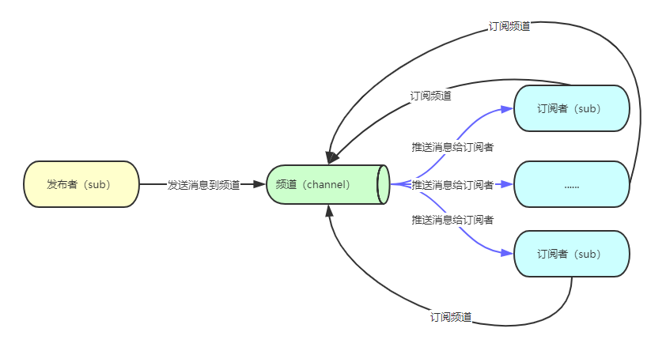
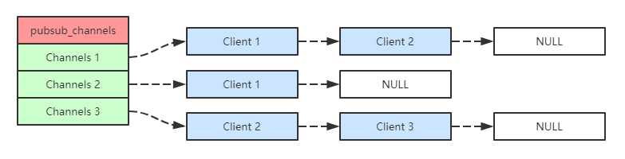

# 发布和订阅

## 简介

---
源码位置：pubsub.c/redis.h

**1. 前言**
Redis发布订阅(pub/sub)是一种消息通信模式，由三部分组成：发布者(pub)，频道(channel)，订阅者(sub)。具体结构如下：

发布者和订阅者都是Redis客户端，频道是Redis服务端，发布者将消息发布到某一频道上，订阅了这一频道的订阅者就会收到该条信息。Redis客户端可订阅任意数量的频道。
Redis的发布订阅功能并不保证可靠，因为所有数据都存在内存中，没有提供持久化的功能，也不记录消费端状态，所以相对市面上的一些消息队列相比（如kafka、rabittMQ等），可靠性会差很多。在Redis5.0版本的stream消息队列功能发布之前，会有使用者使用redis-list来实现消息队列和发布订阅的功能，虽然有持久化（AOF & RDB）的功能，但是实现起来比较笨拙，不够方便。

pubsub与stream比较：
|pub/sub|stream|
|---|---|
|不能持久化消息|可以持久化，支持RDB和AOF两种持久化机制|
|没有消息队列中群组的概念|引入了消费组的概念|
|redis客户端断线重连会丢失中间的数据|支持position，能够消费历史消息。断线后支持消息继续从上次的时间点读取，不会丢失消息，也可以直接读取最新消息|
|redis断线后需要重新订阅||不存在这个问题|
|没有ack机制|有ACK机制，能够一定程度保证消息“at least once” 消费|

基于stream消息队列的多种好处，pub/sub功能仅做源码学习，实际项目中推荐使用stream或者kafka等消息队列。

**2. 命令介绍**
下面介绍命令的使用详情：

* PSUBSCRIBE pattern [pattern1 ....]
  * 说明：订阅一个或多个符合给定模式的频道，每个模式以*作为匹配符
  * 参数：pattern(给定的模式)
  * 返回：接受到的信息
* PUNSUBSCRIBE pattern [pattern1 ....]
  * 说明：用于退订所有给定模式的频道
  * 参数：pattern(给定的模式)
  * 返回：这个命令在不同的客户端中有不同的表现。
* SUBSCRIBE channel [channel1 ...]
  * 说明：用于订阅给定的一个或多个频道的信息
  * 参数：channel(给定的频道名)
  * 返回：接收到的信息
* UNSUBSCRIBE channel [channel1 ...]
  * 说明：用于退订给定的一个或多个频道的信息
  * 参数：channel(给定的频道名)
  * 返回：这个命令在不同的客户端中有不同的表现
* PUBLISH channel message
  * 说明：用于将信息发送到指定的频道
  * 参数：channel(频道名称)，message(将要发送的信息)
  * 返回：接收到此消息的订阅者数量
* PUBSUB < subcommand > argument [argument1 ....]
  * 说明：用于查看订阅与发布系统状态，它由数个不同格式的子命令组成
  * 参数：subcommand(子命令)，argument(子命令参数)
  * 返回：由活跃频道组成的列表

子命令如下：
|subcommand|argument|说明|
|---|---|---|
|CHANNELS|[pattern]|返回指定模式pattern的活跃的频道,指定返回由SUBSCRIBE订阅的频道|
|NUMSUB|channel channel2 ...|返回指定频道的订阅数量|
|NUMPAT||返回订阅模式的数量，注意：这个命令返回的不是订阅模式的客户端的数量， 而是客户端订阅的所有模式的数量总和|

**3. 实现原理**
每个 Redis 服务器进程维持着一个标识服务器状态 的 redis.h/redisServer 结构，其中就 保存着有订阅的频道 以及 订阅模式 的信息：

``` c
struct redisServer {
    // ...
    /* Pubsub */
    dict *pubsub_channels;  /* 订阅频道（字典数据结构） */
    list *pubsub_patterns;  /* 订阅模式（列表结构） */
    // ...
};
typedef struct client {
    // ...
    dict *pubsub_channels;  /* 该客户端订阅的频道 */
    list *pubsub_patterns;  /* 该客户端订阅的模式 */
    // ...
}
```

>1.在Redis服务端内部维护了一个 `pubsub_channels` 的channel列表，记录了此客户端所订阅的频道。
>
>2.当客户端订阅某一个频道之后，Redis服务端就会往自身的 `pubsub_channels` 这个字典变量中新添加一条数据，实际上这个 dict 字典维护的是一张链表，比如，下图展示的 pubsub_channels 示例中，client 1、client 2 就订阅了 channel 1，而其他频道也分别被其他客户端订阅：

>
>3.当一个Redis客户端publish一个message的时候，会先去服务端的 `pubsub_channels` 找相应的channel，遍历里面的client，然后发送通知，即完成了整个发布订阅的流程。

下面我们通过代码来看看pub/sub的实现吧。

</br>
</br>

## 函数功能总览

---

```c
/* Pubsub commands implementation */
void subscribeCommand(client *c); /* 用于订阅给定的一个或多个频道的信息 */
void unsubscribeCommand(client *c); /* 用于退订给定的一个或多个频道的信息 */
void psubscribeCommand(client *c); /* 订阅一个或多个符合给定模式的频道 */
void punsubscribeCommand(client *c); /* 用于退订所有给定模式的频道 */
void publishCommand(client *c); /* 用于将信息发送到指定的频道 */
void pubsubCommand(client *c); /* 用于查看订阅与发布系统状态 */

/* Pubsub low level API */
void freePubsubPattern(void *p); /* 释放发布订阅的模式 */
int listMatchPubsubPattern(void *a, void *b); /* 发布订阅模式是否匹配 */
int clientSubscriptionsCount(redisClient *c); /* 返回客户端的所订阅的数量，包括channels + patterns频道和模式 */
int pubsubSubscribeChannel(redisClient *c, robj *channel); /* Client订阅一个Channel频道 */
int pubsubUnsubscribeChannel(redisClient *c, robj *channel, int notify); /* 取消订阅Client中的Channel */
int pubsubSubscribePattern(redisClient *c, robj *pattern); /* Client客户端订阅一种模式 */
int pubsubUnsubscribePattern(redisClient *c, robj *pattern, int notify); /* Client客户端取消订阅pattern模式 */
int pubsubUnsubscribeAllChannels(redisClient *c, int notify); /* 客户端取消自身订阅的所有Channel */
int pubsubUnsubscribeAllPatterns(redisClient *c, int notify); /* 客户端取消订阅所有的pattern模式 */
int pubsubPublishMessage(robj *channel, robj *message); /* 为所有订阅了Channel的Client发送消息message */
```

</br>

## 主要函数实现

---

**Redis客户端订阅频道：**

```c
// 服务端实现
void subscribeCommand(client *c) {
    int j;

    for (j = 1; j < c->argc; j++)
        pubsubSubscribeChannel(c,c->argv[j]);
    // 添加pubsub订阅标识，方便其他地方判断
    c->flags |= CLIENT_PUBSUB;
}
int pubsubSubscribeChannel(client *c, robj *channel) {
    dictEntry *de;
    list *clients = NULL;
    int retval = 0;

    /* step.1 将要订阅的 channel 添加到各自客户端的 pubsub_channels 容器中 */
    if (dictAdd(c->pubsub_channels,channel,NULL) == DICT_OK) {
        retval = 1;
        incrRefCount(channel);
        /* step.2 将要订阅的channel 添加到 server.pubsub_channels 中, 方便在publish时判定是否触发通知 */
        de = dictFind(server.pubsub_channels,channel);
        if (de == NULL) {
            // 如果此频道的client列表为空，则创建新列表并添加
            clients = listCreate();
            dictAdd(server.pubsub_channels,channel,clients);
            incrRefCount(channel);
        } else {
            // 否则，获取频道的客户端列表，在尾部添加新的元素
            clients = dictGetVal(de);
        }
        /* step.3 将客户端自身添加到相应的 server.pubsub_channels 对应的队列中去, 在通知时只需遍历该队列即可 */
        listAddNodeTail(clients,c);
    }
    /* 回复客户端 */
    addReplyPubsubSubscribed(c,channel);
    return retval;
}
// 客户端订阅的总channel数, 两种订阅方式相加
int clientSubscriptionsCount(client *c) {
    return dictSize(c->pubsub_channels)+
           listLength(c->pubsub_patterns);
}
```

总结：

1. 客户端自行管理需要订阅的channel, 放到 c->pubsub_channels 中;
2. redis使用的一个统一的 server->pubsub_channels dict容器进行管理所有的channel;
3. 对于多个客户端订阅一个channel, redis 使用list进行管理追加;

**Redis客户端退订频道：**

```c
// 服务端实现
void unsubscribeCommand(client *c) {
    if (c->argc == 1) {
        pubsubUnsubscribeAllChannels(c,1);
    } else {
        int j;

        for (j = 1; j < c->argc; j++)
            pubsubUnsubscribeChannel(c,c->argv[j],1);
    }
    if (clientSubscriptionsCount(c) == 0) c->flags &= ~CLIENT_PUBSUB;
}
/* 退订所有频道，返回退订的数目 */
int pubsubUnsubscribeAllChannels(client *c, int notify) {
    dictIterator *di = dictGetSafeIterator(c->pubsub_channels);
    dictEntry *de;
    int count = 0;

    // 遍历该客户端订阅的所有频道并退订
    while((de = dictNext(di)) != NULL) {
        robj *channel = dictGetKey(de);

        count += pubsubUnsubscribeChannel(c,channel,notify);
    }
    /* We were subscribed to nothing? Still reply to the client. */
    if (notify && count == 0) addReplyPubsubUnsubscribed(c,NULL);
    dictReleaseIterator(di);
    return count;
}
int pubsubUnsubscribeChannel(client *c, robj *channel, int notify) {
    dictEntry *de;
    list *clients;
    listNode *ln;
    int retval = 0;

    /* 从client.pubsub_channels中移除频道 */
    incrRefCount(channel);
    if (dictDelete(c->pubsub_channels,channel) == DICT_OK) {
        retval = 1;
        /* 从server.pubsub_channels中移除频道 */
        de = dictFind(server.pubsub_channels,channel);
        serverAssertWithInfo(c,NULL,de != NULL);
        clients = dictGetVal(de);
        ln = listSearchKey(clients,c);
        serverAssertWithInfo(c,NULL,ln != NULL);
        listDelNode(clients,ln);
        if (listLength(clients) == 0) {
            // 如果列表中没有数据了，就移除频道列表
            dictDelete(server.pubsub_channels,channel);
        }
    }
    if (notify) addReplyPubsubUnsubscribed(c,channel);
    decrRefCount(channel); /* it is finally safe to release it */
    return retval;
}

```
