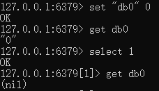
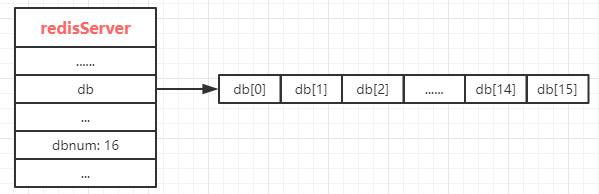

# redisDb数据库

## 简介

---
源码位置：db.c/server.h

**Redis数据库介绍：**
在前两个阶段中，我们学习了redis数据结构的实现，而这些数据结构都是为了实现数据库功能做的铺垫，下面，让我们一起来看看redis数据库是如何实现的吧。  

Redis服务器在运行的时候会创建大量的redisObject对象，这些对象都是存在redisDb中的，为了快速索引到某个对象，redisDb采用了dict字典结构设计。  
启动Redis后，Redis服务器将所有数据库都保存在redisServer结构的db数组中，db数组的每一项都是一个redisDb结构，代表一个数据库。根据配置参数，redis服务器在初始化的时候，默认情况下会创建16个数据库，由dbnum决定(可通过`databases`配置修改)，每个数据库都是独立的。  
客户端可以通过`select`命令来切换数据库，如`select 1`会切换到数据库号为 1 的数据库，select是通过修改客户端的db指针，指针指向不同的数据库来实现数据库的切换操作的。  

操作如下图：


redis服务结构体如下：  


redis通过字典保存数据库中的所有键值对，我们称之为键空间(key space)。键空间和用户所见的数据库是直接对应的：

* 键空间的键也就是数据库的键，每个键都是一个字符串对象。
* 键空间的值也就是数据库的值，每个值可以是字符串对象、列表对象、哈希表对象、集合对象和有序集合对象中的任意一种redis对象。

**redis数据库支持增删改查(curd)操作：**

**1.添加新键**
添加一个新键值对到数据库，实际上就是将一个新键值对添加到键空间的字典里，其中键为字符串对象，值为任意一种类型的redis对象。  
**2.删除键**
删除数据库中的一个键，实际上就是在键空间里面删除键所对应的键值对对象。
**3.更新键**
对一个数据库键进行更新，实际上就是对键空间里面键所对应的值对象进行更新，根据值对象类型的不同，更新的方法也不同。
**4.查询键**
对一个数据库键进行查询，实际上就是在键空间中取出键所对应的值对象，根据值对象类型的不同，取值的方法也不同。  

除了以上操作外，redis还有很多针对数据库本身的命令，也是通过对键空间进行处理来完成的。  

**读写键空间时的维护操作：**
当使用redis命令对数据库进行读写时，服务器不仅会对键空间执行指定的读写操作，还会执行一些额外的操作，其中包括：

* 在读取一个键之后（读写操作都需要先对键进行读取），服务器会根据键是否存在来更新服务器的键空间命中(hit)次数或不命中(miss)次数，这两个值可以在`INFO stat`命令的`keyspace_hits`和`keyspace_misses`属性中查看。
* 在读取一个键之后，服务器会更新键的LRU或LFU时间，这个值用于计算键的闲置时间，可以使用`OBJECT idletime [key]`命令查看key的闲置时间。
* 如果服务器在读取一个键时发现该键已经过期，那么服务器会先删除这个过期的键，然后才执行余下操作。
* 如果有客户端使用`WATCH`命令监视了某个键，那么服务器在对被监视的键进行修改之后，会将这个键标记为脏(dirty)，从而让事务程序注意到这个键已经被修改过。
* 服务器每次修改一个键后，都会对脏(dirty)键计数器的值增 1，这个计数器会触发服务器的持久化以及复制操作。
* 如果服务器开启了数据库通知功能，那么在对键进行修改之后，服务器会按配置发送相应的数据库通知。

**设置键的生存时间或过期时间：**
Redis有四个命令可以设置键的过期时间，包括expire,pexpire,expireat,pexpireat，不过这四个命令最后都会转化成pexpireat命令来实现。  
RedisDb中，使用一个字典expires来存储带有过期时间的键，称之为过期字典。

* 过期字典的键是一个指针，这个指针指向键空间中的某个键对象。
* 过期字典的值是一个long long类型的整数，这个整数保存了键所指向的数据库键的过期时间（精度为毫秒的unix时间戳）。

**过期键的删除策略：**
如果一个键过期了，那么它什么时候被删除呢？redis有三种删除策略：

1. 定时删除：在设置键的过期时间的同时，创建一个定时器，让定时器在键的过期时间来临时，立即执行删除操作。
2. 惰性删除：放任键过期不管，但是每次从键空间中获取键时，都检查取得的键是否过期，如果过期的话，执行删除操作，如果没过期，则返回该键。
3. 定期删除：每隔一段时间，程序对数据库进行检查，删除过期的键。至于要删除多少过期键，以及要检查多少个数据库，则由算法实现。

这几种方式各有利弊。

1. 定时删除对内存最为友好，当键过期时，会立即删除该键，释放内存。不过对CPU最不友好，因为每一个键都需要创建一个定时器，这种行为可能会占用相当一部分的CPU时间。此外，创建定时器需要用到Redis服务器中的时间时间，而当前时间时间的实现方式-无序链表查找一个事件的时间复杂度为O(N)，不能高效地处理大量时间事件。
2. 惰性删除策略对CPU是最友好的，但是对内存最不友好。如果一个键已经过期，这个键又保留在数据库中，那么内存就会一直占用不释放，由db.c/expireIfNeeded()函数实现惰性删除。
3. 定期删除算是前两种策略的一种整合和折中，定期策略每隔一段时间执行一次删除过期键操作，并通过限制删除操作执行的时长和频率减少删除操作对CPU时间的影响。定期删除过期键可以有效地减少因为过期键带来的内存浪费。

下面我们通过代码来看看redis数据库的实现吧。

</br>
</br>

## 结构体与宏定义

---

``` c
// redisServer
struct redisServer {
    // ...
    redisDb *db;    /* 数据库数组*/
    // ...
    int dbnum;      /* 数据库的总个数 */
    // ...
};

// redisDb
typedef struct redisDb {
    dict *dict;                 /* 数据库的键空间 */
    dict *expires;              /* 键的过期字典 */
    dict *blocking_keys;        /* 存放所有造成阻塞的键及其客户端 */
    dict *ready_keys;           /* 存放push操作添加的造成阻塞的键，便于解阻塞 */
    dict *watched_keys;         /* 被watch命令监控的键和相应的客户端，用于multi/exec */
    int id;                     /* 数据库编号 */
    long long avg_ttl;          /* 平均生存时间 */
    unsigned long expires_cursor; /* Cursor of the active expire cycle. */
    list *defrag_later;         /* 要尝试逐项进行碎片整理的密钥名称列表 */
} redisDb;
```

</br>

## 函数功能总览

---

``` c
int removeExpire(redisDb *db, robj *key); // 移除key的过期时间，当只有在db->dict中存在key时，才会移除
void propagateExpire(redisDb *db, robj *key, int lazy); // 将过期key的del操作通知给slaves和AOF文件
int expireIfNeeded(redisDb *db, robj *key); // 被动的删除过期key。当用户对key进行操作时，首先判断key是否过期，过期则删除返回NULL
long long getExpire(redisDb *db, robj *key); // 返回key的过期时间
void setExpire(client *c, redisDb *db, robj *key, long long when); // 设置key的过期时间
robj *lookupKey(redisDb *db, robj *key, int flags); // db中查找元素的底层实现
robj *lookupKeyRead(redisDb *db, robj *key); // 调用lookupKeyReadWithFlags，需要修改键的访问时间
robj *lookupKeyWrite(redisDb *db, robj *key); // 调用lookupKeyWriteWithFlags，需要修改键的访问时间
robj *lookupKeyReadOrReply(client *c, robj *key, robj *reply); // 调用lookupKeyRead，未找到则将描述信息加入到缓冲区输出到客户端
robj *lookupKeyWriteOrReply(client *c, robj *key, robj *reply); // 调用lookupKeyWrite，未找到则将描述信息加入到缓冲区输出到客户端
robj *lookupKeyReadWithFlags(redisDb *db, robj *key, int flags); // 首先从过期字典中查找键是否过期，未过期调用lookupKey来查找元素，并更新键的命中或不命中的属性
robj *lookupKeyWriteWithFlags(redisDb *db, robj *key, int flags); // 首先从过期字典中查找键是否过期并调用lookupKey来查找元素

void dbAdd(redisDb *db, robj *key, robj *val); // 键空间增加键值对
void dbOverwrite(redisDb *db, robj *key, robj *val); // 重写键的值，继承源键的过期时间
void genericSetKey(redisDb *db, robj *key, robj *val, int keepttl); // 高阶函数，如果key不存在则增加，key存在则修改值，可选择是否删除过期字典中的key
void setKey(redisDb *db, robj *key, robj *val); // 调用genericSetKey，并从过期字典中删除该key
int dbExists(redisDb *db, robj *key); // key是否存在
robj *dbRandomKey(redisDb *db); // 随机获取key
int dbSyncDelete(redisDb *db, robj *key); // 同步删除键空间和过期字典中的key
int dbDelete(redisDb *db, robj *key); // 通过redis延迟删除配置，选择dbSyncDelete或者dbAsyncDelete
robj *dbUnshareStringValue(redisDb *db, robj *key, robj *o);

long long emptyDb(int dbnum, int flags, void(callback)(void*)); // 调用emptyDbGeneric清空数据库
long long emptyDbGeneric(redisDb *dbarray, int dbnum, int flags, void(callback)(void*)); // 清空数据库
void flushAllDataAndResetRDB(int flags); // 清空所有的数据库并重置
long long dbTotalServerKeyCount(); // 统计所有数据库的键数量

int selectDb(client *c, int id); // 选择数据库
void signalModifiedKey(redisDb *db, robj *key); // 每次修改键空间的键时，都会调用此函数
void signalFlushedDb(int dbid); // 清空数据库时调用此函数

// redis-cluster集群 slot槽点相关函数，将在cluster中解释
unsigned int getKeysInSlot(unsigned int hashslot, robj **keys, unsigned int count);
unsigned int countKeysInSlot(unsigned int hashslot);
unsigned int delKeysInSlot(unsigned int hashslot);
int verifyClusterConfigWithData(void);
void scanGenericCommand(client *c, robj *o, unsigned long cursor);
int parseScanCursorOrReply(client *c, robj *o, unsigned long *cursor);
void slotToKeyAdd(robj *key);
void slotToKeyDel(robj *key);
void slotToKeyFlush(void);

int dbAsyncDelete(redisDb *db, robj *key); // 异步删除过期key，放入惰性删除列表中，将在另一个bio.c线程中回收
void emptyDbAsync(redisDb *db); // 异步清空数据库，创建新库，将旧库放入惰性删除列表中，将在另一个bio.c线程中回收

/* API to get key arguments from commands */
// 一些命令的实现
int *getKeysFromCommand(struct redisCommand *cmd, robj **argv, int argc, int *numkeys); // 获取所有的 keyIndex
void getKeysFreeResult(int *result); // 释放keyindex
int *zunionInterGetKeys(struct redisCommand *cmd,robj **argv, int argc, int *numkeys);
int *evalGetKeys(struct redisCommand *cmd, robj **argv, int argc, int *numkeys);
int *sortGetKeys(struct redisCommand *cmd, robj **argv, int argc, int *numkeys);
int *migrateGetKeys(struct redisCommand *cmd, robj **argv, int argc, int *numkeys);
int *georadiusGetKeys(struct redisCommand *cmd, robj **argv, int argc, int *numkeys);
int *xreadGetKeys(struct redisCommand *cmd, robj **argv, int argc, int *numkeys);
int *memoryGetKeys(struct redisCommand *cmd, robj **argv, int argc, int *numkeys);
```
